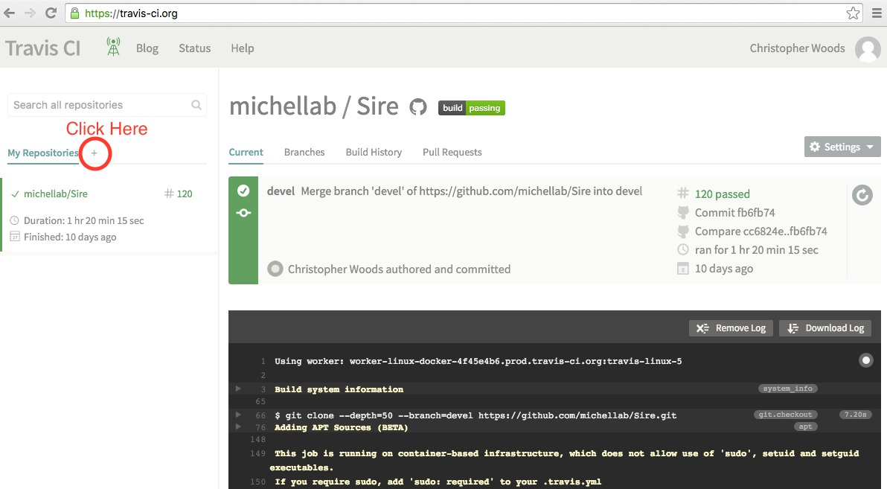
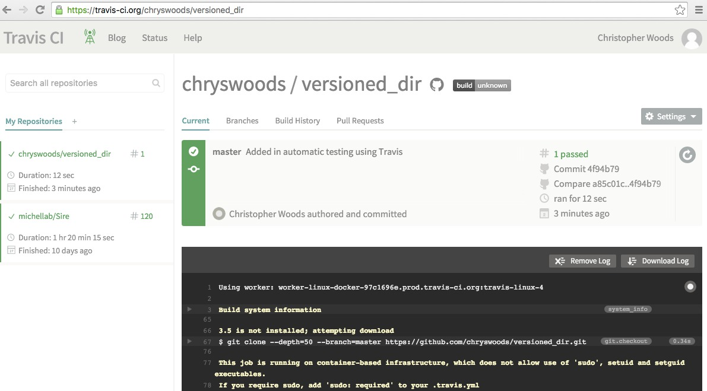
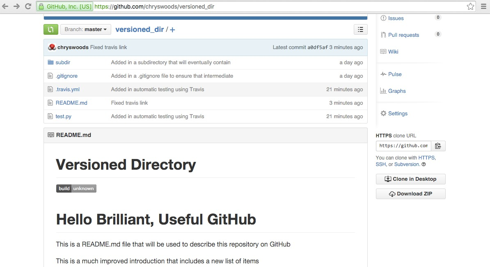

# Continuous Integration (CI)

How can you know that changes to your files won't break anything? Particularly
when you start having large numbers of people making and merging changes,
and sending you large numbers of pull requests?

One way would be to read every single line of text and manually
review each change as they come in. However, as projects get bigger,
and the number of people working together increases, this becomes an
ever bigger and unmanagable task.

Instead, a better approach is to find a way of automatically testing
every single change committed to the repository. If all of the tests
pass, then you have confidence that nothing has been broken (assuming
that you have good coverage with your tests). This approach, of
automatically running tests on every commit, is called "continuous
integration", or CI.

GitHub is brilliant and useful because it has a built in link to
a free CI platform called [Travis CI](https://travis-ci.org/). 
Travis CI provides free servers on which you can sync GitHub
repositories and run tests. To use Travis CI, sign up for a 
Travis account and then next to the "My Repositories" link,
click the "+" sign, e.g.



Travis CI links to your GitHub account, so knows all about your
repositories. Click the toggle switch to switch on CI testing
for your `versioned_dir` repository.

Next, to use Travis, you have to add a file called `.travis.yml`
to the top level of your `versioned_dir` directory. Change
into this directory

```
cd 
cd versioned_dir
```

and then create the file using nano

```
nano .travis.yml
```

Copy into the file the following

```
language: python
python:
  - "3.5"
# command to run tests
script: python test.py
```

This file tells Travis that you want it to run a test script (which we will soon write) 
called `test.py`. This is run using the 3.5 version of the python interpreter (Travis
supports a lot of languages and versions. Take a look 
[here](http://docs.travis-ci.com/user/getting-started/) for the full documentation).

Next, create the `test.py` test script

```
nano test.py
```

and copy in the text

```
lines = open("README.MD", "r").readlines()

for line in lines:
    print(line, end="")

print("\nEverything is OK")
```

This is a simple python script that just prints out every line of `README.MD`
and then prints `Everything is OK`. Note that a good test script should
actually run some real tests... This is just for demonstration.

Add these two new files to Git and then commit and push your changes.

```
git add .travis.yml test.py
git commit -a
git push
```

Now, take a look at your Travis CI page, at 
[https://travis-ci.org/USERNAME/versioned_dir](https://travis-ci.org/USERNAME/versioned_dir),
where `USERNAME` is your GitHub/Travis username. For example,
my page is shown below.



You should see, as above, that Travis has seen the commit, has downloaded
and install Python, cloned your repository, and then run the `test.py` script.
You should be able to see all of the output from `test.py`, including that
the test passed, because `test.py` exited with an exit value of 0 (a non-zero
exit value implies failure).

## Showing Travis status on Github

To show the Travis build status on Github, you need to edit your
`README.MD` file. Open this up

```
nano README.MD
```
   
and set the contents equal to

```
# Versioned Directory

[  ]
(https://travis-ci.org/chryswoods/versioned_dir)

# Hello Brilliant, Useful GitHub

This is a README.MD file that will be used to describe this
repository on GitHub

This is a much improved introduction that includes a 
new list of items

* Item 1
* Item 2
* Item 3

This is an extra line of text added to the copy 
of README.MD in the cloned repository
```

The first added lines just create a nice title for your project.

The next line

```
[  ]
(https://travis-ci.org/USERNAME/versioned_dir)
```

creates a markdown link to your Travis CI page for `versioned_dir`, and uses the 
image created for your Travis build status as the icon. Note that you will have
to replace `USERNAME` with your Github/Travis username, e.g. for me, I have

```
[  ]
(https://travis-ci.org/chryswoods/versioned_dir)
```

Now go to your Github project page, and you should see a Travis icon
in your rendered `README.MD`, e.g.



## Skipping CI for some commits

Every time anyone now commits, the changes will be tested using Travis.
Sometimes you many only want to commit a small change, and don't want the
test to run. If this is the case, ensure that the line `[ci skip]` is included
in your commit message.

***

## Exercise

Deliberately break your `test.py` script so that it exits with a non-zero
exit code. For example, you could use

```
import sys

sys.exit(-1)
```

Commit your change and push it to Github. Watch what happens on Travis.
What does a build fail look like?

***

# [Previous](pull.md) [Up](README.md) [Next](whatnext.md)
