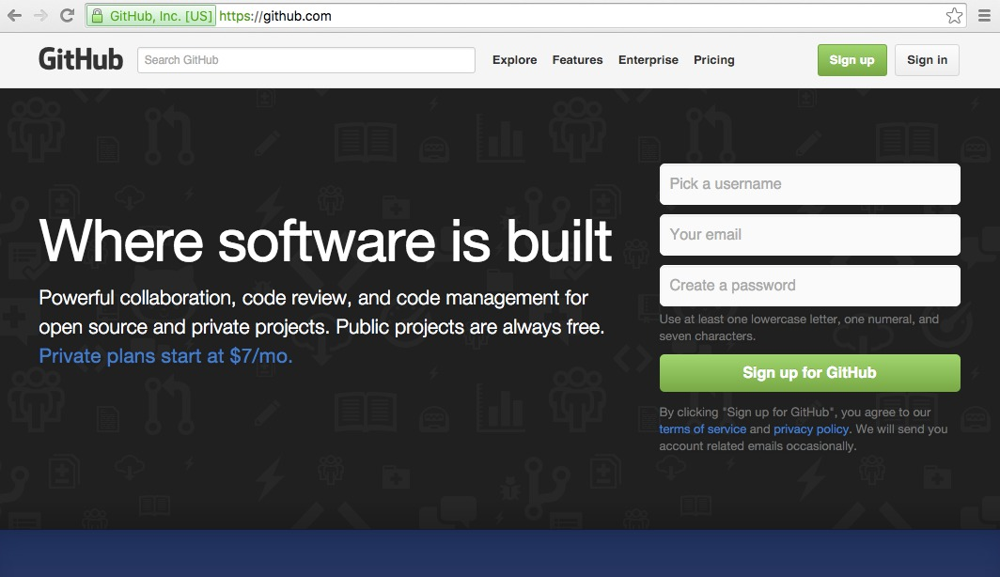
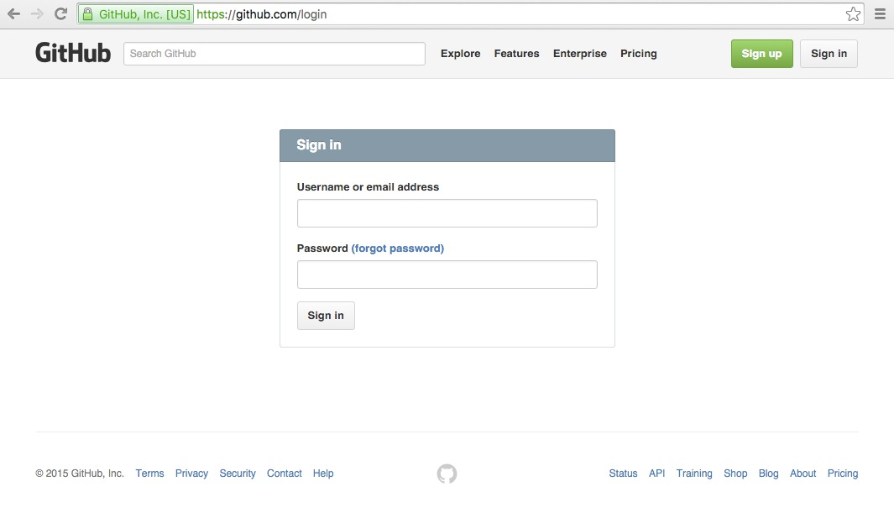

# Creating and Logging into your GitHub Account

First, open a web-browser and navigate to [https://github.com](https://github.com).

You should see something like this.

GitHub provides free GitHub accounts with free hosting for open projects.
To create a GitHub account, type in your desired username, email address
and password into the boxes and click "Sign up for GitHub". Follow
the instructions on those pages and you will have created an account.

To sign into your account, click the "Sign in" button, which is normally
on the top right of the screen. This will take you to the sign in page,
which may look like this

Type in your GitHub username (or the email address you used to sign up) 
and your password and you should then be logged in.

***

# [Back](github.md)
