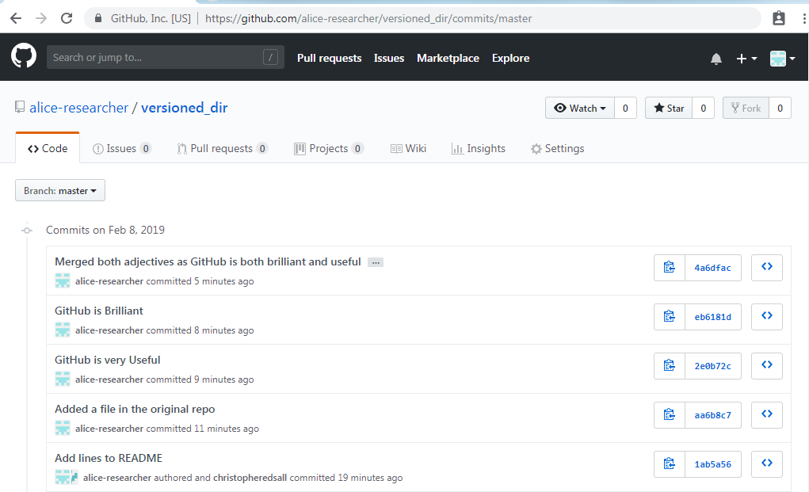

# Merging

One use-case for cloning a repository is so that you can work
on the same files from multiple different computers. Another,
and indeed defining use-case of Git, is so that multiple different
people can clone a single repository, and all make contributions
to it together.

Other people can only push changes to your cloud repository
if you give them permission. You can give other GitHub
users permission to push to your cloud repository by editing
the "Settings" of your repository. Click on the "Settings"
link (normally on the right), and then navigate to "Collaborators".
GitHub provides a search box to find people, based either
on their email address of GitHub username. Find the person you
want to add, and then click "Add collaborator".

## Conflict

A major problem of allowing multiple people to share and 
contribute to a single repository is that it increases
the probability of conflict. Conflict occurs when two 
people are trying to make different changes to the same
line of a file.

We are going to simulate a conflict by making conflicting
changes to our "original" and "cloned" `versioned_dir`
repositories.

First, change into the "original" `versioned_dir`

```
cd 
cd versioned_dir
```

Edit `README.MD` and set its content equal to

```
# Hello Useful GitHub

This is a README.MD file that will be used to describe this
repository on GitHub

This is an extra line of text added to the copy
of README.MD in the cloned repository
```

(we have added the word `Useful` to the title)

Commit this change and then push it to the cloud.

```
git commit -a
git push
```

Ensure that you use an informative commit message.

Now, change into the "cloned" repository

```
cd
cd tmpdir/versioned_dir
```

Now edit `README.MD` and set this equal to

```
# Hello Brilliant GitHub

This is a README.MD file that will be used to describe this
repository on GitHub

This is an extra line of text added to the copy
of README.MD in the cloned repository
```

(We have added the word `Brilliant` to the title)

Commit this change using `git commit -a`, making sure
you use a good commit message. However, now, run

```
git pull
```

to pull changes from the cloud. You should see an 
error message, that will look something like this

```
remote: Counting objects: 3, done.
remote: Compressing objects: 100% (2/2), done.
remote: Total 3 (delta 1), reused 3 (delta 1), pack-reused 0
Unpacking objects: 100% (3/3), done.
From https://github.com/chryswoods/versioned_dir
   46fefdd..6b653ec  master     -> origin/master
Auto-merging README.MD
CONFLICT (content): Merge conflict in README.MD
Automatic merge failed; fix conflicts and then commit the result.
```

Git has seen that the changes to the local repository conflict
with the changes in the cloud repository. Git reports this
in the `CONFLICT` line, with Git reporting that the conflict
is in `README.MD`. Where possible, Git will try to resolve 
conflicts automatically, by merging changes where possible.
However, if the changes occur on the same line, then automatic
conflict resolution is not possible, and you will need to
fix the conflict manually.

You can see this in more detail by typing `git status`. This
should print out something like

```
# On branch master
# Your branch and 'origin/master' have diverged,
# and have 1 and 1 different commit each, respectively.
#   (use "git pull" to merge the remote branch into yours)
#
# You have unmerged paths.
#   (fix conflicts and run "git commit")
#
# Unmerged paths:
#   (use "git add <file>..." to mark resolution)
#
#	both modified:      README.MD
#
no changes added to commit (use "git add" and/or "git commit -a")
```

This tells you that you have a conflict in `README.MD` that
needs to be fixed. Edit this file. When you open it, you will
see this

```
<<<<<<< HEAD
# Hello Brilliant GitHub
=======
# Hello Useful GitHub
>>>>>>> 6b653ec0a49ce966dd3aab3174db5930988b7ae4

This is a README.MD file that will be used to describe this
repository on GitHub

This is an extra line of text added to the copy
of README.MD in the cloned repository
```

The line that has a conflict is written twice. The first is the
version of the line in `HEAD`. The second is the version
of the line on the cloud repository, with the specfied Git 
commit ID. 

To resolve the conflict you need to choose which of the
two lines you want to use (or indeed, if you want to use
both lines). Edit the file and merge the lines together, 
set the contents equal to

```
# Hello Brilliant, Useful GitHub

This is a README.MD file that will be used to describe this
repository on GitHub

This is an extra line of text added to the copy 
of README.MD in the cloned repository
```

Once you have fixed the conflict, you need to tell Git that
you have manually merged the files. You do this by using
`git add` to re-add the file back to the repository, e.g.

```
git add README.MD
```

Now, run `git status`. You should see

```
# On branch master
# Your branch and 'origin/master' have diverged,
# and have 1 and 1 different commit each, respectively.
#   (use "git pull" to merge the remote branch into yours)
#
# All conflicts fixed but you are still merging.
#   (use "git commit" to conclude merge)
#
# Changes not staged for commit:
#   (use "git add <file>..." to update what will be committed)
#   (use "git checkout -- <file>..." to discard changes in working directory)
#
#	modified:   README.MD
#
no changes added to commit (use "git add" and/or "git commit -a")
```

You should see that Git recognises that you have fixed the conflict,
and is happy for you to commit the change.

```
git commit -a
```

Make sure that your commit message contains some information about
how you fixed and conflict, and why you merged in the way you did,
e.g.

```
Merged both adjectives as GitHub is both brilliant and useful

Note that the below lines are automatically added by Git

Merge branch 'master' of https://github.com/chryswoods/versioned_dir

Conflicts:
	README.MD
#
# It looks like you may be committing a merge.
# If this is not correct, please remove the file
#	.git/MERGE_HEAD
# and try again.


# Please enter the commit message for your changes. Lines starting
# with '#' will be ignored, and an empty message aborts the commit.
# On branch master
# Your branch and 'origin/master' have diverged,
# and have 1 and 1 different commit each, respectively.
#   (use "git pull" to merge the remote branch into yours)
#
# All conflicts fixed but you are still merging.
#   (use "git commit" to conclude merge)
#
# Changes to be committed:
#
#	modified:   README.MD
#
```

Now, run `git pull` again to make sure that nothing else has changed
while we were fixing the conflict.

```
git pull
```

You should see that everything is ok, and see something like

```
Already up-to-date.
```

Now everything is ok, you can `git push` the merge up to the
cloud repository.

```
git push
```

Finally, change back into your "original" `versioned_dir`, and use
`git pull` to check that you can pull in the new, merged, `README.MD`,
e.g.

```
cd
cd versioned_dir
git pull
```

You can follow the merge by taking a look at the commit history
on GitHub (visiting [https://github.com/USERNAME/versioned_dir/commits/master](https://github.com/USERNAME/versioned_dir/commits/master), 
where `USERNAME` is your GitHub username). For my repository, this 
looks like



## Workflow (multi-user)

A good workflow when working on a shared GitHub repository is

* `git status` to ensure your working directory is clean. If it isn't,
   then clean it up and `git commit -a` any changes.
* `git pull` the latest changes from other people. If there are any
  conflicts, then merge them now, then `git commit -a` and `git push`
  the merges to the cloud.
* Make changes to your files as you want.
* `git commit -a` your changes, and use `git status` to then ensure
  that your working directory is clean.
* `git pull` to pull in any changes that anyone else has made while 
  you were working. If there are any conflicts, then resolve those 
  conflicts and `git commit -a` until your working directory is clean.
* When `git pull` causes no changes and `git status` shows your working
  directory is clean, then use `git push` to push your work to the cloud
  repository.

***

## Exercise

Make some conflicting changes in your "original" and "cloned"
copies of `versioned_dir`. Try to commit and push both to the cloud.
What happens? Use `git pull` and then resolve the conflict. Once
you have resolved, use `git add` to signal that the conflicted file
has been resolved, and then `git commit -a` and `git push` the merged
file back up to the cloud.


***

# [Previous](cloning.md) [Up](README.md) [Next](pull.md)
