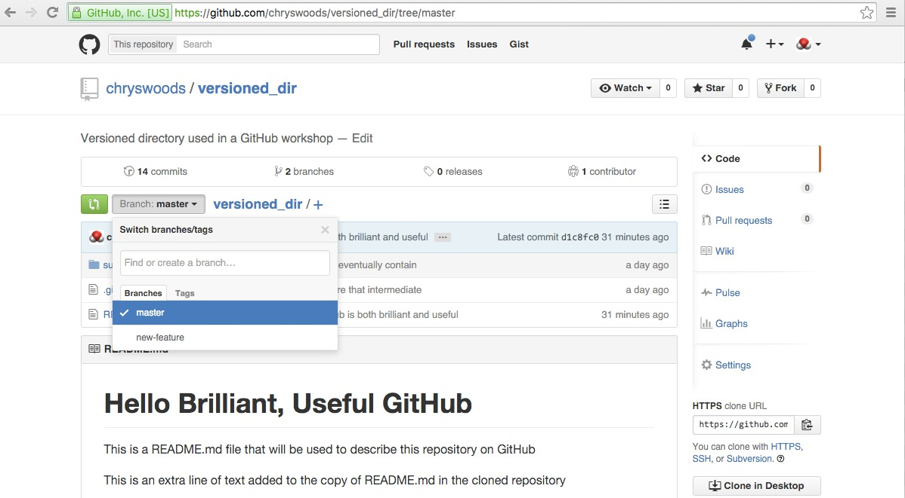
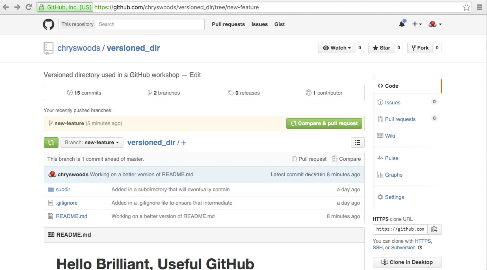
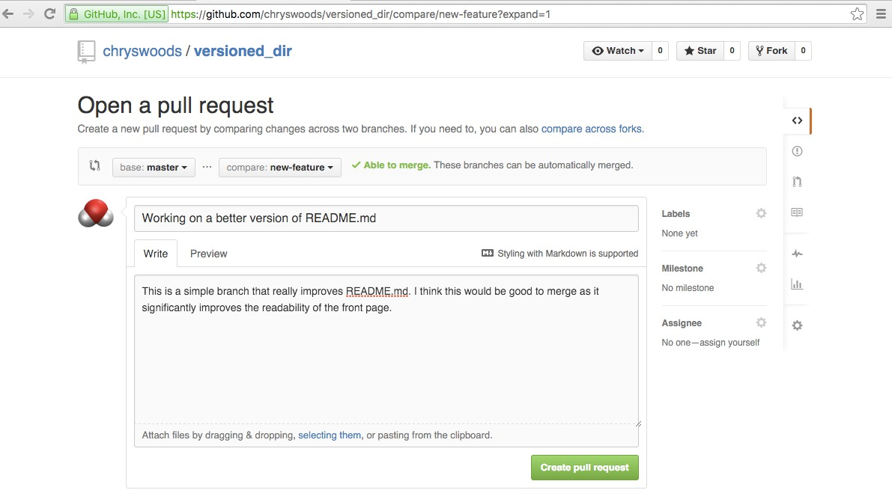
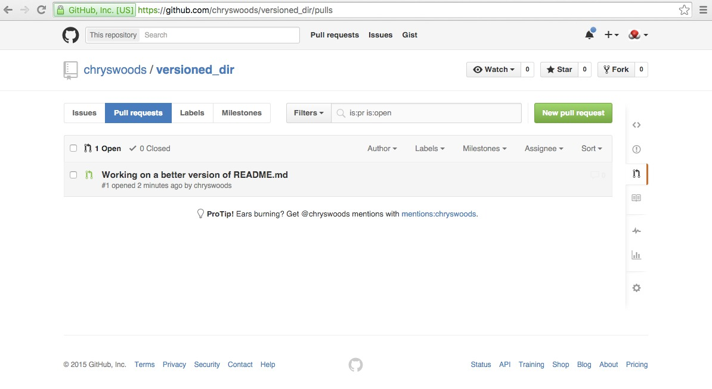
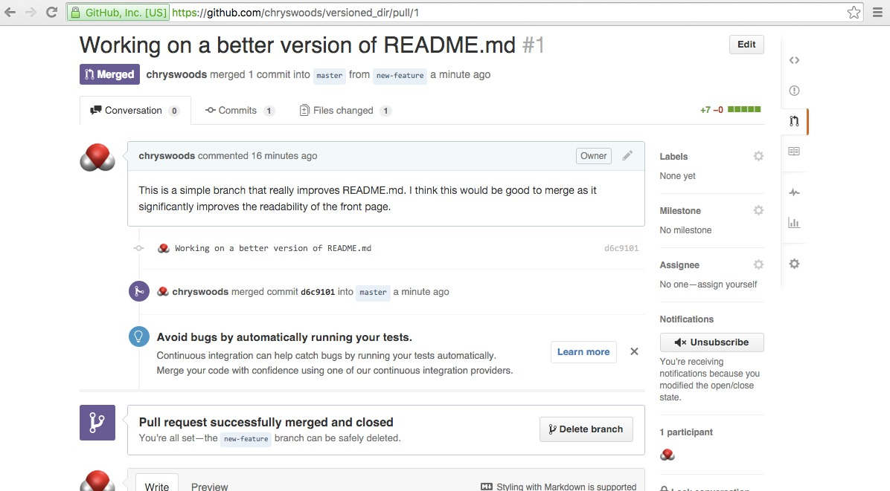
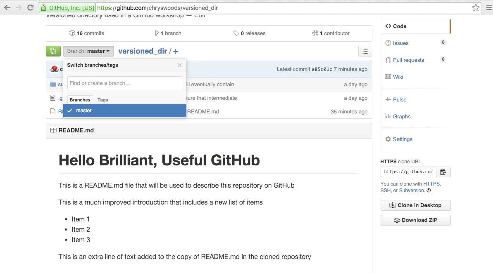

# Pull Requests

Working together on a shared repository can be very frustrating,
as you have to be very aware of what everyone else is doing,
and have to continually think about merging everyone's changes
together.

One way to simplify this process is to use branches. We used
branches before when we wanted to edit an old version of 
`versioned_dir`. The most common use of branching is to allow
you to work on your own, personal branch of the code, safe
in the knowledge that conflicting changes will not be made
by others. You can then merge in your changes by merging
in your branch, e.g.

```
o-o-o-o-o   master
 `o-o'      my-branch
```

The above diagram shows that you have created a `my-branch`
branch from `master`, which you have edited and committed.
Meanwhile, there have been other commits made to `master`.
You have then merged `my-branch` into `master`, and then 
further commits have been made to `master`.

## Branch in the cloud

First, we will create a branch of the "original" `versioned_dir`,
which will be pushed to the cloud. We will call this branch
`new-feature` (in general, it is good to call your branch something
that indicates the purpose of the branch, e.g. what feature is
being implemented).

```
git checkout -b new-feature
```

This will create and switch to a new branch called `new-branch`.

Now, push this branch to the cloud repository.

```
git push origin new-feature
```

(remember, we earlier created an alias that said that `origin` 
was equal to `https://github.com/USERNAME/versioned_dir.git`, where
`USERNAME` was your GitHub username)

This command pushes to `origin` your `new-feature` branch. This
will fail if a branch with this name already exists. It is good
practice to ensure that your branch has a unique name, e.g. 
it includes part of the your username.

If you look on GitHub, you should see that the `new-feature`
branch is visible in the "Branch" dropdown, e.g.



## Working on your branch

Now that you have your own branch, you are free to make changes
to it without worrying about conflict (assuming no-one is so rude
to make changes to your branch!). Let's make some changes, e.g.
edit `README.MD` to read

```
# Hello Brilliant, Useful GitHub

This is a README.md file that will be used to describe this
repository on GitHub

This is a much improved introduction that includes a 
new list of items

* Item 1
* Item 2
* Item 3

This is an extra line of text added to the copy 
of README.md in the cloned repository
```

Save the file and then commit the change

```
git commit -a
```

Now, when we push, we need to tell Git to push
changes from our local `new-feature` branch to the 
cloud `new-feature` branch. To do this, we run a modified
`git push` command

```
git push --set-upstream origin new-feature
```

This changes the branch we push to on origin to `new-feature`.
Note that we only have to do this once, when we first push to
the `new-feature` branch.

## Pull Requests

Once you have finished implementing your new feature, you need
to tell all of the other developers that you are ready to merge.
To do this, you issue a "pull request". A "pull request" is a 
request to the other developers that they should pull in the
changes made in your code.

To issue a pull request, use your browser to navigate to your
project on GitHub. Change the viewed branch to `new-feature`, and
then click the green "Compare and pull request" button, e.g.



This will open a form in which you can send a message requesting
that the changes in your branch are pulled into `master` (you 
can issue pull requests to merge into other branches by clicking
on the "base:master" button and choosing a different branch).

There is a space for you to add a message, which you should
use to describe your changes and say why your branch should
be merged.

GitHub will automatically check whether your pull request 
can be automatically merged. In general, it is good practice
for you to merge as much as you can yourself, so that it is
as easy as possible for others to merge your branch. However,
where this is not possible, make sure you say why you cannot
resolve all conflicts, and try to suggest how the conflicts
could be resolved. In this case, our commits can be automatically
merged, so add in a simple message, as shown below.



Once you are ready, click "Create pull request" and your
request will be made.

## Dealing with a pull request

You can see all pull requests by clicking on the "Pull Request"
icon on the right of the screen, e.g.



Clicking on this pull request will open up a forum that you can
use to discuss this request with other developers. If the pull
request can be automatically merged, then you can click "Merge 
Pull Request" to automatically merge and close the pull request.
Alternatively, clicking on "view command line instructions"
will show the commands you need to run to merge manually.

We are going to merge manually, using the "cloned" repository
to simulate a different user.

Change into the "cloned" repository

```
cd
cd tmpdir/versioned_dir
```

Use `git status` to ensure that your working directory is clean
and you are on the `master` branch. Run `git pull` to make sure
you have pulled in the latest changes.

Now, we will bring in the changes from the cloud `new-feature` branch.

```
git fetch origin
git checkout -b new-feature origin/new-feature
```

This pulls in all information from `origin`, and then checks out
the `new-feature` branch, ensuring that it tracks the `origin/new-feature`
branch. If you now type `git branch` you should see that you have
switched to the `new-feature` branch.

Next, we need to merge in all of the changes from `master` to `new-feature`.

```
git merge master
```

If there are any conflicts, you will need to resolve them, and you will
then need to commit the changes using `git commit -a` and `git push`
(in our case, the merge from `master` has not changed anything, so
`git commit -a` and `git push` are not necessary).

Now, switch back to the `master` branch, using

```
git checkout master
```

We now merge `new-feature` into `master`, using

```
git merge --no-ff new-feature
```

The `--no-ff` option is necessary and will ensure that an automatic
commit will be requested. This will open up your text editor to let
you write this commit message.
You should say that you are merging in response to a pull request.
This will now merge every change from `new-feature` into `master`, 
and you should see something like

```
Merge made by the 'recursive' strategy.
 README.md | 7 +++++++
 1 file changed, 7 insertions(+)
```

Finally, push to `origin` the changes that you have made to your
local copy of `master`

```
git push origin master
```

You should see something like

```
Counting objects: 1, done.
Writing objects: 100% (1/1), 259 bytes | 0 bytes/s, done.
Total 1 (delta 0), reused 0 (delta 0)
To https://github.com/chryswoods/versioned_dir.git
   d1c8fc0..a85c01c  master -> master
```

You will notice on github.com that GitHub has automatically
recognised that you have merged the pull request, and the page
should have automatically updated to look something like below



At this point the pull request has been closed. As the branch 
has now been merged, it can be deleted. Click "Delete Branch"
to remove this temporary branch from your GitHub cloud repository.

If you return to the main GitHub page for your repository, you
should see that the changes in `new-feature` have been merged,
and that `new-feature` has disappeared from the list of visible
branches, e.g.



## Ideal Workflow

The best way to use Git and GitHub for a multi-user project is
to make a lot of use of temporary branches and pull requests.

Whenever you want to implement a new feature, you should create
a new temporary branch. Give this branch a name that gives some
idea of who you are, and what feature you are implementing. Then,
make the changes, committing and pushing regularly.

When you have finished, do what you can to merge as much as possible
from `master` into your new feature branch. As far as possible, you
want your pull request to be automatically mergeable.

Then, issue a pull request, giving a useful message to other developers
to encourage them to put effort into merging your changes. Participate
in the resulting discussion on the pull request forum, and help
merge in all of the code.

Once ready, merge the pull request with the co-operation and help 
of other developers (and normally the blessing of the person/group that
manages `master`). Once merged, close the pull request and delete
the temporary branch.

While Git cannot help with the social problems of working on a multi-person
project, the above process of "branch and pull-request" makes it as
painless as possible, particularly if you have good communication 
in the pull request forum.

***

# [Previous](merging.md) [Up](README.md) [Next](ci.md)


