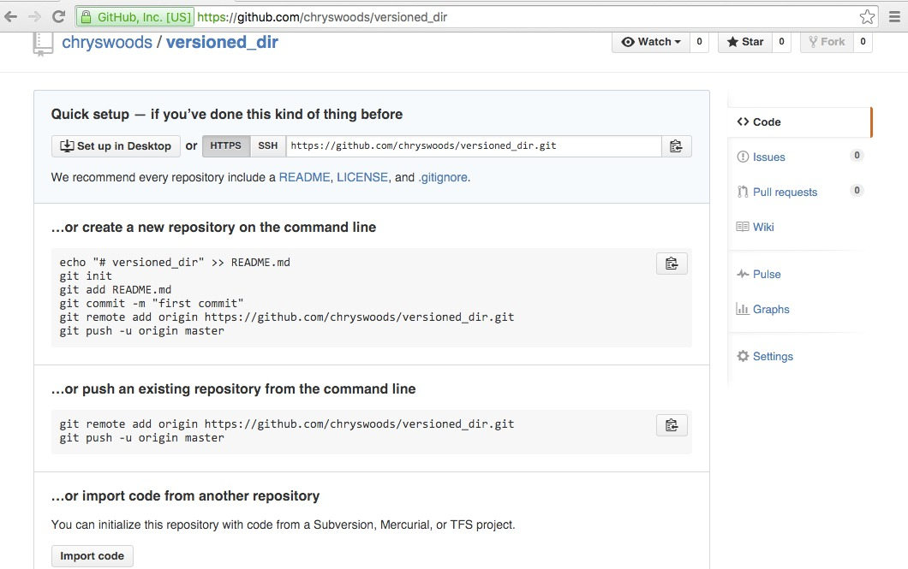
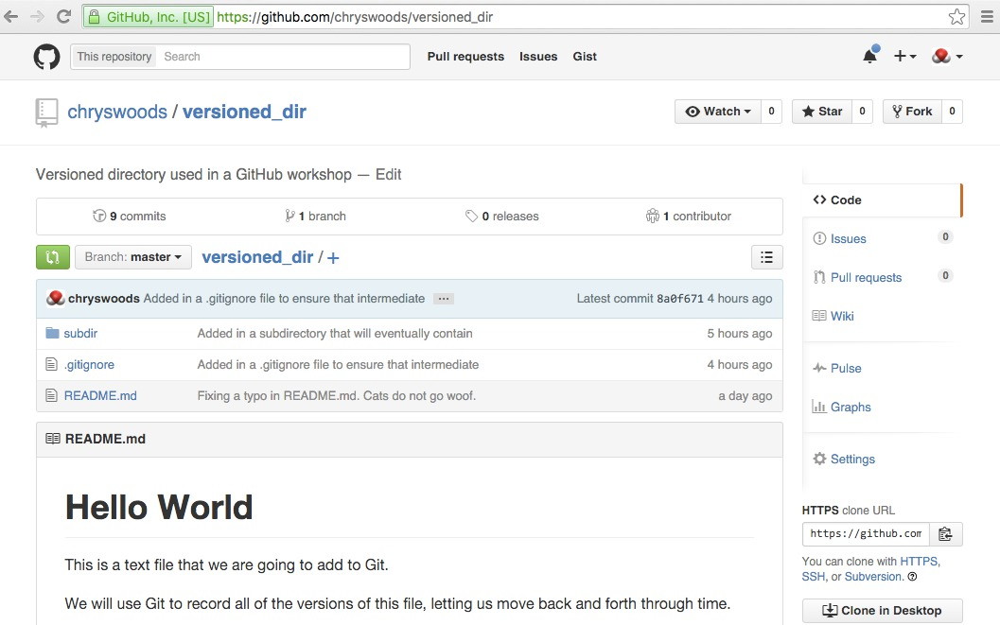
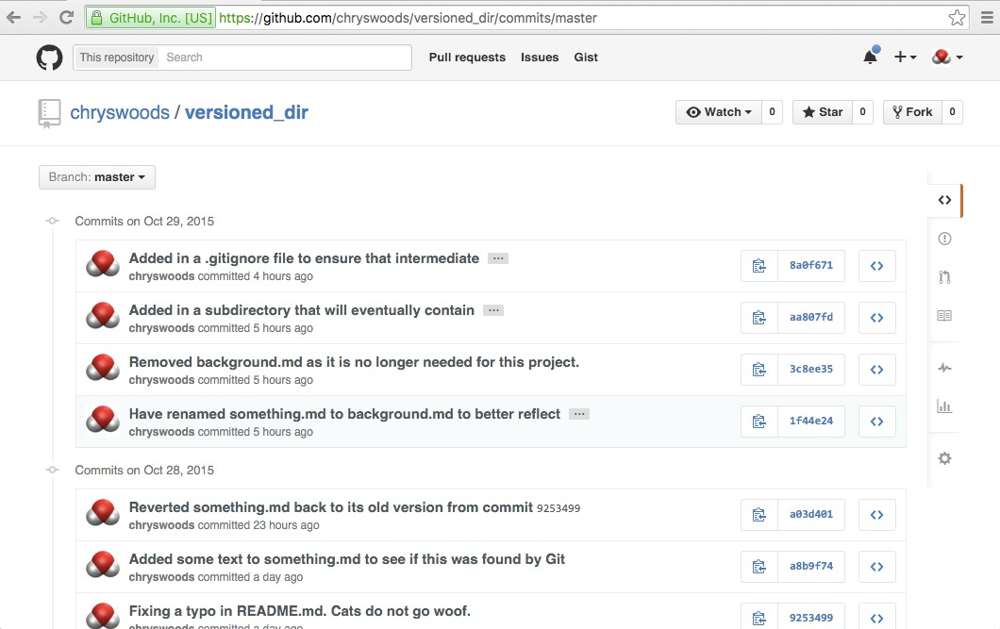
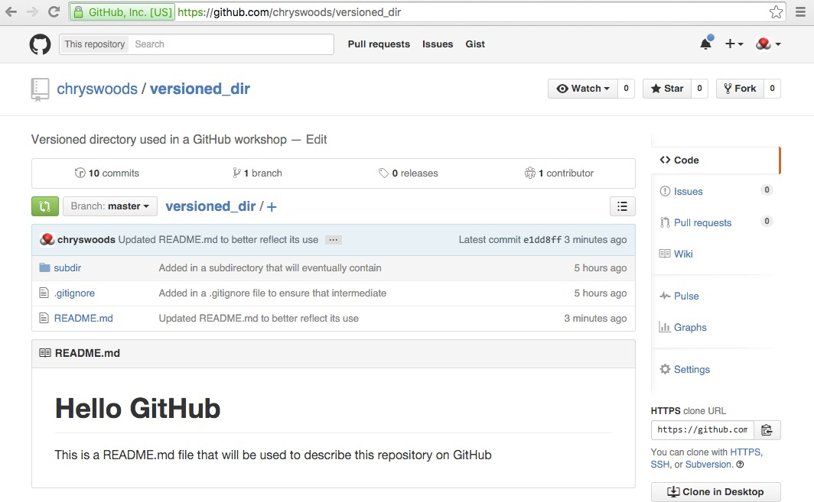
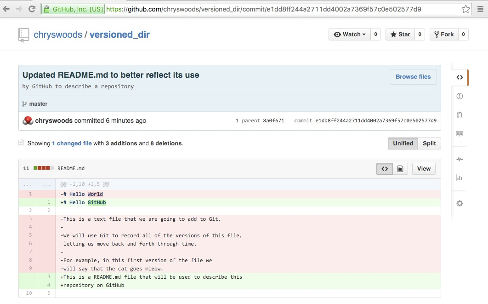

# Pushing to the Cloud

Now that you have created a new repository you have to supply
it with some version data. GitHub provides many ways in which you can
supply version data, which are helpfully described on the page
given to you when you create a new repository (as seen below). 
We are going to use the third of these options, which is to
push the version data from our local `versioned_dir` directory
into our cloud `versioned_dir` GitHub repository.



To do this, we need to tell Git running on our local machine, 
that it needs to use our GitHub cloud repository as a remote
repository. This is achieved using the `git remote add` command.

First, ensure that the `HEAD` is at the latest commit on the `master`
branch by typing

```
git checkout master
```

Use `git status` to double-check that your working directory is clean.

Now you will type the command

```
git remote add origin https://github.com/USERNAME/versioned_dir.git
```

where `USERNAME` is your GitHub username. My GitHub username is `chryswoods`,
so I would type

```
git remote add origin https://github.com/chryswoods/versioned_dir.git
```

(note that GitHub helpfully tells you exactly what to type in the third
option, e.g. find the above command in the picture above).

This command has told Git that we want to connect to a remote Git repository, 
which we are calling `origin`.

## Pushing all of the version information

The next step is to push all of the version information from our local 
`versioned_dir` repository to the remote GitHub cloud repository. We do
this by typing

```
git push -u origin master
```

You will be asked to type in your GitHub username and password.
(note that if you enabled two-factor authentication - 2FA - on GitHub,
then you will need to generate an [access token for command line use](https://help.github.com/articles/creating-an-access-token-for-command-line-use/)
and will need to use that instead of your password).

This tells Git to push all of the version information for the `master` branch
to `origin`, which is the alias for the remote GitHub repository.

If the command works, you should see something like this
(remembering to substitute "chryswoods" for your GitHub user name)

```
Username for 'http://github.com': chryswoods
Password for 'http://chryswoods@github.com': 
Counting objects: 25, done.
Delta compression using up to 16 threads.
Compressing objects: 100% (20/20), done.
Writing objects: 100% (25/25), 4.19 KiB | 0 bytes/s, done.
Total 25 (delta 2), reused 0 (delta 0)
To http://github.com/chryswoods/versioned_dir.git
 * [new branch]      master -> master
Branch master set up to track remote branch master from origin.
```

This output shows that Git has copied all of your version information
for the local `master` branch to `http://github.com/chryswoods/versioned_dir.git`.

The final line of output says that, in addition, there is now a new link
that will ensure that our local `master` branch will track the remote
`master` branch from `origin` (remembering that `origin` is just an alias
for `http://github.com/chryswoods/versioned_dir.git`).

So, what does this mean in practice? Open your web browser and navigate
to [https://github.com/USERNAME/versioned_dir](https://github.com/USERNAME/versioned_dir),
where `USERNAME` is your GitHub username. You should see something like this



You should be able to see that all of your files are available on GitHub.
By default, if your repository contains a file called `README.MD`, then this
is rendered and displayed at the bottom of the page (hence why we originally
called this file `README.MD`, and also why you can now see it rendered nicely.
We will go into more about this later...)

Click on the button that says "9 commits" (in your case you may have a different
number - just look for "N commits", next to the icon that says "1 branch").

This will take you to a page where you can see all of the commits that were
made to the `master` branch, e.g. as here



Feel free to click on any of the commits. You should see a nice page that
shows exactly what changed in the commit. For example, clicking on the commit
in which we corrected the "cat goes woof" to the "cat goes mieow" shows


Pretty cool right?

## git push

Every time you want to push commits from your local repository to the cloud 
repository, you have to use a `git push` command. For example, edit 
the `README.MD` file,

```
nano README.MD
```

and change it so that the contents now read

```
# Hello GitHub

This is	a README.MD file that will be used to describe this
repository on GitHub
```

Run `git status`. You should see that Git knows that `README.MD` has
been modified.

Run `git commit -a` to commit this modified `README.MD` to the local
repository. Make sure you use a good commit message.

The last `git commit -a` command has saved this change as a new version
of the `master` branch of the local repository. To copy this version
to the cloud repository, you now need to type

```
git push
```

You will be asked your for your github username and password, and should
see output similar to

```
Username for 'http://github.com': chryswoods
Password for 'http://chryswoods@github.com': 
Counting objects: 5, done.
Delta compression using up to 16 threads.
Compressing objects: 100% (3/3), done.
Writing objects: 100% (3/3), 454 bytes | 0 bytes/s, done.
Total 3 (delta 0), reused 0 (delta 0)
To http://github.com/chryswoods/versioned_dir.git
   8a0f671..e1dd8ff  master -> master
```

Now, reload the GitHub page for your repository in your web browser
(e.g. [https://github.com/USERNAME/versioned_dir](https://github.com/USERNAME/versioned_dir),
where `USERNAME` is your GitHub username).
 
You should see that the number of commits has increased, and that
the new `README.MD` file is being shown, e.g. as in here



If you navigate to the commit page for this latest commit, then 
you should be able to find the information for the latest commit,
e.g. as here



To ensure that your local and cloud repositories are kept in sync,
always ensure that you use `git push` after you `git commit -a`.

## Note - Everything free on GitHub is PUBLIC

Unless you have paid for a private repository, then everything you
push to GitHub will be public. This means EVERYTHING, of EVERY version
on the branch you push. If you are using a public repository make 
sure that you;

* NEVER push passwords or sensitive data to the repository.
  Make sure that you never save a password in a version controlled
  directory, or else you risk accidentally uploading it to the cloud.

* NEVER push private or unpublished research data. By pushing to
  a public repository you are making the file (and all its previous
  versions) public. Don't push a file that you don't have permission
  to publish. Don't push sensitive or private research data. Don't
  push grant proposals or research papers (at least, not before
  they have been awarded or published!).

* BE CAREFUL of offensive commit messages. It is a bad idea to
  be abusive or condescending in your commit messages, particularly
  as they will become public when you push them into a public
  repository. Avoid commit messages like "Fixed this annoying
  piece of rubbish code written by Fred", as "Fred" is likely
  to see that comment once it is published.

## Note - Saving your username and password

Instructions to tell `git` to save your GitHub username and password
are available [here](https://help.github.com/articles/caching-your-github-password-in-git/#platform-all).

Essentially, you need to type;

```
git config --global credential.helper 'cache --timeout=3600'
```

to tell `git` to save your password in memory for one hour. 
You can test this by typing `git push`, which will first ask you for your
username and password. However, this will now be saved, so that if you
type `git push` again, then you won't need to enter the details again.

## Note - Responding to Changes in Git policy

Occasionally Git will change the way it works. Whenever it does this, it
will give you a useful message telling you how to change things. For example,
you may see the following message when you use `git push`

```
warning: push.default is unset; its implicit value is changing in
Git 2.0 from 'matching' to 'simple'. To squelch this message
and maintain the current behavior after the default changes, use:

  git config --global push.default matching

To squelch this message and adopt the new behavior now, use:

  git config --global push.default simple

See 'git help config' and search for 'push.default' for further information.
(the 'simple' mode was introduced in Git 1.7.11. Use the similar mode
'current' instead of 'simple' if you sometimes use older versions of Git)
```

Git tells you how to remove this message, you just have to choose
one of the commands. In this case, there is no reason not to adopt the
new behaviour of Git, so we can type

```
git config --global push.default simple
```

and adopt the new `simple` push behaviour. Now, when we type `git push`
we will only see

```
Everything up-to-date
```

***

# [Previous](github.md) [Up](README.md) [Next](markdown.md)
