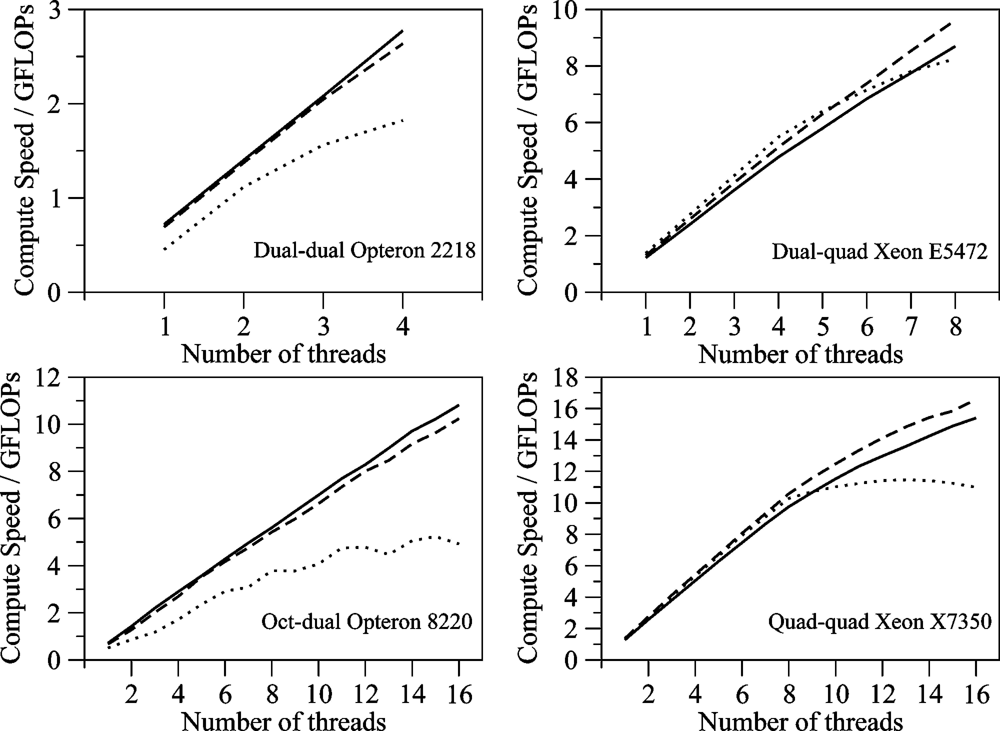

#Case Study

The paper [Multicore Parallelization of Kohn-Sham Theory](http://dx.doi.org/10.1021/ct900138j) 
presents an OpenMP parallelisation of a Density Functional Theory (DFT) calculation. 
The calculation is performed within the quantum chemical program 
[Molpro](http://www.molpro.net/). Molpro is a large (1.5 million lines of code) 
program written in a variety of versions of Fortran. Benchmarking revealed 
that the bottleneck of the calculation was the numerical integration of integrals 
using a quadrature grid. We thus decided to use OpenMP to parallelise this 
calculation by using an OpenMP loop to map batches of grid points for 
evaluation to different threads, and to then use OpenMP reduction to sum 
together the sum of the integral evaluations at each grid point.

To achieve this, we had to restructure the way that Molpro represented the 
quadrature grid and basis functions for the integrals. We decided that we would 
write the code in C++ as this would let us have greater control of which data was 
thread-local and which was global, and it allowed us to create objects that 
represented different bits of data in the calculation (e.g. Grid, Orbital, 
Matrix etc. - if you compare the Fortran, C and C++ examples in this workshop 
you will see that the OpenMP directives for C++ are much easier as the 
private directive is not needed). Rather than rewrite the whole of Molpro 
in C++ (which would have taken years!) we just rewrote the function that 
performed the numerical integration in C++, and then linked this new C++ 
function into the Fortran program. This works, as C++ and Fortran are both 
compiled to machine code, and there are now standard methods for calling 
Fortran functions from C++, and for calling C++ functions from Fortran.

Rewriting the code in this way allowed us to speed up the DFT calculation 
in Molpro by over 10 times on a 16 core Intel Xeon (a quad-socket quad-core node). 
The rewrite itself took a few months, the majority of which were spent thinking 
about how to restructure the algorithm so that it could be easily parallelised using OpenMP.

The above graphs show the scaling behaviour of the resulting code as a function 
of the number of OpenMP threads. Three calculations were performed on 
each of the four different benchmark platforms, with each calculation 
using a sequentially larger data size. This allowed us to benchmark how 
well the code scaled as we increased the number of cores, and also how 
the code behaved as the amount of data to process became larger than 
the bandwidth between main memory and the processor (the solid line 
is the smallest problem, the dashed line is the medium problem and the 
dotted line is the large problem). This kind of benchmarking is invaluable 
when writing parallel code, and is also useful for machine evaluation, 
e.g. in this case we can see that the Intel Xeon processors have more 
bandwidth so cope better than the Opterons as the problem size increases. 
It should be noted that the Opterons tested here were much older 
than the Xeons, and that modern Opterons are likely to be comparable to modern Xeons.

***

# [Previous](performance.md) [Up](README.md) [Next](whatnext.md) 
