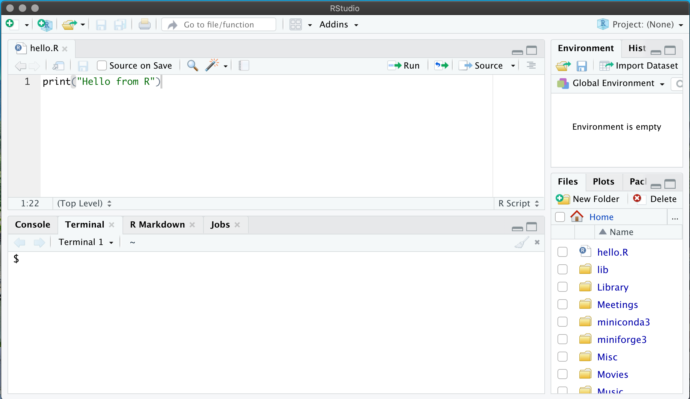
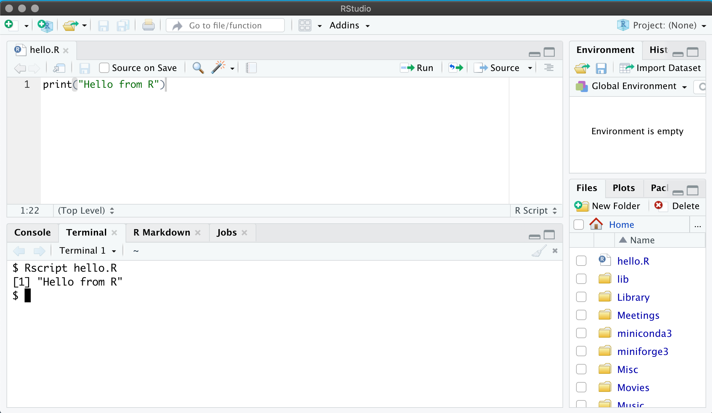

```{r setup, include=FALSE}
knitr::opts_chunk$set(echo = TRUE)
```

## Writing our first script

An R script is a simple text file containing a set of instructions. 
As long as these instructions are written in the "R Programming Language" then 
the computer will be able to understand them and perform the tasks we've asked.

To create our script, go to the text editor pane in RStudio and type into it:

```R
print("Hello from R")
```

then go to File → Save and choose the save the file as "hello.R".

We've just saved our R script with the name "hello.R". We could have used any name
we wanted. We chose "hello.R" as this is descriptive. The use of ".R" at the end
is a sign to other people that this text file contains commands written in the 
R programming language.



## Running our script

To run the script that we've just written and saved, we move to the pane on the bottom
with the label "Terminal". This pane gives us access to a command line interface to 
our computer. This is the same interface that you have in a Command Prompt in Windows 
or a Terminal on MacOS or Linux. We type commands in here and the computer runs 
the programmes we ask it to.

The only command we need to know about here is Rscript which we run by typing 
Rscript in that window, followed by a space, followed by the name of our 
script file (including the ".R" extension) and then pressing enter:

```
Rscript hello.R
```

If you do that you should see, printed to the terminal:

```
[1] Hello from R
```



Congratulations, you've just written and executed your very first R programme!

## Explanation

This was a simple script. R is a language designed to help you write everything 
from small and simple scripts to large complete programs. In my opinion 
R is one of the best data analysis and statistical programming languages. 

This script has introduced three of the basic building blocks of R;

* A function `print`. Functions are instructions that tell R to do something, 
in this case print tells R to print the following string to the screen. 
Functions are "called" by following them with a pair of parentheses (). 
Whatever we put between those parentheses are called "arguments" and specify 
exactly what the function should do.
* A string "Hello from R". A string is just a piece of text, which can contain 
multiple lines. Strings are enclosed in double quotes.
* A line of code `print("Hello from R")`. A line of code forms a complete instruction 
which can be executed by R. R executes each line of code, one at a time in order, 
moving from the top of the file downwards until it reaches the end of the file.

Important things to remember for this section are:

* Always save your R scripts after making a change (the file name will change red
and have a "*" next to it if you haven't saved the file)
* Always give your R scripts a ".R" extension
* R code goes in the text editor window while you run the script from the terminal window

## [Previous](index.html) | [Next](data_types.html)
