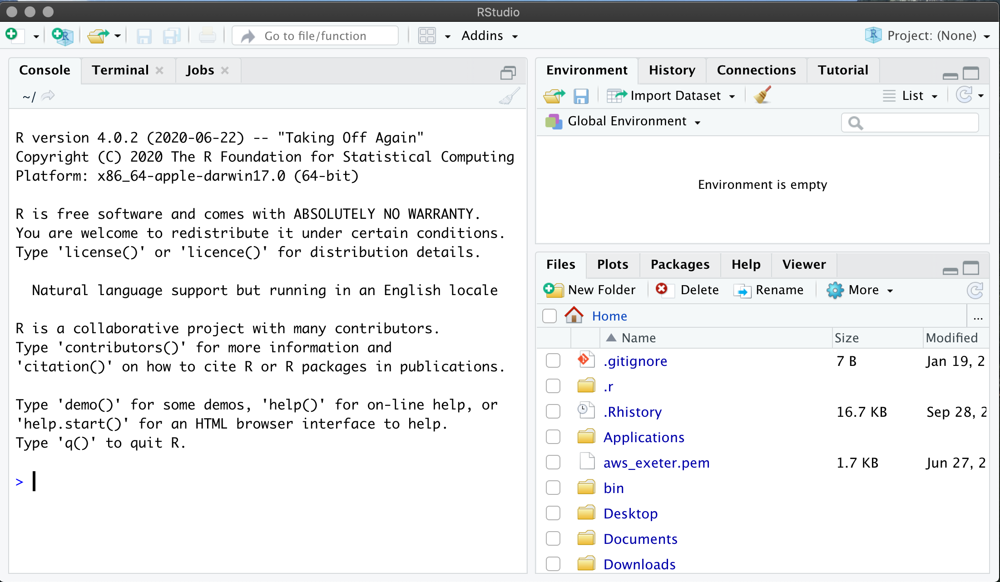
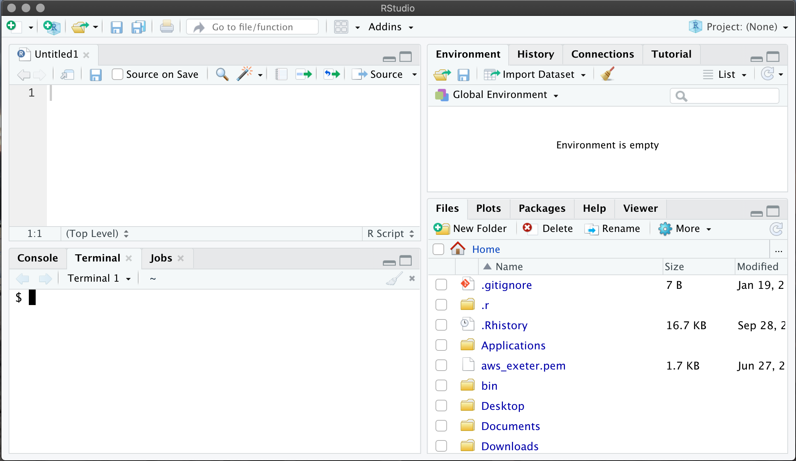
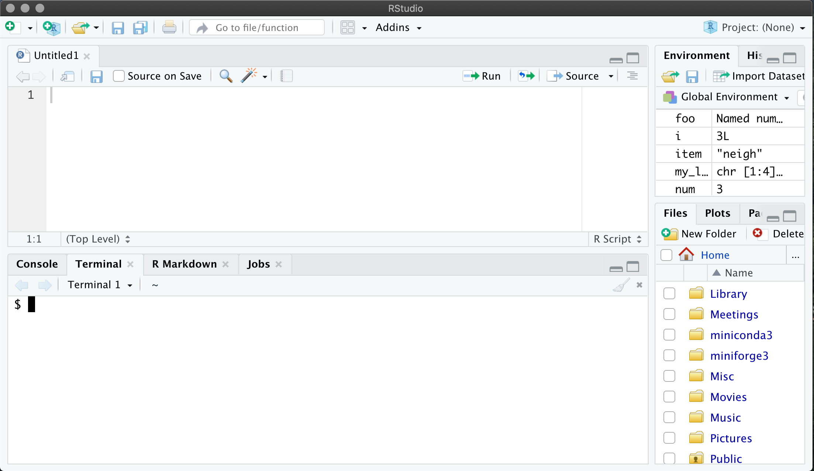

```{r setup, include=FALSE}
knitr::opts_chunk$set(echo = TRUE)
```

R is a programming language which allows us to give instructions to the computer. 
These instructions can be as simple as "add together these two numbers" or as 
complex as "give me the average CO2 concentration for 2020". For the former we 
will be able to complete the task using only a single instruction but for the latter, 
we may have to write a larger program containing hundreds or thousands of instructions.

This course is going to start from the beginning, showing you to talk to the computer 
to perform simple tasks. This course does not assume any knowledge of programming.
Indeed, this course is designed for people who are completely new to programming.
The aim is to introduce you to enough of the R programming
language, that, as you become more confident and follow the later courses (e.g.
[Intermediate R](https://chryswoods.com/intermediate_r) and 
[Introduction to Data Analysis with R](https://chryswoods.com/data_analysis_r)), 
you will find that you are able to write much more complex programmes and
understand how to exploit the power of R for data analysis and visualisation.

R is a well-established language, initially released in 1995 (with version 1.0 in 2000),
and the latest release (4.0.2) released in 2020. R is a general programming language, 
but has found particular application in statistical and data driven programming. It has
become the de facto standard programming language of data science.

R is available for all operating systems, including Windows, OS X and Linux. It
is not installed by default. It is typically installed as part of an R programming
environment, e.g. [RStudio](https://rstudio.com), the Open Source version of which
can be [downloaded from here](https://rstudio.com/products/rstudio).

This workshop is going to introduce you to the basics of the R programming language 
with more advanced topics being covered by later workshops.

You can jump ahead to any chapter (and pre-recorded video walkthroughs of 
each chapter is avaiable at the link):

1. [Getting started](getting_started.html) - [walkthrough video](https://youtu.be/kpXGXyo8j9E)
2. [Data types](data_types.html) - [walkthrough video](https://youtu.be/lUqm8SMQPO0)
3. [Lists](lists.html) - [walkthrough video](https://youtu.be/a-O3QU8nZOk)
4. [Loops](loops.html) - [walkthrough video](https://youtu.be/z7MJmYBLvC8)
5. [Conditionals](conditionals.html) - [walkthrough video](https://youtu.be/72DSSuss-k8)
6. [Dictionaries](dictionaries.html) - [walkthrough video](https://youtu.be/vOEsLbRZXb0)
7. [Files](files.html) - [walkthough video](https://youtu.be/Wpj4Jui94E4)
8. [Summary](summary.html) - [walkthrough video](https://youtu.be/1td7vZc2TZg)

## Installation videos

To follow this workshop you must install both R and RStudio. Instructions to 
do this are below. Videos demonstrating installation on Windows 10, Ubuntu Linux
and macOS Catalina are here;

* [Installing on Windows](https://youtu.be/K5FQoepK8YI)
* [Installing on Linux](https://youtu.be/WpNd6j1nvEE)
* [Installing on macOS](https://youtu.be/N2Jt1-iC5MU)

## Installing R

Because R is not installed by default on most computers, you will need to download
and install it before continuing with this workshop. R is available for many
operating systems, including Windows, Linux and OS X. You will need administrator
access to install R on your computer. If you don't have administrator access,
then your IT Services may have made it available via a software catalogue
or software center. If not, then get in contact with your IT Services to
install R.

If you have administrator access or elevated user rights, you can download and install
R by following the [links on this page](https://cran.r-project.org). For convenience,
the download links are;

* [Windows](https://cran.r-project.org/bin/windows/base/)
* [Linux](https://cran.r-project.org/bin/linux/) - choose your distribution from here
* [OS X](https://cran.r-project.org/bin/macosx/)

Follow the instructions on those pages to download and install R. 

## Installing RStudio

There are lots of different ways to run R code and many tools to help you write it. 
You don't require any special tools to create a R script, a simple text editor 
like Notepad on Windows is sufficient. More advanced tools include things 
like Jupyter Notebooks and IDEs like RStudio or Visual Studio Code.

For this workshop we will be keeping things as simple as possible in order to 
allow us to focus on the topics we're learning without having to learn too 
many extra tools along the way.

For the purpose of this course we will be using a free and open source version 
of RStudio. This provides a graphical interface with a local text editor,
interface to the operating system terminal, and an interactive R console.
Again, you need administrator access or elevated user rights to install
RStudio on your computer. If you don't have this, then your IT Services
may have made RStudio available via a software catalogue or software center.
If not, then get in touch with your IT Services to install RStudio for you.

If you do have administrator access or elevated user rights, then 
the easiest way to get access to RStudio is to download the free "open source edition"
of "RStudio Desktop" [from the website](https://rstudio.com/products/rstudio/),
and to then follow the instructions on the website to install the version
that is appropriate for your operating system.

## Setting up your workspace

Once RStudio is installed, start it by double-clicking on the "RStudio" icon.
This should open a window that looks something like this;



The way that we will be setting up the space is to have a text editor on the 
top left of the screen and a terminal on the bottom left. 
We'll use the editor to write our code and the terminal to run it.

To do this, click on the menu "File" and then "New file" and then "R script".
This will create a new text file called "Untitled1" and will open the text
file at the top left of the screen.

Next, on the tab reading "Console", "Terminal", "Jobs", click the "Terminal" 
tab. This will open a terminal that will let you type commands directly
to your computer. The contents of the terminal will be different on different
computers, but that's ok. On Linux and OS X this will likely be a bash (or similar) prompt,
while on Windows this will likely be a command prompt.



Finally, we will drag the divider across so that the text file and terminal 
have more space, e.g.



We're now ready to get started!

# [Next](getting_started.html)
