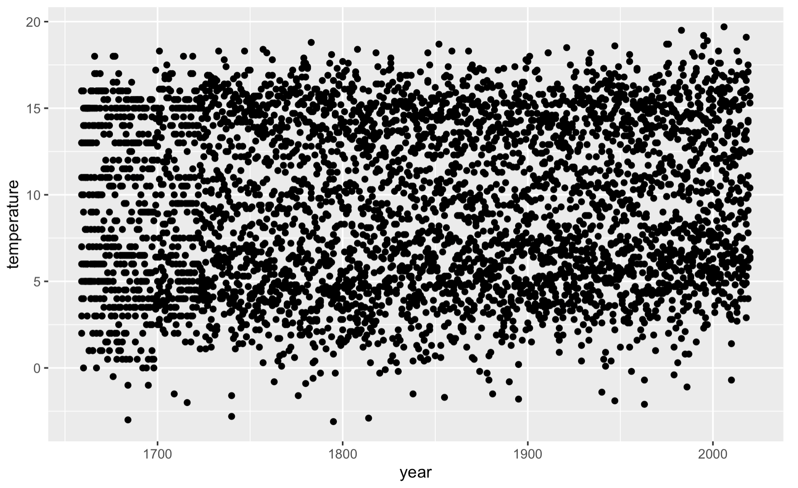
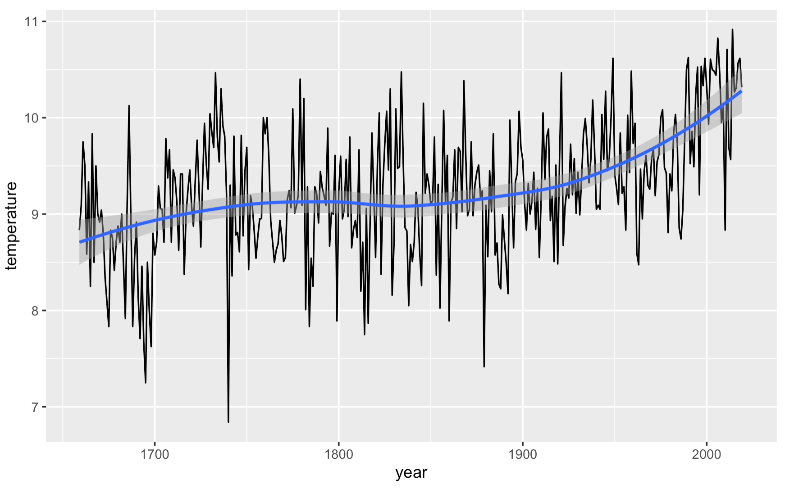
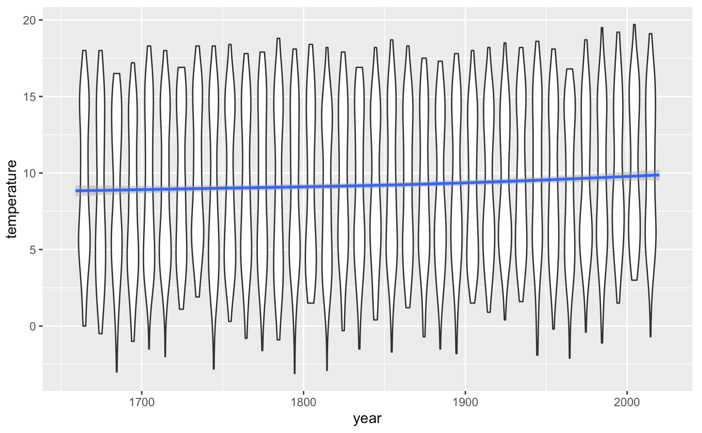

```{r setup, include=FALSE}
knitr::opts_chunk$set(echo = TRUE)
```

# Plotting data

Plotting of data in modern R is handled by 
[ggplot2](https://ggplot2.tidyverse.org), which is installed as part of the tidyverse.
There is an [excellent cheat sheet](https://github.com/rstudio/cheatsheets/blob/master/data-visualization-2.1.pdf)
and a great free online book,
[ggplot2: Elegant graphics for data analysis, by Hadley Wickham, Danielle Navarro, and Thomas Lin Pedersen](https://ggplot2-book.org).

We cannot cover all of [ggplot2](https://ggplot2.tidyverse.org) in this workshop, 
so you are strongly encouraged to read the book and cheat sheet. For today,
we will give a quick overview of how to create some simple graphs.

First we load the `tidyverse` in the same way as previously;

```R
library(tidyverse)
```

Next we will load some data to plot. We will use the climate data from the previous
section (available from [cetml1659on.txt](https://chryswoods.com/data_analysis_r/cetml1659on.txt)).

Plotting works best with tidy data, so we will load and tidy the data as in the previous
section;

```R
temperature <- read_table(
    "https://chryswoods.com/data_analysis_r/cetml1659on.txt",
    skip=6,
    na=c("-99.99", "-99.9"),
    col_types=cols("DATE"=col_integer())
)

month_levels <- c("JAN", "FEB", "MAR", "APR", "MAY", "JUN",
                  "JUL", "AUG", "SEP", "OCT", "NOV", "DEC")

historical_temperature <- temperature %>%
    select(-YEAR) %>%
    pivot_longer(c("JAN", "FEB", "MAR", "APR", "MAY", "JUN",
                   "JUL", "AUG", "SEP", "OCT", "NOV", "DEC"),
                 names_to="month",
                 values_to="temperature") %>%
    rename(year=DATE) %>%
    mutate(month=factor(month, month_levels))
```

Next, we will use `ggplot` to draw a graph (we will explain how 
this works after drawing).

```{r}
ggplot(historical_temperature, aes(x = year, y = temperature)) + geom_point()
```

You should see a graph similar to this;



This command has drawn a scatter plot of the data contained in the tibble
`historical_temperature`, putting the `year` column on the x-axis, and
the `temperature` column on the y-axis.

`ggplot` is written to follow a specific "grammar of visualisation". 
There are three key components;

1. data,
2. A set of *aesthetic mappings* between variables in the data and 
   visual properties of the graph, and
3. one or more *layers* that describe how to render each observation.

These are entered via the general form;

```R
ggplot( data, aesthetic ) + layer1 + layer2 + layer3...
```

The `data` is a tibble containing tidy data with one observation per row,
and one variable per column.

The `aesthetic` is a mapping specified via the `aes` function, which
maps the variables to axes, colours or other graphical properties.

The layers (`layer1`, `layer2` etc) are specific renderings of the data,
e.g. `geom_point()` will draw points (scatter plot), `geom_line()` 
will draw lines (line graph) etc.

## Plotting the analysis

You can combine analysis with plotting, e.g. here we plot the average
yearly temperature as a line graph;

```{r}
ggplot(historical_temperature %>%
           group_by(year) %>%
           summarise(temperature=mean(temperature)), 
       aes(x = year, y = temperature)) +
    geom_line() + 
    geom_smooth()
```

Here we've added two layers; `geom_line()` to draw a line graph, 
and `geom_smooth()` to add a fitted line with errors.



We could do more. For example, here we add a new variable (column)
to the data that is the decade in which the observation was taken;

```R
historical_temperature["decade"] <- (historical_temperature["year"] %/% 10) * 10
```

(`%/%` means "integer division", so `1655 %/% 10` equals `165`, which
becomes `1650` when multiplied by `10`)

This enables us to draw a line graph of the average temperature 
each decade;

```R
ggplot(historical_temperature %>%
           group_by(decade) %>%
           summarise(temperature=mean(temperature)), 
       aes(x = decade, y = temperature)) + 
       geom_line()
```

A line chart is not a good choice for this plot, as it doesn't
show the underlying statistics of the average. Instead, a
box-and-whisker or violin plot would be better. To use this,
we need to specify the grouping in the aesthetic, e.g.

```R
ggplot(historical_temperature, 
       aes(x = decade, y = temperature, group=decade)) + 
       geom_violin()
```

Finally, the global aesthetic set in `ggplot` can be overridden by 
setting it in the layers themselves. For example, here we overlay
a smooth line over the violin plot;

```R
ggplot(historical_temperature, 
       aes(x=year, y = temperature)) + 
       geom_violin(aes(group=decade)) + 
       geom_smooth()
```

Note how the group aesthetic has to be set only for the violin plot.



You can save your plots to a file using the 
[ggsave](https://ggplot2.tidyverse.org/reference/ggsave.html) function.
This will save the last plot drawn to a file, with filename, size,
format etc. all controlled via arguments to this function, e.g.

```R
ggsave("violin.pdf", device="pdf", dpi="print")
```

would save the plot to a file called `violin.pdf`, in PDF format,
using a resolution (dpi) that is suitable for printing.

> EXERCISE
>
> Play with graphs


## [Previous](analysis.html) | [Next](prettier.html)

