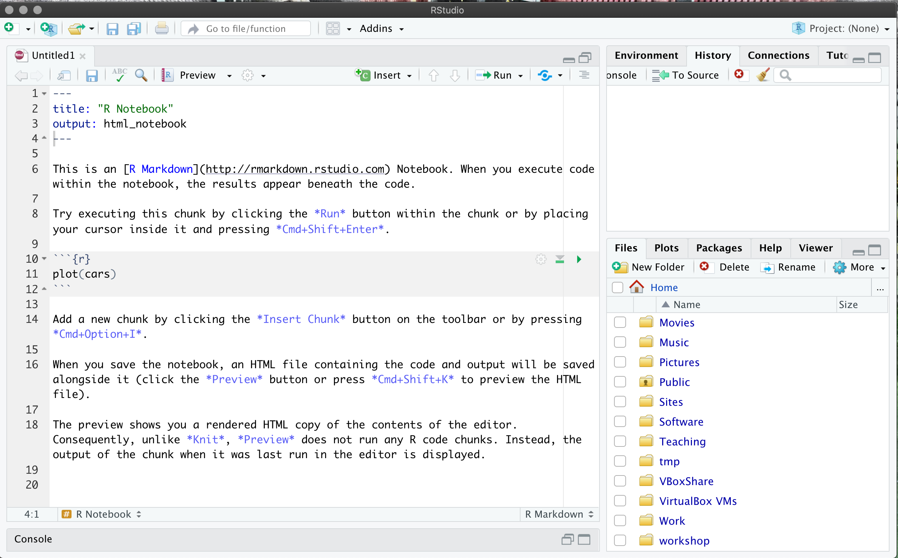
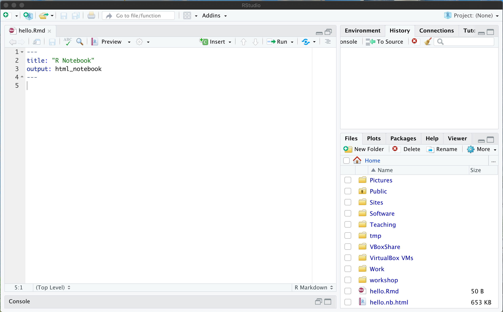
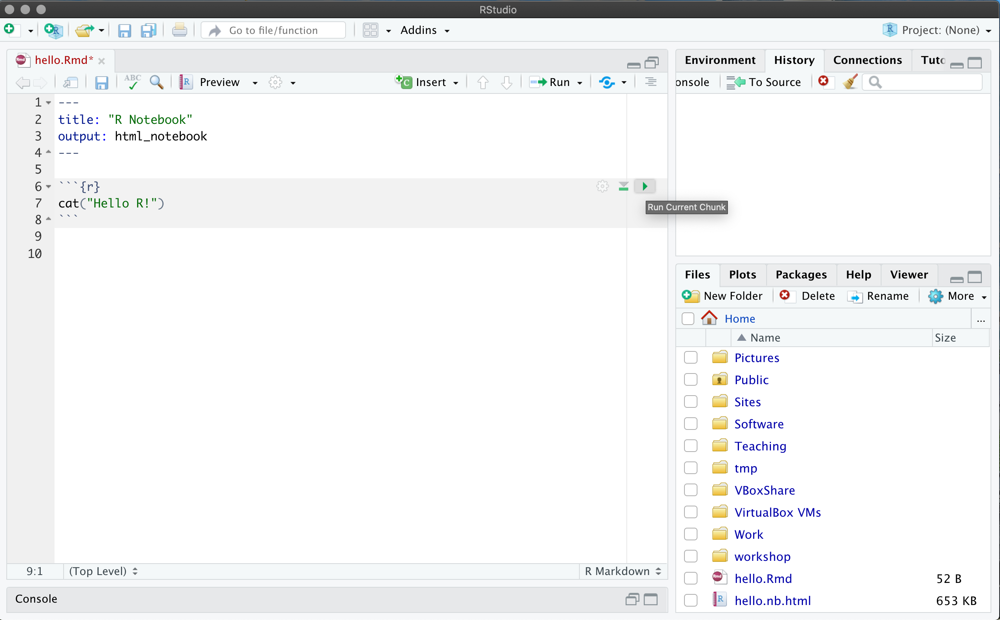
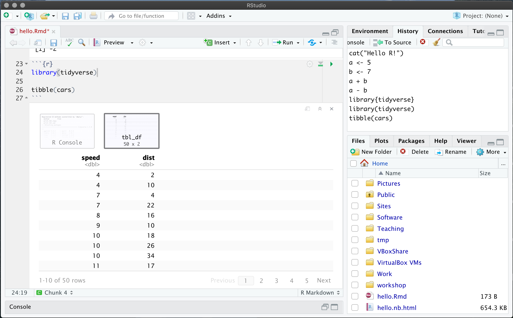
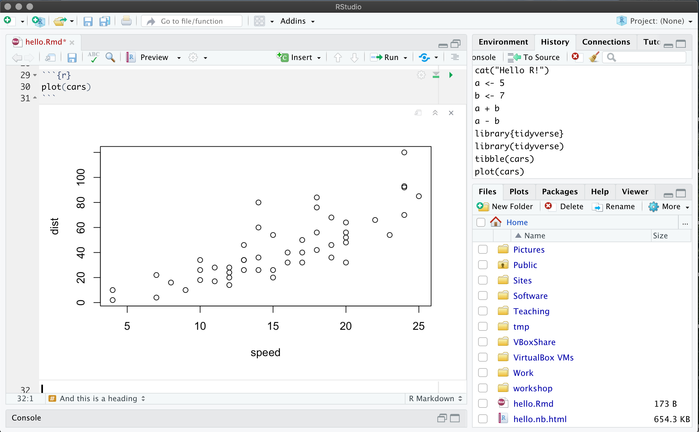

```{r setup, include=FALSE}
knitr::opts_chunk$set(echo = TRUE)
```

This course is aimed at the intermediate R developer who wants to learn 
how to do useful data analysis tasks in R. It will focus on "modern R",
specifically using the [tidyverse](https://www.tidyverse.org) collection
of packages which are designed for data science.

Data analysis is a huge topic and we couldn't possibly cover it all in 
one short course. The purpose of this workshop is to give you an introduction 
to some of the most useful tools and to demonstrate some of the most 
common problems that surface.

This workshop assumes you have knowledge of R equivalent to that covered
in [Beginning R](https://chryswoods.com/beginning_r) and 
[Intermediate R](https://chryswoods.com/intermediate_r). This workshop
provides the background necessary to follow
[Applied Data Analysis in R](https://chryswoods.com/applied_r).

You can jump ahead to any chapter:

* [walkthrough video for this page](https://youtu.be/TwHbD9J7dUw)

1. [Tibbles and filters](tibbles.html) - [walkthrough video](https://youtu.be/4p_sU03lLGo)
2. [Reading from a file](files.html) - [walkthrough video](https://youtu.be/Vs-c9tGRd1c)
3. [Tidy data](tidyverse.html) - [walkthough video](https://youtu.be/YNb0yJTuai8)
4. [Data analysis](analysis.html) - [walkthrough video](https://youtu.be/WYjkHKB_FKQ)
5. [Plotting data](ggplot.html) - [walkthrough video](https://youtu.be/MlM0H96YDNM)
6. [Summary](summary.html) - [walkthrough video](https://youtu.be/v1GEpRVWrkI)

For the purposes of this workshop we will be using RStudio. If you haven't
installed and got RStudio working, then please follow the instructions
in the [Intermediate R workshop](https://chryswoods.com/intermediate_r).

In previous courses, you've used the `Rscript` command line program to 
execute scripts and the RStudio console to run interactively. 
This course will use another tool called R Notebooks (or R Markdown Notebooks)
to run your R code. It operates like a standard RStudio console interactive
session, with the addition of allowing you to intersperse your code with 
blocks of text to explain what you're doing and embed output such 
as graphs directly into the page.

To get started, launch RStudio. In the menu, select "File | New File | R Notebook".
This will open a new R Notebook, which should look somethign like this;



The notebook is initially untitled. Give it a name by saving it (either CTRL or CMD + S,
or click on the "Save" icon). Call it something like `hello.Rmd` (Rmd is the
extension used for R Markdown Notebooks).

Throughout this course you will likely want to start a new notebook for 
each section of the course so name them appropriately to make it easier to find them later.

## Getting started

Once the notebook is launched, you will see a lot of example text. Clear everything
except for the title at the top, e.g. as in 



The notebook is just a text file, which is formatted using 
[markdown](https://www.markdownguide.org/cheat-sheet/). This is a simple
markup language that lets you write rich documents.

You can add R code to this file by placing into R code blocks.
You can do this by clicking "Insert | R", e.g. as in;


When you click this, it will add the following text to your R notebook;


(note, you can type this yourself if you want - you don't need to click
"Insert | R")

You can write any R code you want into this block. For example, type;

```R
cat("Hello R!\n")
```

Next, click on the "Run current chunk" button (the green triangle on the right)



This will run the R code in the R block, printing the output directly
on the screen.


Pretty cool!

You can also write text, for example now write;

```
This is some text

## And this is a heading
```

Next, add another R block, e.g.

```
a <- 5
b <- 7
a + b
```

(remembering to use "Insert R" or typing in the ` ```{r} `)

and then click "Run". You should now see;


The R blocks in a notebook are linked together so a variable defined in one 
is available in all the R blocks from that point on. So in the second cell 
you can use the variables `a` and `b`:

```
a - b
```


Most R functions produce outputs that will look really nice in an R notebook, 
for example a tibble will format nicely, while a graph (which we will introduce
later) will render in place, e.g.

```
library(tidyverse)
tibble(cars)
```

will give a nice interface to a tibble of the built-in `cars` dataset, while,



```
plot(cars)
```

will plot the graph of that dataset.



Finally, this document can be rendered to a nice web page or a good-looking
PDF or Word file. You can do this by clicking the "Preview" button.

It is becomming common for people to use R notebooks as a sort of lab notebook 
where they document their processes, interspersed with code. This style of 
working where you give prose and code equal weight is sometimes called 
*literate programming*.

> EXERCISE
>
> Take the following code and break it down, chunk by chunk, interspersing 
> it with documentation explaining what each part does using text:

```r
prices <- c("apple"=0.40, "banana"=0.50)
my_purchase <- c(
    "apple"=1,
    "banana"=6
)
grocery_bill <- 0
for (fruit in names(my_purchase)){
    grocery_bill <- grocery_bill + prices[fruit]*my_purchase[fruit]
}
cat(sprintf("I owe the grocer %.2f\n", grocery_bill))
```
> You don't need to put only one line of code per cell, 
> it makes sense to group some lines together.

Throughout this course, use the R notebook to solve the problems. 
Follow along with the examples, typing them into your own notebooks 
and see how they work.

## Further reading

Note that R markdown notebooks are very powerful and support more than just 
R. You can embed a whole range of languages, including Python, Fortran,
Julia etc. and can generate books, websites, powerpoint presentations etc. 

For more information please take a look at this free
online book, [R Markdown: The definitive guide, by Yihui Xie, 
J. J. Allaire, and Garrett Grolemund](https://bookdown.org/yihui/rmarkdown/).

# [Next](tibbles.html)
