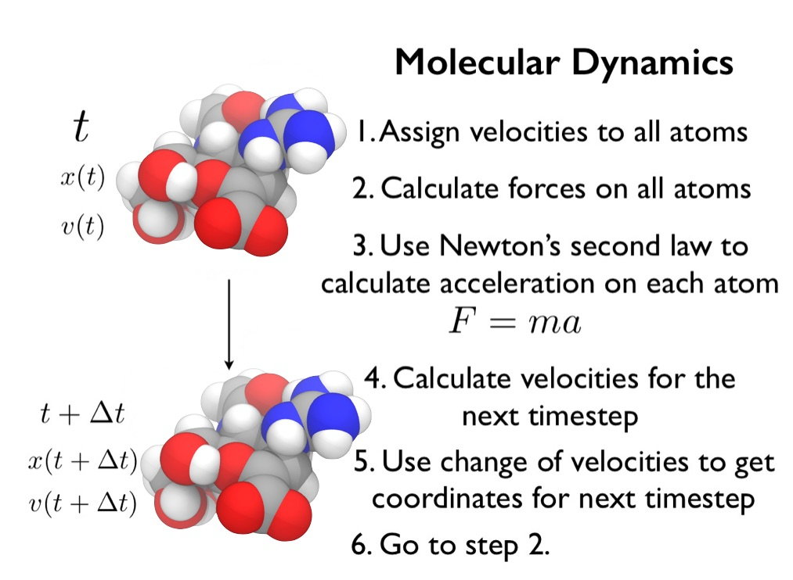

# Part 2: Molecular Dynamics
## What is Molecular Dynamics?

In the last section you performed a molecular dynamics simulation of zanamivir in the gas phase. So, what is molecule dynamics? Molecular dynamics (also called MD) is a simulation technique that is used to give motion to molecular structures. A diagram showing how molecular dynamics works is shown below;



As you can see, there are 6 steps to the algorithm;

1. We start at time t, with the coordinates of the molecule at this time given symbol x(t). We then randomly assign a velocity to each atom, which is called v(t).

2. All of the forces acting on each atom are calculated. These are called f(t)

3. Using Newton's second law (F = ma) we can work out the acceleration of each atom at time t, a(t), from the force acting on each atom, f(t).

4. We advance time by a small timestep, called &Delta;t. Based on the acceleration of each atom at time t, we can calculate the change in velocity of each atom between times t and t+&Delta;t, to give a new velocity, v(t + &Delta;t).

5. From the change in velocity between times t and t+&Delta;t, we can work out how each atom will have moved during this timestep, and thus calculate the new coordinates of the atoms at time t+&Delta;t, which are x(t + &Delta;t).

6. We now repeat this process from step 2, each time advancing time by &Delta;t. Assuming we do this thousands, millions or even billions of times, we will build up a picture of how the molecule moves over time. 

You have just completed a molecular dynamics simulation where you repeated the above algorithm 50,000 times for a gas phase molecule of zanamivir. This was controlled using a namd configuration file called 'mdconfig'. Let's now take a look at this file using a text editor. Open this file by typing;

```
nano mdconfig
```

The first two lines...

```
# Input file to control a molecular dynamics simulation
# of zanamivir in the gas phase
```

...provide a description of the type of simulation that will be performed. These are comment lines, and start with a hash (#) symbol. Any line that starts with a hash symbol is ignored and treated as a comment line. The next lines...

```
# Number of molecular dynamics steps
numsteps 50000

# Time, in femtoseconds, between each step.
# Total simulation length will be numsteps * timestep,
# so, for 50000 steps, each of 1 femtoseconds, the
# total simulation time will be 50 picoseconds
timestep 1
```

...specify the number of molecular dynamics steps (the number of times we repeat the above algorithm), given by "numsteps" and the size of the timestep, &Delta;t, given by "timestep". Note that the timestep is in units of femtoseconds (10^-15 seconds).

The next lines...

```
# Name of the input Amber-format topology and
# coordinate files
parmfile       zan.prmtop
ambercoor      zan.rst
```

...specify the name of the input files that contain the coordinates of zanamivir ("ambercoor", which points to the "zan.rst" file in this directory), and that contains the description of the atoms, bonds and forcefield parameters for zanamivir ("parmfile", short for parameter file, and pointing to "zan.prmtop" which is also in this directory).

The next line...

```
# Root name of all of the output files. They will all
# be called 'output.something', e.g. the output DCD coordinate
# file will be called 'output.dcd'
outputname     output
```

...supplies the base name for all of the output files that will be written during the simulation. Here, we are saying that all of the output files should start with "output.", e.g. the molecular dynamics trajectory file that will be written during the simulation will be called "output.dcd".

The next line... 

```
# Options used to set the temperature of the simulation
# to 300 K
temperature 300
langevin on
langevinDamping 5
langevinTemp 300
```

...is used to specify and control the temperature of the simulation. Here, we are setting the temperature to 300 kelvin using a langevin thermostat (more about this in a later section).

Next...

```
# Frequency of printing out the total energy of the
# molecule to the screen - print every 500 steps
outputEnergies 500

# Frequency of writing the restart file - we will write
# a restart file only once at the end of the simulation
restartFreq 50000

# Frequency of writing the coordinates to the
# DCD trajectory file
DCDfreq 5
```

...we specify how often we want things to be output by the simulation. Here we say that we want the energy of the molecule to be printed to the screen every 500 steps, a restart file to be saved every 50,000 steps and the coordinates to be written to the output.dcd trajectory file every 5 steps.

The next parameters...

```
# The maximum range of interatomic interactions. Any
# atoms separated by more than 7.5 angstroms will not
# interact with one another
cutoff 7.5

# We will not use 'switching', which is a way of softening
# the implementation of the cutoff
switching off
```

...are used to specify the range over which atoms are calculated to interact with one another. This is an approximation that is used to speed up the calculation.

Finally, these lines...

```
# Parameters that you must include if you are using namd
# to simulate Amber-format molecules
amber          on
exclude        scaled1-4
1-4scaling     0.833333
```

...must be included in the input because zanamivir is modelled using one of the Amber forcefields. Any molecule modelled using Amber must have these options and parameters included in the 'mdconfig' file.

# [Previous](getting_started.md) [Up](README.md) [Next](time.md)
