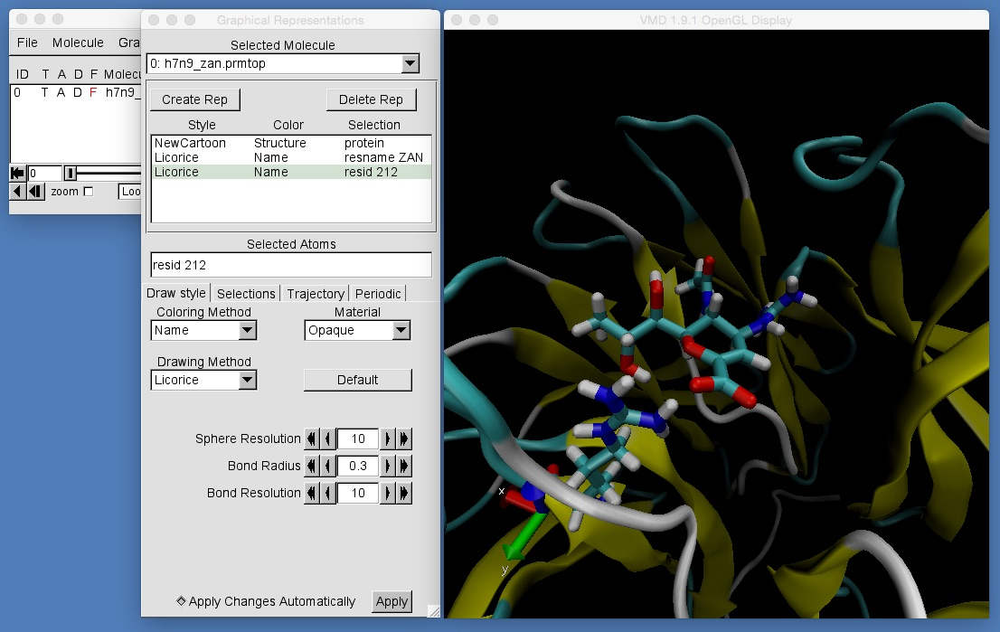
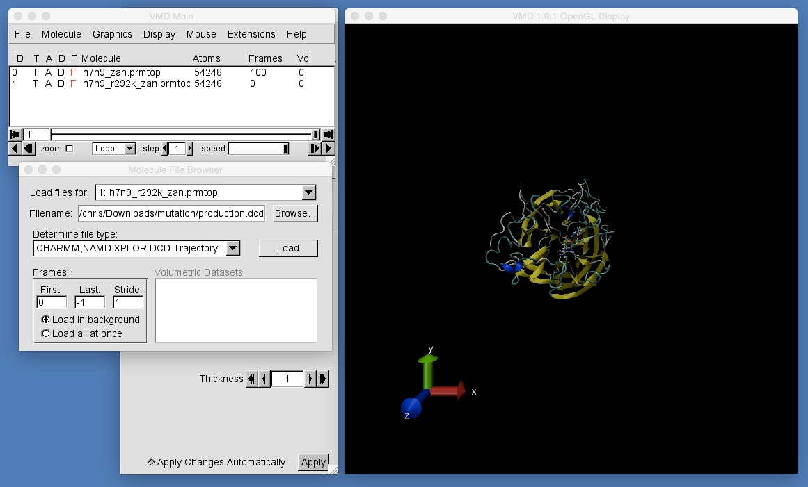
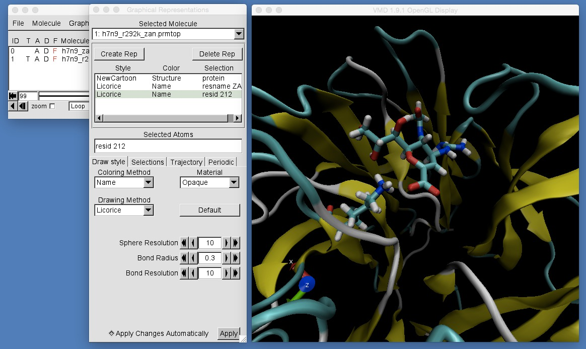
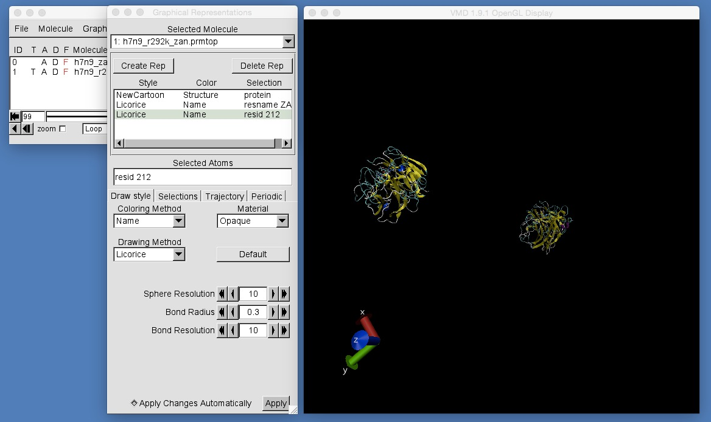
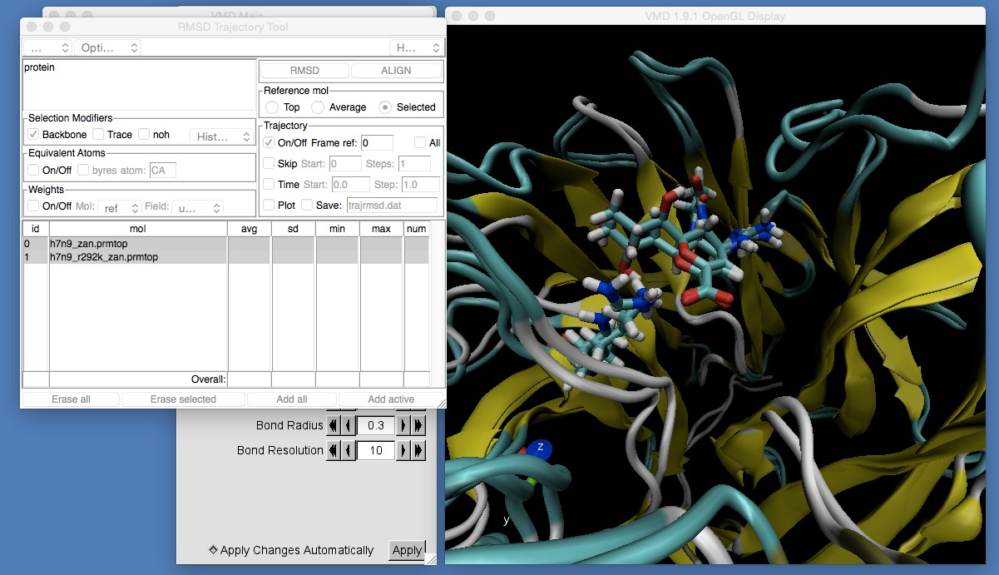

# Part 3: Mutating Proteins and MD Setup
## Comparing Trajectories

In this part of the workshop you have set up and are running a long molecular dynamics simulation of zanamivir binding to mutant H7N9-R292K neuraminidase. At the end of the  [last part](../dynamics/simulation.md) you ran a long molecular dynamics simulation of zanamivir binding to wild type H7N9 neuraminidase. In this last section of the workshop you will look at the two trajectories from these simulations and will use VMD to compare them to see whether or not the R292K mutation affects binding.

First, we will look at the wild type simulation. Change into the directory containing the output from your wild type simulation, e.g. by using;

```
cd $HOME/dynamics/complex
```

assuming that the wild type simulation was run in the directory "$HOME/dynamics/complex".

(or, if you didn't have time to run the simulation, or if something went wrong, you can download 
[example output here](https://drive.google.com/uc?export=download&id=0B_KkGMZ8ACfaZDVUZ3A4MEFSN00). Unpack the example output using the command "tar -zxvf example_dynamics.tgz"). 

Once you have changed into the "dynamics/complex" directory, type;

```
vmd h7n9_zan.prmtop output.dcd
```

Create graphical representations that highlight neuraminidase, zanamivir and arginine 292 (resid 212), e.g.



Next, we will look at your mutant H7N9-R292K simulation. We will load this into the same VMD session as the wildtype. 

* Click "File | New Molecule..." in the VMD main window. 
* Click "Browse..." and navigate to the directory containing the output from your completed H7N9-R292K mutant dynamics simulation (or, if you don't have this output, or your simulation has not finished, you can download [example output here](https://drive.google.com/uc?export=download&id=0B_KkGMZ8ACfaUXk0TlRJYVUxVWM). Unpack this output by typing "tar -zxvf example_mutation.tgz").
* Select "h7n9_r292k_zan.prmtop". This should automatically come up as an "AMBER7 Parm" format file.
* Click "Load" to load the file.
* Now, immediately click "Browse..." to browse for the DCD trajectory file. Select "production.dcd". This should automatically come up as a "CHARMM, NAMD, XPLOR DCD Trajectory".
* Click "Load" to load the trajectory.



Once you have loaded the trajectory create graphical representations that highlight neuraminidase, zanamivir and lysine 292 (resid 212), e.g.



If you zoom out, you should see that the trajectories from both the H7N9 and H7N9-R292K simulations have been loaded, but that the proteins are not aligned.



* Click "Extensions | Analysis | RMSD Trajectory Tool" to open the RMSD trajectory tool.
* Use this to align the protein backbone from each frame from both the H7N9 and H7N9-R292K trajectories against the backbone of the protein from the first frame of the H7N9 simulation.



Once you have aligned both trajectory, play the movies.

* **Can you see and differences between the binding of zanamivir to H7N9 and H7N9-R292K neuraminidase?**

* **Choose distances or angles that could be used to describe these distances, and use VMD to plot graphs that show these differences. For example, you could try the same distances as used for oseltamivir to H7N9 and H7N9-R292K neuraminidase in [this section](../visualisation/comparing.md).**

* **Once you have drawn a graph, pick a frame from the trajectory that best shows the difference in binding mode of zanamivir. Render publication quality pictures that complement your graphs of distances and angles.**


# [Previous](simulation.md) [Up](README.md) [Next](whatnext.md)
