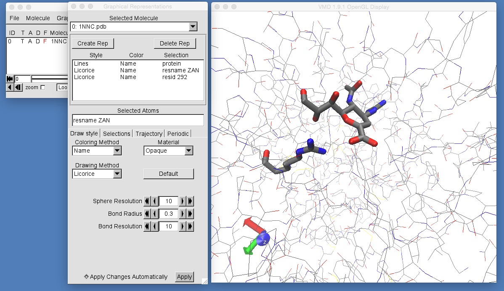

# Part 3: Mutating Proteins and MD Setup
## Getting Started

To start, we must first download the files that you will need for this section of the workshop. You can [download the files here (mutation.tgz)](https://drive.google.com/uc?export=download&id=0B_KkGMZ8ACfaanhLQTMyb2EtelE).

Change into the directory in which you have downloaded mutation.tgz and unpack it using the command

```
tar -zxvf mutation.tgz
```

This will create a directory called 'mutation'. Change into this directory by typing;

```
cd mutation
```

If you look in this directory you will see the following files;

```
:-> ls
1NNC.pdb     ZAN.frcmod   ZAN.prepin   add_atoms.in add_water.in ca.frcmod    ca.prep      equilconfig  heatconfig   mdconfig     minconfig
```

There are a lot of files. The first one we will look at is '1NNC.pdb'. This is a PDB file of zanamivir bound to the wild type form of H7N9 neuraminidase. You can look at this file by typing;

```
vmd 1NNC.pdb
```



You will see that the protein and zanamivir are missing hydrogen atoms, and that this is not in a box of water. You can view zanamivir by creating a graphical representation using selection string "resname ZAN". You can view arginine 292 by creating a graphical representation using selection string "resid 292".

# [Previous](README.md) [Up](README.md) [Next](mutation.md)
