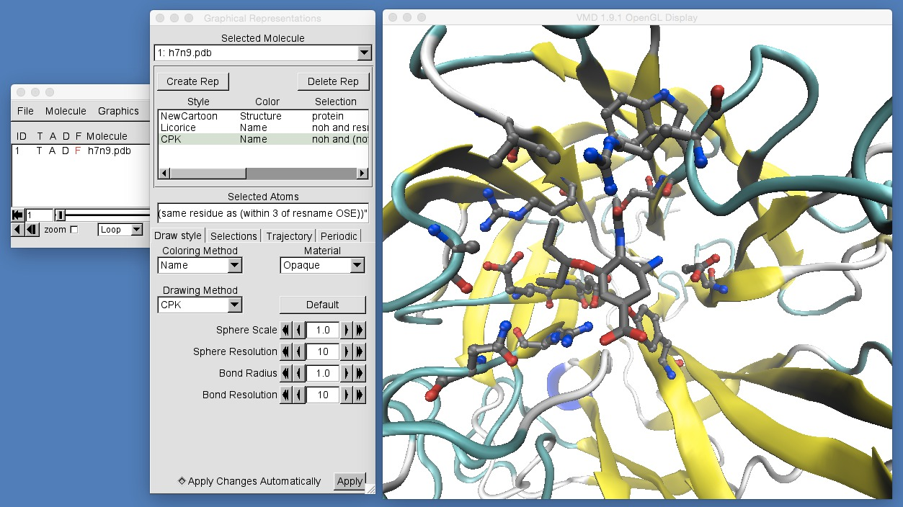

# Part 1: Molecular Visualisation
## Molecular Movies

In addition to being useful for viewing 3D structures of static biomolecules, VMD can also be used to create movies of the output of molecular dynamics simulations. Molecular dynamics (MD) is a simulation technique that adds motion to computer models of biomolecules. MD works by calculating the forces that result from the interactions between atoms (e.g. electrostatic attraction and repulsion, interatomic van der Waals interactions, bonded interactions). These forces are calculated for every atom in each molecule in a biomolecular system, and used to work out how each atom would move over time. The result is a molecular dynamics trajectory, which can be used to produce a movie that approximates the motion of the complete biomolecular system.

A molecular dynamics simulation of H7N9 neuraminidase bound to oseltamivir was performed and is described in [the paper on which this workshop is based](http://www.nature.com/srep/2013/131220/srep03561/full/srep03561.html). This resulted in a molecular dynamics trajectory file, [h7n9.dcd](https://docs.google.com/uc?export=download&confirm=np1i&id=0B_KkGMZ8ACfaUjBSdlNoNHJCSUk), which can be [downloaded here](https://docs.google.com/uc?export=download&confirm=np1i&id=0B_KkGMZ8ACfaUjBSdlNoNHJCSUk). Please download this file and put it into the same directory as h7n9.pdb.

We want to start in a new VMD session, so close you current session by clicking "File | Quit". Then, once VMD has exited, start a new session by typing
```
vmd
```
at the shell prompt in a terminal window.

Now, load up the h7n9.pdb file using the same procedure [as before](opening_files.md) (click "File | New Molecule..." to open the "Molecule File Browser", then click "Browse..." to find the h7n9.pdb file, then click "Load" to load the PDB).

Now that we have loaded h7n9.pdb, we need to load the molecular dynamics trajectory for this molecule into this view. We do this by clicking "Browse" again in the "Molecule File Browser" and this time selecting h7n9.dcd, e.g. as below;


Note that VMD has already worked out that this file has a file type of "CHARMM,NAMD,XPLOR DCD Trajectory" and that this option has been selected in the "Determine file type:" selector. If VMD has not selected this option, then please make sure that this is selected  (you will see that there are a large number of different molecular file formats!).

Next, you need to ensure that the trajectory will be loaded into the molecules loaded from h7n9.pdb. To do this, ensure that the "Load files for:" selector is selecting "1: h7n9.pdb". This will ensure that the molecular trajectory that you load will be added to the molecules loaded from h7n9.pdb. Once everything is ok, click "Load" to load the molecular dynamics trajectory from h7n9.dcd.

Once you've clicked "Load" you will see the molecules in the VMD graphics window animate as each of the 500 frames from the molecular dynamics trajectory are loaded. Once loaded, you should have a screen that looks like this;


There are several controls and pieces of information that are now available for the loaded trajectory;

* *Number of loaded frames* : This shows the number of frames loaded for the trajectory. Each frame is one snapshot of the molecule at a particular point in time. Here, you loaded a trajectory containing 500 frames spaced evenly from a 50 nanosecond dynamics trajectory. This means that each frame is a snapshot of the molecules taken every 0.5 nanoseconds. Note that there are 501 frames as the original data loaded from h7n9.pdb is placed into frame 0 (so one frame from h7n9.pdb plus 500 frames from h7n9.dcd gives 501 frames).

* *Scrubber* : This is a movie scrubber that can be dragged backwards and forwards to scan through the trajectory. Try it now to move backwards and forwards through the movie. Note that the current frame number is displayed to the left of the scrubber. Note also that the frame number starts counting from 0, so the first frame is frame 0, while the last (501st) frame is frame 500.

* *Play Backwards / Step Backwards* : These two buttons are used to either play the movie backwards, or to step, frame-by-frame backwards.

* *Step Forwards / Play Forwards* : These two buttons are used to either play the movie forwards, ot to step, frame-by-frame forwards.

* *Step Size* : This is used to control the step size between frames when stepping through or playing the movie. Try setting the step size to 10 and then playing the movie. What happens?

* *Speed* : This is used to slow down or speed up playback of the movie. Try playing the movie and then dragging this speed control backwards and forwards. What happens?

Now that the molecular dynamics trajectory is loaded you need to add some graphical representations to the molecule so that you can get a better view of what occured during the trajectory. Open the graphical representations window and add these representations;

* "protein", drawn using "NewCartoon" and colored by "Secondary Structure"
* "noh and resname OSE", drawn using licorice and colored by "Name"
* "noh and (not resname OSE) and (same residue as (within 3 of resname OSE))", drawn using  CPK, where you have changed the "Bond Radius" custom control for CPK to a value of 1.0.

Also, change the color of the background to white and turn off the display of the axes. Then rotate and zoom in the view until you have a good view of oseltamivir in the binding site of H7N9 neuraminidase. Once you have done all of this, you should have a view like this;




# [Previous](rendering.md) [Up](README.md) [Next](picking.md)
