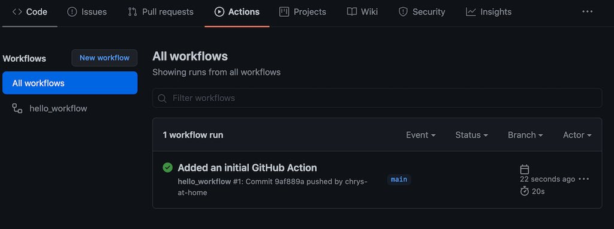
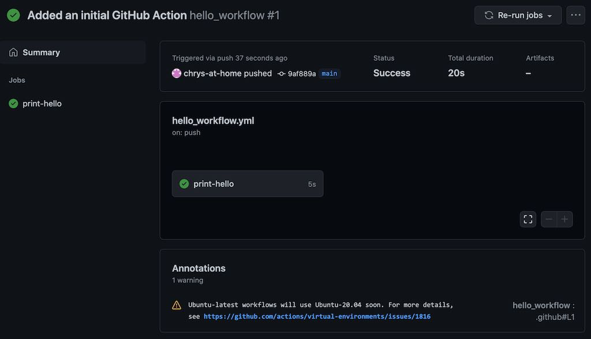
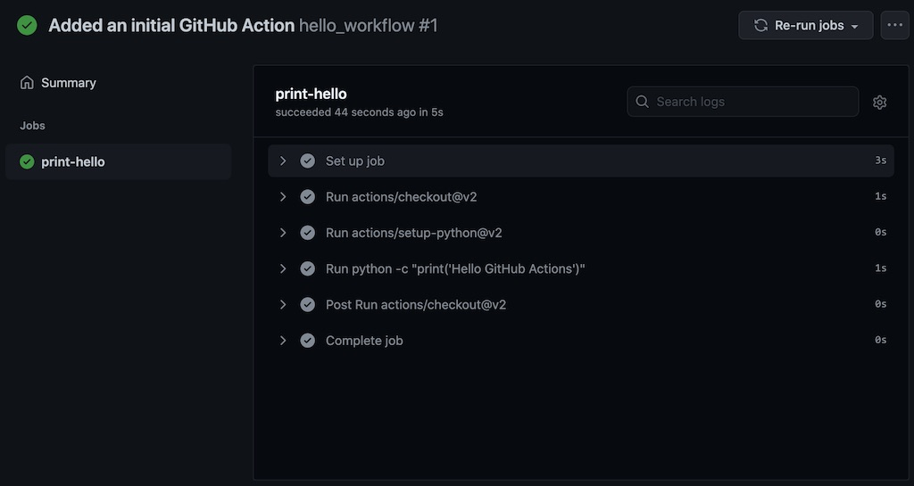
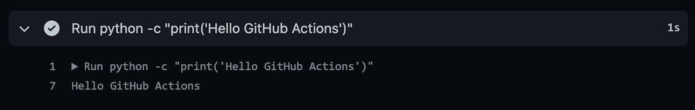

```{r setup, include=FALSE}
knitr::opts_chunk$set(echo = TRUE)
```

## GitHub Actions and continuous integration (CI)

It is quite common, when working collaboratively, that you need to automatically
run some tasks when people make changes to the project. Tasks could include 
automatically testing that the project is still sane (e.g. by running
some tests against all documents in the repository). Or it could include
automatically generating reports, websites or other output documents by 
assembling the files within the repository. Or it could be that you want
to automatically run an analysis and regenerate graphs whenever new data
is added.

Continuous integration (CI) is the name given to the set of automated actions
that can be performed against the files in a repository whenever there
is a new commit. There are many continuous integration services, for example
[Travis](https://travis-ci.org) and [GitHub Actions](https://docs.github.com/en/actions/learn-github-actions/introduction-to-github-actions). You can also setup and 
run your own via [GitLab](https://about.gitlab.com) and [GitLab runner](https://docs.gitlab.com/runner/).

[GitHub Actions](https://docs.github.com/en/actions/learn-github-actions/introduction-to-github-actions) is a free service that is provided by GitHub and is closely
integrated. You can set up actions that will run on a range of operating
systems (Windows, macOS and Linux), against a range of different software. 
Your action can do anything you want, subject to some limits
that are [described here](https://docs.github.com/en/actions/reference/usage-limits-billing-and-administration). It is a free service. You get unlimited minutes of actions
against public repositories, and 2000 minutes per month for private 
repositories ([see here](https://docs.github.com/en/github/setting-up-and-managing-billing-and-payments-on-github/about-billing-for-github-actions)). You can also use
your own computer as a "self-hosted runner".

Actions can be composed into workflows, with each action limited to 6 hours of 
execution time, and the whole workflow limited to 72 hours. Typically though,
your actions will take minutes rather than hours, so it is unlikely you will
run into these limits.

Actions could be used, for example, for compiling and testing software, creating installation
packages, auto-generating documentation, and rendering and uploading a website. 
The [MetaWards](https://metawards.org) project uses GitHub Actions for all of these
tasks (indeed, using continuous integration to create and deploy software packages
and websites is called Continuous Deployment, or CD, so GitHub Actions is better
called a CI/CD service).

## Adding actions to your own repository

You add GitHub Actions to a GitHub repository by adding files into the hidden
directory `.github/workflows`. Each file describes a different workflow. You 
can add as many workflows as you wish to a single repository.

To start, we will create a workflow that will just print hello. We will call 
this `hello_workflow`. First, create the `.github` directory via;

```
mkdir .github
```

and next create the `workflows` directory within that;

```
mkdir .github/workflows
```

Workflows are written in [yaml format](https://yaml.org). Create your
first workflow file, called `.github/workflows/hello_workflow.yml` in a text
editor, e.g. via

```
nano .github/workflows/hello_workflow.yml
```

Copy into this file the below text (we will explain this later)

```
name: hello_workflow
on: [push]
jobs:
  print-hello:
    runs-on: ubuntu-latest
    steps:
      - uses: actions/checkout@v2
      - uses: actions/setup-python@v2
      - run: python -c "print('Hello GitHub Actions')"
```

Now add this file to the repository and push it to GitHub;

```
git add .github/workflows/hello_workflow.yml
git commit -a
git push
```

The GitHub action will run immediately when after the push. To see it, go to your
GitHub repository in a web browser, and switch to the `Actions` tab, e.g.



You should see your workflow listed. It will have a yellow circle if the action
is still running, which will switch to a green tick once it has finished.

Click on the name of the action in the centre of the screen to see more 
information. It should look something like this;



In this case the action was successful and took 20 seconds to run. To see more
information, click on the `print-hello` in the centre of the screen with
the green tick (wait until your action has finished if it is still running).
You should see something like this;



This shows the different stages of the workflow, as they were described
in your `hello_workflow.yml` file. You can see `actions/checkout@v2`, which
is the action that checked out your repository to the computer that
runs the action. This was followed by `actions/setup-python@v2`, which 
installed and set up python on that computer. Next was your custom action,
where you ran a single python command. If you click on the triangle next to
this, you can expand it, e.g.



Here you can see the output of the action, namely printing `Hello GitHub Actions`.

## The workflow file

The workflow file has several sections, with syntax and all commands
described [in detail here](https://docs.github.com/en/actions/reference/workflow-syntax-for-github-actions).

```
name: hello_workflow
```

This sets the name of the workflow. You can call it anything you want.

```
on: [push]
```

This sets when the workflow actions will be run. In this case, the workflow
will be run every time something is pushed to the repository. You can
use different [on](https://docs.github.com/en/actions/reference/workflow-syntax-for-github-actions#on) commands to set actions that will run on pull requests, 
or limit runs to specific branches in a repository, e.g.

```
on:
  # Trigger the workflow on push or pull request,
  # but only for the main branch
  push:
    branches:
      - main
  pull_request:
    branches:
      - main
```

will run the workflow only on push and pull requests to the `main` branch (note also 
that you can - and should - add comments using `#` to say what you mean).

```
jobs:
  print-hello:
```

Here you have added all of the jobs that should run. The jobs are indented, and you 
can have as many jobs as you want. In this case, we have one job that we have
called `print-hello`.

```
    runs-on: ubuntu-latest
```

Everything that is part of this job is also indented. The [runs-on](https://docs.github.com/en/actions/reference/workflow-syntax-for-github-actions#jobsjob_idruns-on)
command says what operating system this job should run on, e.g. here it will run
on the latest version of Ubuntu Linux available on GitHub Actions. You can
run on as many operating systems as supported, e.g.

```
    runs-on: [ubuntu-latest, windows-latest, macos-latest]
```

would run on all of the latest versions of Ubuntu Linux, Windows and macOS. You can
also specify specific versions of these operating systems if you prefer.

```
    steps:
      - uses: actions/checkout@v2
      - uses: actions/setup-python@v2
      - run: python -c "print('Hello GitHub Actions')"
```

These are now the steps that should be run as part of this job. The individual steps
are indented and preceeded by `-`. You can have as many steps as you want. They
will be run sequentially.

The steps can be any command that you want to run. For example, we have used

```
- run: python -c "print('Hello GitHub Actions')"
```

to run the command `python -c "print('Hello GitHub Actions')"` (this just tells
Python to print `Hello GitHub Actions` to the screen). To use Python, we have
to ensure that Python has been installed. This is handled by the line

```
      - uses: actions/setup-python@v2
```

which uses a pre-written set of commands to install Python for us. These commands
are from the `setup-python` GitHub Action package, which you can 
[see here](https://github.com/actions/setup-python). The `@v2` says that you 
want to use version 2 of this package. This is sensible, as packages are always
being updated, so specifying the version will help prevent breakage as
the package changes.

You can see the [full list of GitHub Action packages here](https://github.com/actions).
Note that they are all hosted and developed on GitHub too :-).

Of course, you need to check out your repository to the computer, hence why we started
the steps with 

```
      - uses: actions/checkout@v2
```

This is the action that will checkout your repository. By default it will check out
the right version and branch that is associated with the GitHub push or pull request.

## Exercise

Have a look at the [GitHub Actions Documentation](https://docs.github.com/en/actions/learn-github-actions/introduction-to-github-actions), 
[list of commands](https://docs.github.com/en/actions/reference/workflow-syntax-for-github-actions) and 
[list of available actions](https://github.com/actions) and have a go
at editing your `hello_workflow.yml`. For example, make the action run on Windows.
Or add in more commands to run, in whatever programming language you want.
Have a play!

For inspiration, take a look at GitHub Actions configured for different repositories
on GitHub. Look at those for your favorite programs (if they have any). Or take
a look at the actions listed in [awesome actions](https://github.com/sdras/awesome-actions)
or those used by the [MetaWards project](https://github.com/metawards/MetaWards/blob/devel/.github/workflows/main.yaml).

# [Next](bestpractice.html)
