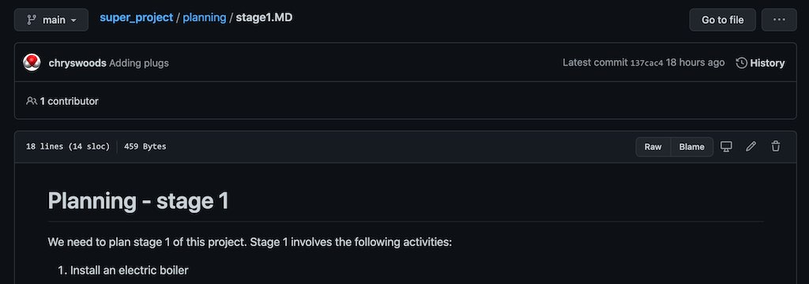
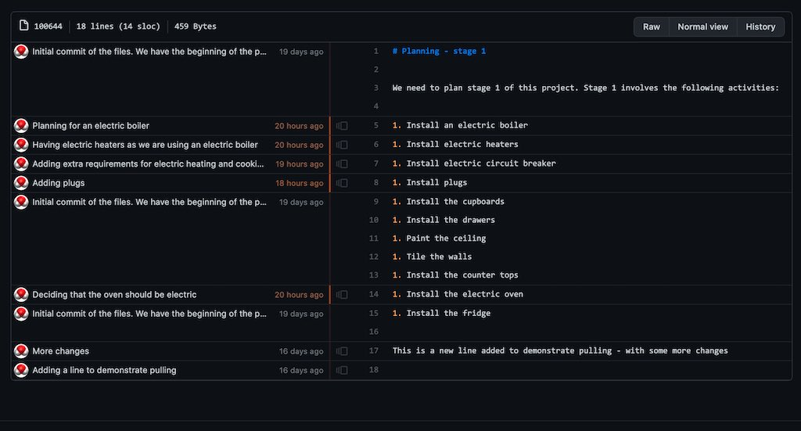

```{r setup, include=FALSE}
knitr::opts_chunk$set(echo = TRUE)
```

## Blaming (who changed what)

When working in a team it can sometimes be helpful to know who made a change to a file, and when.
This could be because you want to talk about that change with the original author, 
or maybe you want to find out what commit was associated with that change, so that you can
understand its broader context.

The command `git blame` is used to do this. For example, type;

```
git blame planning/stage1.MD
```

This will print out the commit details associated with each line in this file, e.g. today I see;

```
^fcd3771 (Christopher Woods 2021-01-22 11:52:30 +0000  1) # Planning - stage 1
^fcd3771 (Christopher Woods 2021-01-22 11:52:30 +0000  2) 
^fcd3771 (Christopher Woods 2021-01-22 11:52:30 +0000  3) We need to plan stage 1 of this project. Stage 1 involves the following activities:
^fcd3771 (Christopher Woods 2021-01-22 11:52:30 +0000  4) 
ccace020 (Christopher Woods 2021-02-09 14:59:52 +0000  5) 1. Install an electric boiler
23b0083d (Christopher Woods 2021-02-09 15:11:10 +0000  6) 1. Install electric heaters
b4f91aad (Christopher Woods 2021-02-09 15:58:55 +0000  7) 1. Install electric circuit breaker
137cac40 (Christopher Woods 2021-02-09 16:18:49 +0000  8) 1. Install plugs
^fcd3771 (Christopher Woods 2021-01-22 11:52:30 +0000  9) 1. Install the cupboards
^fcd3771 (Christopher Woods 2021-01-22 11:52:30 +0000 10) 1. Install the drawers
^fcd3771 (Christopher Woods 2021-01-22 11:52:30 +0000 11) 1. Paint the ceiling
^fcd3771 (Christopher Woods 2021-01-22 11:52:30 +0000 12) 1. Tile the walls
^fcd3771 (Christopher Woods 2021-01-22 11:52:30 +0000 13) 1. Install the counter tops
455bb5eb (Christopher Woods 2021-02-09 14:27:37 +0000 14) 1. Install the electric oven
^fcd3771 (Christopher Woods 2021-01-22 11:52:30 +0000 15) 1. Install the fridge
^fcd3771 (Christopher Woods 2021-01-22 11:52:30 +0000 16) 
4ebc7623 (Christopher Woods 2021-01-25 17:19:51 +0000 17) This is a new line added to demonstrate pulling - with some more changes
ee1ef2cd (Christopher Woods 2021-01-25 17:06:39 +0000 18) 
```

(note that this may be different when you take this workshop)

GitHub can also show this information in a slightly easier-to-navigate way. Click on the file
within the file browser, e.g.



Click on the `Blame` button on the right. This will bring up the blame view of the file, e.g.



From here you can click on the individual commits to see more information. You can also go backwards
in time and see the blame view for earlier commits of the file.

## Git Cheat Sheet

We have one new command, `git blame`, which can be used to see who changed which line in a file,
in which commit.

```
Git Cheat Sheet

(1)  git init              : Tell git to start version controlling the files in a directory
                             (initialises git in a directory)
(2)  git status            : Tell git to print the status of the files in the version 
                             controlled directory.
(3)  git add               : Tell git to start monitoring (tracking) the versions of a new
                             file, e.g. `git add README.md` will tell git to track `README.md`   
(4)  git commit -a         : Tell git to save a new snapshot version of all of the tracked
                             files in the directory. The `-a` means "all files". You can
                             commit new versions of individual files if you want, but this
                             is not recommended.
(5)  git diff              : Tell git to show the differences between the files in the working
                             directory and the last saved version in the git repository. This will
                             show the differences for all tracked files. Use
                             `git diff FILENAME` to limit to only the file `FILENAME`
(6a) git checkout VERSION FILENAME  : Tell git to bring `VERSION` version of `FILENAME` into the 
                                      current working directory. If `VERSION` is `main` then 
                                      restore the last version of `FILENAME` that was saved
                                      to the repository.
(6b) git checkout VERSION  : Tell git to change the working directory back to a specific `VERSION`
                             number. If `VERSION` is `main`, then return the working directory to
                             the last saved version in the repository.
(7)  git log               : Print a log of the versions in the repository. Use `git log -n N`
                             to limit to the last `N` versions. You may need to use `q` to exit
                             from the text viewer if there are a lot of versions to print.
(8)  git mv OLD NEW        : Rename a file from name `OLD` to name `NEW`.
(9)  git rm FILENAME       : Remove the file `FILENAME` from the working directory (it still exists
                             in the repository). Will only work if the file is tracked by
                             git and doesn't have any changes. Use `-f` to force removal of files. 
(10) git push              : Push versions that are saved in the local repository (.git folder)
                             so they are backed up to a remote repository (.git folder)
(11) git clone URL         : Clone (download) a local copy of the remote repository that is available
                             at the specified URL. You will only be allowed to push to that repository
                             if you have permission. If not, then fork the repository into your
                             own account before cloning. 
(12a) git remote -v        : Show information about all of the remotes that have been configured
                             for a local repository.
(12b) git remote add NAME URL   : Add a new remote called `NAME` that refers to the remote 
                                  repository at `URL`, e.g. 
                                  `git remote add upstream https://github.com/chryswoods/super_project.git`
                                  will add a remote called `upstream` that refers to the original
                                  `super_project` URL.
(13)  git pull REMOTE BRANCH : Pull changes from the specified BRANCH of the specified REMOTE into
                               the local repository and merge them into the working tree. For example,
                               `git pull upstream main` would pull changes from the default branch
                               of `upstream` into the local repository. By default, REMOTE is `origin`
                               and BRANCH is `main`, so `git pull` will pull changes from the same
                               remote repository that `git push` pushes to.
(14)  git blame FILENAME   : Print a line-by-line view of who changed each line in a file at 
                             which commit.
```

## Exercise

Explore the blame view of the file. Make a change to `planning/stage1.MD` and commit and push
that change. Can you see that change in the blame view of the file?

# [Next](branching.html)
