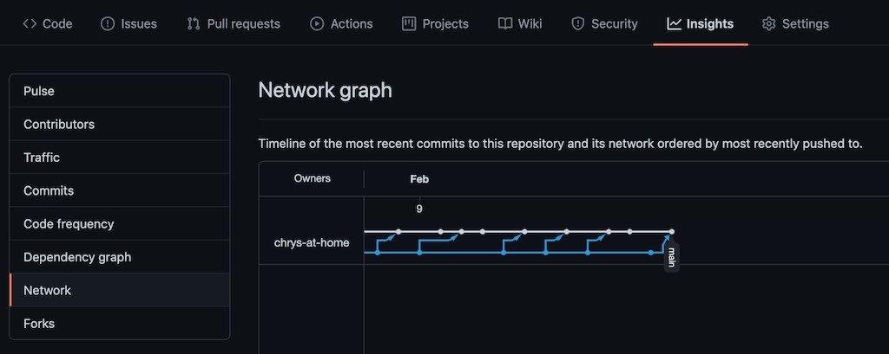
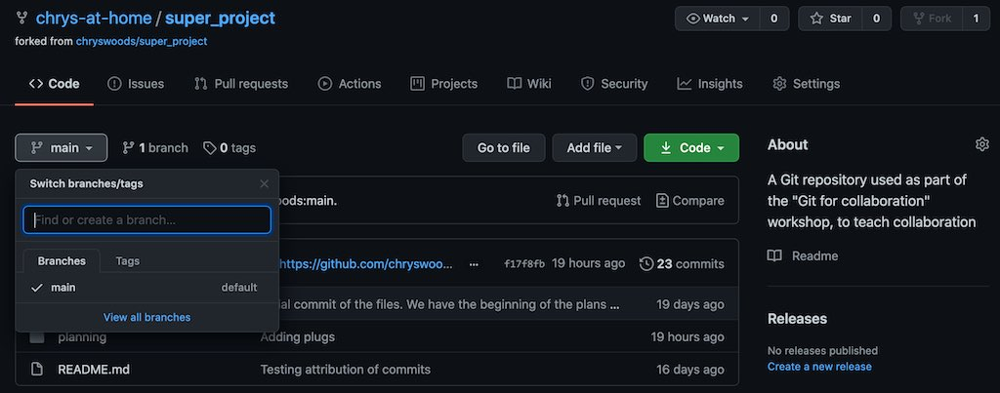
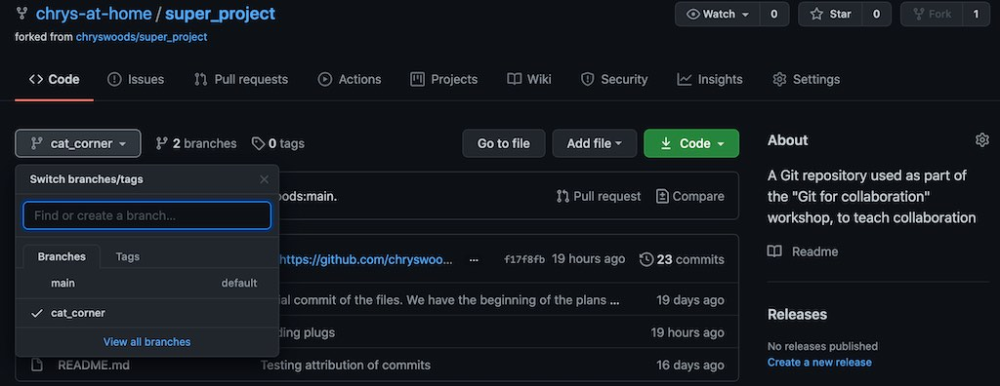
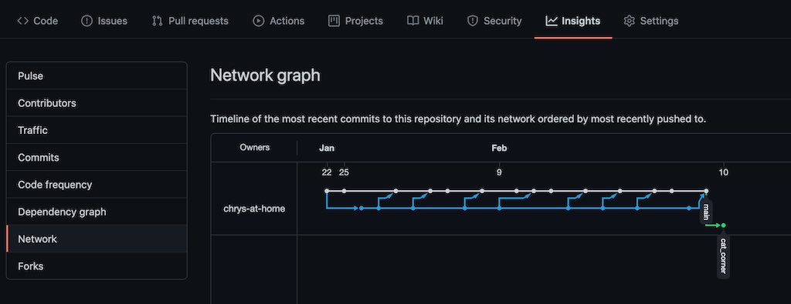
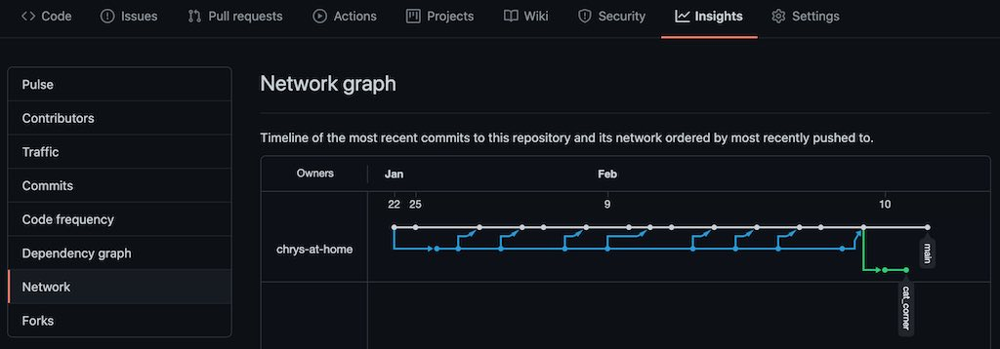
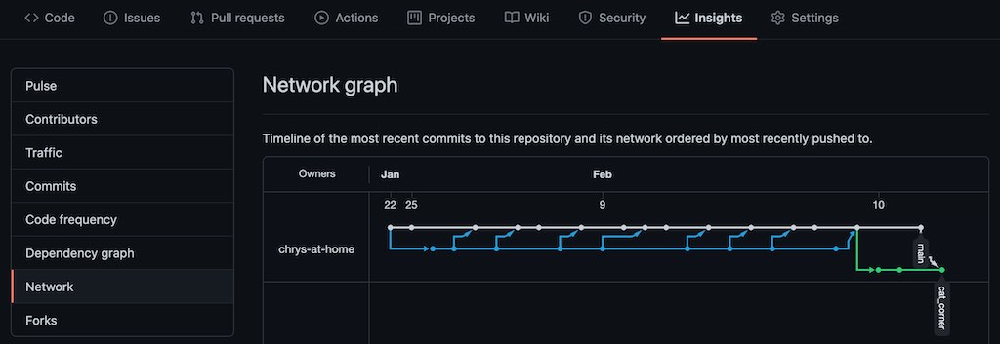
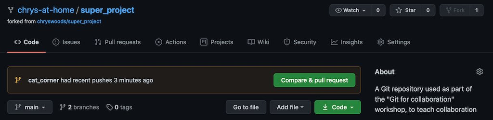
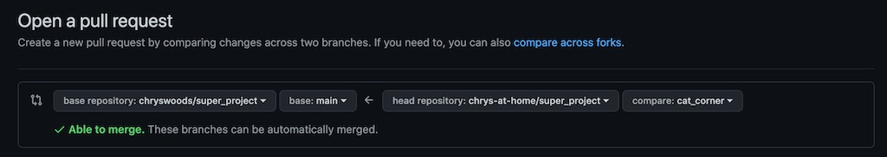
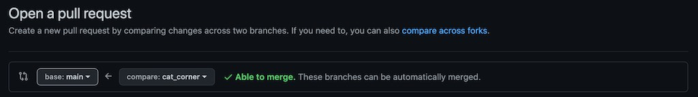
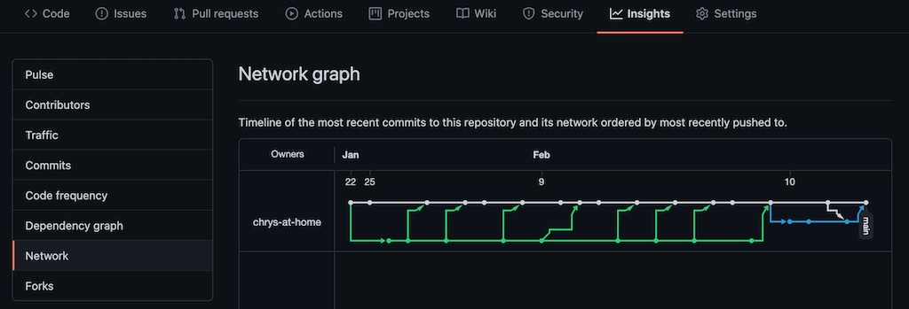

```{r setup, include=FALSE}
knitr::opts_chunk$set(echo = TRUE)
```

## Branching

At the start of this workshop you forked the original `upstream` repository into your own fork,
in your own GitHub account. This allowed you to work in your fork without interupting 
any work taking place in `upstream`. You pulled changes from `upstream` into your fork
via `git pull upstream main` and you requested that `upstream` pulled your changes by
issueing pull requests.

You can visualise your fork and `upstream` as being two parallel lines of development, e.g.

```
your fork       o-----o--o--o--o
               /     /
              /     /
upstream     o--o--o--o--o--o
```

The circles represent commits, while the lines joining your fork to `upstream` represent
the `git pull upstream main` calls that pulled code from `upstream` into your fork.

GitHub helpfully draws these diagrams for you. Go to 'Insights' then 'Network'. Here you
will get an interactive plot that will let you explore the individual commits, e.g.



## What is main?

Your fork of `upstream` represents a separate branch of development of `upstream`. This 
branch is called `main`. We use `main` as a convention to name the primary branch of
development within a fork. So `upstream main` is the primary branch of development
in `upstream`. And `origin main` is the primary branch of development in your fork
(remember that `origin` is the default name given to your repository).

## Branching within a fork

You can create additional branches of development within a repository. These branches
behave like forks, but they are within a repository. For example, go back to the main
page of your repository and click on the `main` button. This should bring up a list
of the branches, e.g.



Here you can create a new branch by typing in a name, and then clicking `Create branch`.
For example, let's create a branch where we will do the work of installing the 
corner of the kitchen for Thompson the cat. Call the branch `cat_corner` and click
`Create branch`.

This will create the branch and will automatically switch you to `cat_corner`.



You can click on the branch name button and switch back and forth between the `main` and 
`cats_corner` branches.

Next, type the command `git pull`. You should see that git will report that a new
branch has been created, e.g.

```
From https://github.com/chrys-at-home/super_project
 * [new branch]      cat_corner -> origin/cat_corner
```

You can switch between different branches on the command line using the 
`git checkout` command, followed by the name you want to switch to. To switch
to the `cat_corner` branch, type

```
git checkout cat_corner
```

You should see output similar to;

```
Branch 'cat_corner' set up to track remote branch 'cat_corner' from 'origin'.
Switched to a new branch 'cat_corner'
```

Typing `git status` should also show that you are now on the `cat_corner` branch, e.g.

```
On branch cat_corner
Your branch is up to date with 'origin/cat_corner'.
```

## Committing to a branch

You can make changes and commit to your `cat_corner` branch, and it will not affect or 
change your `main` branch. For example, edit `planning/stage1.MD` and add in a step to 
install an automatic cat feeder, e.g.

```
1. Paint the ceiling
1. Tile the walls
1. Install the counter tops
1. Install the electric oven
1. Install automatic cat feeder
1. Install the fridge
```

Commit and push this change (`git commit -a` and `git push`). You will see that this will
push to the `cat_corner` branch, e.g.

```
Enumerating objects: 7, done.
Counting objects: 100% (7/7), done.
Delta compression using up to 8 threads
Compressing objects: 100% (3/3), done.
Writing objects: 100% (4/4), 374 bytes | 374.00 KiB/s, done.
Total 4 (delta 2), reused 0 (delta 0)
remote: Resolving deltas: 100% (2/2), completed with 2 local objects.
To https://github.com/chrys-at-home/super_project.git
   f17f8fb..7a62c0d  cat_corner -> cat_corner
```

If you look at the `Insights` page on GitHub, you can see that this commit
as a new line that has branched from `main`, e.g.



We can also represent that using a "circle and line" diagram, e.g.

```
origin cat_corner                       o
                                       /
                                      /
origin main           o-----o--o--o--o
                     /     /
                    /     /
upstream main      o--o--o--o--o--o
```

Further commits to `cat_corner` will add to this line, e.g.

```
origin cat_corner                       o--o--o--o
                                       /
                                      /
origin main           o-----o--o--o--o
                     /     /
                    /     /
upstream main      o--o--o--o--o--o
```

## Exercise

Make some more changes to `planning/stage1.MD` and commit and push them to the `cat_corner` branch.

Look at the network view on the GitHub `Insights` page. Can you see your new commits?

## Switching between branches

It is very easy to switch between branches. Simply type `git checkout BRANCH_NAME` to switch to 
the branch you want, e.g.

```
git checkout main
```

will switch back to `origin main`. If you do this, take a look at `planning/stage1.MD`.
Notice how the changes you made in `cat_corner` are not in this file.

Now switch back to `cat_corner` by typing

```
git checkout cat_corner
```

Take a look at `planning/stage1.MD`. See that your changes are restored.

## Pulling between branches

Branches behave pretty much identically to forks. You can consider them as separate forks
within a repository. This means that you can pull changes from one branch into another, 
and you can also issue pull requests from one branch to another.

For example, switch back to `main` via `git checkout main`. Now edit `planning/stage1.MD`
and add an extra line to the bottom, e.g. similar to the last line shown below;

```
1. Install the counter tops
1. Install the electric oven
1. Install the fridge

This is a new line added to demonstrate pulling - with some more changes

This is another line added to demonstrate pulling across branches
```

Commit this change (`git commit -a`) and push to `main` (`git push`). The GitHub
`Insights` network graph will now look something like this;



Now switch back to your `cat_corner` branch by typing;

```
git checkout cat_corner
```

We can pull this latest change that was made in `main` into `cat_corner` by typing;

```
git pull origin main
```

This will open a text editor showing you that the change can be automatically merged, 
and when you save this it will merge the change, e.g.

```
From https://github.com/chrys-at-home/super_project
 * branch            main       -> FETCH_HEAD
Auto-merging planning/stage1.MD
Merge made by the 'recursive' strategy.
 planning/stage1.MD | 2 ++
 1 file changed, 2 insertions(+)
```

Double check `planning/stage1.MD` - notice how the line added to `origin main` 
has been merged into the file for `origin cat_corner`.

Push this change to `cat_corner` (`git push`). The GitHub network graph should
now look something like this;



## Pull requests between branches

If we wanted, we could follow a similar process to merge changes from `cat_corner`
into `main`, e.g. `git checkout main`, followed by `git pull origin cat_corner`,
then `git push`. But we could also achieve the same thing using a pull request.
If you navigate back to the main web page for your repository, you should see
that GitHub has seen that `cat_corner` has changed, and given you the option
of making a pull request, e.g.



If you click on `Compare and Pull Request` this will open up the pull request
dialog. This will be pre-populated with a request to pull from `origin cat_corner`
into `upstream main` (where `origin` is your repository, and `upstream`
is the `chryswoods` repository). 



Change the base repository to be your 
repository (so this is a pull request from `origin cat_corner` to 
`origin main`). Note that the dialog will now change to only showing you
the branch names, e.g.



Fill in the pull request message and click `Create pull request`.
This will create the pull request.

Next, you can merge the pull request by clicking `Merge pull request`.
Click this, and then click `Confirm merge`. The pull request should
be successfully merged and closed. At this point, there may no longer
be any need for the `cat_corner` branch (maybe we have finished 
all changes that are needed for this?). In this case, we can
then delete the branch, by clicking on the `Delete branch` button.

This will delete the branch. But note that the branch can be undeleted
if needed (e.g. by pushing to it again), and also all of the changes 
made have now been pulled into `main`.

If you look at the GitHub network graph, you should see that the `cat_corner`
branch is shown as merged into `main`, and that it then stops, e.g.



We can also represent this is a circle and line diagram, e.g.

```
origin cat_corner                       o--o--o--o------o
                                       /               / \
                                      /               /   \
origin main           o-----o--o--o--o---------------o-----o
                     /     /
                    /     /
upstream main      o--o--o--o--o--o
```

## Deleting a branch locally

Deleting a branch on GitHub will not delete the branch locally. You can list your branches
using the `git branch` command, e.g.

```
git branch
```

for me prints

```
* cat_corner
  main
```

The `*` shows which branch you are currently on. Since we have deleted `cat_corner` from
GitHub, we should also delete it locally. To do this, we will first switch to the 
`main` branch...

```
git checkout main
```

You should see printed a message telling you that your branch is behind that on GitHub, e.g.

```
Your branch is behind 'origin/main' by 4 commits, and can be fast-forwarded.
  (use "git pull" to update your local branch)
```

This is because the pull request meant commits were pushed into `main` on GitHub that
are not reflected locally. To pull these changes, you need to run

```
git pull
```

This will pull all of the changes in GitHub to your local repository.

Next, to delete the `cat_corner` branch you should type;

```
git branch -d cat_corner
```

The `-d` means "delete the branch". Again, this won't actually delete any files, as
they all still exist in the repository.

## Git Cheat Sheet

We have an additional usage of the `git checkout` command for changing between branches,
and `git pull` for pulling changes from the remote repository (GitHub). We also have
the new command, `git branch` to get information about branches and to delete branches.

```
Git Cheat Sheet

(1)  git init              : Tell git to start version controlling the files in a directory
                             (initialises git in a directory)
(2)  git status            : Tell git to print the status of the files in the version 
                             controlled directory.
(3)  git add               : Tell git to start monitoring (tracking) the versions of a new
                             file, e.g. `git add README.md` will tell git to track `README.md`   
(4)  git commit -a         : Tell git to save a new snapshot version of all of the tracked
                             files in the directory. The `-a` means "all files". You can
                             commit new versions of individual files if you want, but this
                             is not recommended.
(5)  git diff              : Tell git to show the differences between the files in the working
                             directory and the last saved version in the git repository. This will
                             show the differences for all tracked files. Use
                             `git diff FILENAME` to limit to only the file `FILENAME`
(6a) git checkout VERSION FILENAME  : Tell git to bring `VERSION` version of `FILENAME` into the 
                                      current working directory. If `VERSION` is `main` then 
                                      restore the last version of `FILENAME` that was saved
                                      to the repository.
(6b) git checkout VERSION  : Tell git to change the working directory back to a specific `VERSION`
                             number. If `VERSION` is `main`, then return the working directory to
                             the last saved version in the repository.
(6c) git checkout BRANCH   : Switch to the branch called `BRANCH`, e.g. git checkout main will
                             switch to the `main` branch.
(7)  git log               : Print a log of the versions in the repository. Use `git log -n N`
                             to limit to the last `N` versions. You may need to use `q` to exit
                             from the text viewer if there are a lot of versions to print.
(8)  git mv OLD NEW        : Rename a file from name `OLD` to name `NEW`.
(9)  git rm FILENAME       : Remove the file `FILENAME` from the working directory (it still exists
                             in the repository). Will only work if the file is tracked by
                             git and doesn't have any changes. Use `-f` to force removal of files. 
(10) git push              : Push versions that are saved in the local repository (.git folder)
                             so they are backed up to a remote repository (.git folder)
(11) git clone URL         : Clone (download) a local copy of the remote repository that is available
                             at the specified URL. You will only be allowed to push to that repository
                             if you have permission. If not, then fork the repository into your
                             own account before cloning. 
(12a) git remote -v        : Show information about all of the remotes that have been configured
                             for a local repository.
(12b) git remote add NAME URL   : Add a new remote called `NAME` that refers to the remote 
                                  repository at `URL`, e.g. 
                                  `git remote add upstream https://github.com/chryswoods/super_project.git`
                                  will add a remote called `upstream` that refers to the original
                                  `super_project` URL.
(13a) git pull             : Pull changes from the remote repository into the local repository.
                             This is the opposite of git push
(13b) git pull REMOTE BRANCH : Pull changes from the specified BRANCH of the specified REMOTE into
                               the local repository and merge them into the working tree. For example,
                               `git pull upstream main` would pull changes from the default branch
                               of `upstream` into the local repository. By default, REMOTE is `origin`
                               and BRANCH is `main`, so `git pull` will pull changes from the same
                               remote repository that `git push` pushes to.
(14)  git blame FILENAME   : Print a line-by-line view of who changed each line in a file at 
                             which commit.
(15a) git branch           : Print out information about all of the branches in a repository
(15b) git branch -d BRANCH : Delete the branch called `BRANCH`
```

## Exercise

Create a new branch in GitHub. Commit some changes. Issue a pull request from that branch
to `main` to pull those changes back into `main`. Accept the pull request and then delete
the branch. Check the GitHub network view to make sure that you can see all of these
steps represented.


## Bonus - branching from the past

You can create a branch from any committed version in the repository. If you navigate to an
old commit, and then create a branch, then the branch will be from that old version of the 
files. In this way you can revert back to an old version of the files and make edits from
that point. Using branches to "edit the past" is one of the key use cases.

Equally another good use case is to create branches that refer to specific releases
or versions of a project, e.g. every time you create a release you create a branch
for that release. This way, you can use those branches to back-port in fixes
from later versions of the code.

# [Next](actions.html)
