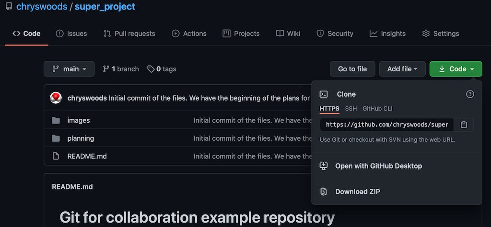
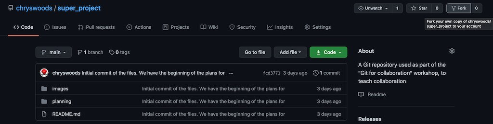
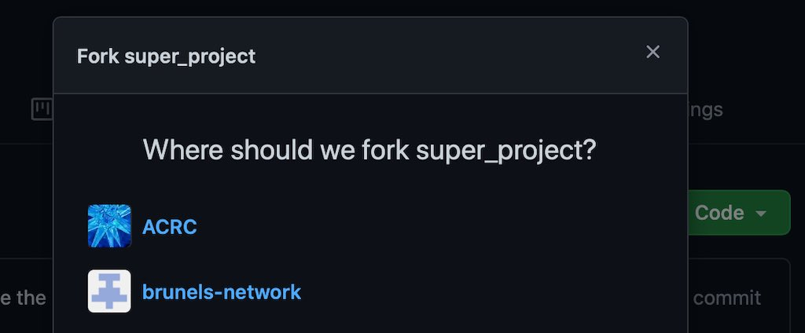

```{r setup, include=FALSE}
knitr::opts_chunk$set(echo = TRUE)
```

## Cloning and Forking a repository

Throughout this workshop, we will be working collaboratively on an example Git respository. This project
is called [super_project](https://github.com/chryswoods/super_project), and it describes a hypothetical
refurbishment of a kitchen.

You can find the project at its [GitHub page](https://github.com/chryswoods/super_project). As you will see,
there are subdirectories for planning the project, and also for useful images (e.g. the
kitchen before remodelling, and for Thompson, the kitchen cat who will have specific requirements).

## Cloning

Creating a local copy of a repository is called "cloning". You can do this using the `git clone` command.

To do this, you need the URL of the remote repository to be cloned. You can find this using the "Code" button
in the GitHub interface.



The URL for `super_project` is `https://github.com/chryswoods/super_project.git`. To create a clone,
type (on a command line);

```
git clone https://github.com/chryswoods/super_project.git
```

You should see output that looks something like this;

```
Cloning into 'super_project'...
remote: Enumerating objects: 8, done.
remote: Counting objects: 100% (8/8), done.
remote: Compressing objects: 100% (7/7), done.
remote: Total 8 (delta 0), reused 8 (delta 0), pack-reused 0
Unpacking objects: 100% (8/8), done.
```

This shows that git has created a new directory on your computer called `super_project`, and it will download a local
copy of the repository into the `.git` folder in `super_project`. It will then checkout the latest
version from the repository, so that `super_project` contains the most up to date versions of the
files.

Once you have cloned, change into the `super_project` directory using;

```
cd super_project
```

You should be able to list the contents of this directory using

```
ls
```

Check the status of the files using

```
git status
```

You should see something like

```
On branch main
Your branch is up to date with 'origin/main'.

nothing to commit, working tree clean
```

This shows that your working tree (the files in your directory) are the same as those in the last saved version in the local repository (.git folder). And that this local repository has the same versions as those on the remote GitHub `.git` folder in `https://github.com/chryswoods/super_project.git`.

## Changing the files

You have full permission to change any files that are on your computer.  This means that you can edit and commit changes that you make 
locally to your copy of `super_project`. Check this by making a change to the `README.md` file from `super_project`, e.g. by using

```
nano README.md
```

Write whatever you want. Once you have made the change, commit the change using;

```
git commit -a
```

Once you have committed, use `git status` to check the status of the directory. You should see something like this;

```
On branch main
Your branch is ahead of 'origin/main' by 1 commit.
  (use "git push" to publish your local commits)

nothing to commit, working tree clean
```

This shows that your working tree is clean, but that now your local `.git` folder has one more version (is ahead) than the versions on GitHub.

In the [last workshop](https://chryswoods.com/introducing_git) you learned that you could upload new versions to GitHub using
the `git push` command. Do you think this will work to push new versions to the `super_project` in my GitHub account? Have a go...


```
git push
```

(enter your GitHub username and password if requested)

You should see that this doesn't work, and that you get an error message that looks something like this;

```
remote: Permission to chryswoods/super_project.git denied to [your user name].
fatal: unable to access 'https://github.com/chryswoods/super_project.git/': The requested URL returned error: 403
```

You see this error because, while you can commit to your local copy of the `super_project` repository, you don't have permission to 
push new versions to my remote copy of `super_project` on GitHub.

## Forking a remote repository

One solution to this problem would be for you to create your own new GitHub repository called `super_project`, and then push your 
local `.git` folder up to your remote GitHub `super_project`'s `.git` folder. This would work, but it is several steps.

Instead, there is a single, one-click action that can achieve the same result. You can `fork` my remote GitHub `super_project` into
your own copy in your remote GitHub account. You do this by clicking the `Fork` button on the repository's [GitHub page](https://github.com/chryswoods/super_project);



(If you see this popup, then make sure you choose your GitHub username so that you ask GitHub to make a copy in your personal GitHub
account)



GitHub will fork the repository into your personal GitHub account. This may take a few seconds. Once the process has completed your browser will change to view your copy of `super_project` in your GitHub account. This is your personal copy of `super_project`. GitHub has copied the `.git` folder (all repository versions) associated with the project into your account. As this is your copy, you can do whatever you would like to it - changing it, deleting files, even deleting the project. It won't affect, notify or change anything in the original `super_project` in my account.

## Re-cloning

Now that you have created your own copy of the remote repository into your account, you now need to create your own local copy on your computer.

The easiest way to do this is to clone the repository again. Change up a directory, and then remove the `super_project` you cloned earlier.

```
cd ..
rm -rf super_project
```

Now clone your `super_project`. Click on the `Code` button and find the URL to use to clone the repository. It will look something like `https://github.com/[YOUR GITHUB USERNAME]/super_project.git` (you may need to select the "HTTPS" option). 
Use that URL in your `git clone` command, e.g.

```
git clone https://github.com/[YOUR GITHUB USERNAME]/super_project.git
```

then change into that directory...

```
cd super_project
```

and check the status using

```
git status
```

You should see output that looks something like this;

```
On branch main
Your branch is up to date with 'origin/main'.

nothing to commit, working tree clean
```

Now make a change to `README.md` and commit the change using `git commit -a`. Finally, push that change to GitHub using;

```
git push
```

You should find that this now works. Take a look on GitHub. You should see that your commit has now been added to your fork
of `super_project` on GitHub. Your commit has not changed the original `super_project` in my GitHub account at all. 

## Git Cheat Sheet

You may remember the Git Cheat Sheet from the [last workshop](https://chryswoods.com/introducing_git). We will add new
git commands to this Cheat Sheet as we progress through this workshop. In this section we have introduced one new command,
`git clone`, for downloading a new local copy of a remote repository to your computer.

```
Git Cheat Sheet

(1)  git init              : Tell git to start version controlling the files in a directory
                             (initialises git in a directory)
(2)  git status            : Tell git to print the status of the files in the version 
                             controlled directory.
(3)  git add               : Tell git to start monitoring (tracking) the versions of a new
                             file, e.g. `git add README.md` will tell git to track `README.md`   
(4)  git commit -a         : Tell git to save a new snapshot version of all of the tracked
                             files in the directory. The `-a` means "all files". You can
                             commit new versions of individual files if you want, but this
                             is not recommended.
(5)  git diff              : Tell git to show the differences between the files in the working
                             directory and the last saved version in the git repository. This will
                             show the differences for all tracked files. Use
                             `git diff FILENAME` to limit to only the file `FILENAME`
(6a) git checkout VERSION FILENAME  : Tell git to bring `VERSION` version of `FILENAME` into the 
                                      current working directory. If `VERSION` is `main` then 
                                      restore the last version of `FILENAME` that was saved
                                      to the repository.
(6b) git checkout VERSION  : Tell git to change the working directory back to a specific `VERSION`
                             number. If `VERSION` is `main`, then return the working directory to
                             the last saved version in the repository.
(7)  git log               : Print a log of the versions in the repository. Use `git log -n N`
                             to limit to the last `N` versions. You may need to use `q` to exit
                             from the text viewer if there are a lot of versions to print.
(8)  git mv OLD NEW        : Rename a file from name `OLD` to name `NEW`.
(9)  git rm FILENAME       : Remove the file `FILENAME` from the working directory (it still exists
                             in the repository). Will only work if the file is tracked by
                             git and doesn't have any changes. Use `-f` to force removal of files. 
(10) git push              : Push versions that are saved in the local repository (.git folder)
                             so they are backed up to a remote repository (.git folder)
(11) git clone URL         : Clone (download) a local copy of the remote repository that is available
                             at the specified URL. You will only be allowed to push to that repository
                             if you have permission. If not, then fork the repository into your
                             own account before cloning. 
```

## Exercise

Find another project on GitHub that interests you. Fork the project into your own GitHub account. Clone the
project to download it to your own computer. Make a change to one of the files, commit the change, and then
push it back up to GitHub. Verify that this really did only change the fork (copy) in your GitHub account,
and didn't cause any changes to the original project.

## Notes

GitHub (and other Git hosting sites) are very clever with how they store data. Forking a project doesn't consume
any more disk space for them, and they allow you to have an unlimited number of public projects. You can fork
as many repositories as you want - don't feel limited :-)

By necessity, you are only able to fork a project because you can see it - i.e. it is public. It is considered
poor manners to fork a project and then make that fork (your copy) private. It may also violate the license
terms under which you make a copy. In general, forking is used as a mechanism for people to work together
publicly. 

If you want to collaborate privately, then you can set up an run a private Git server, and control
access via controlling who has a user account on that server. Or, if you have a private GitHub repository, 
you can grant push access to that repository via the `Settings`. This will enable the people you specify 
to be able to push to your copy of the remote repository.

# [Next](pulling.html)
