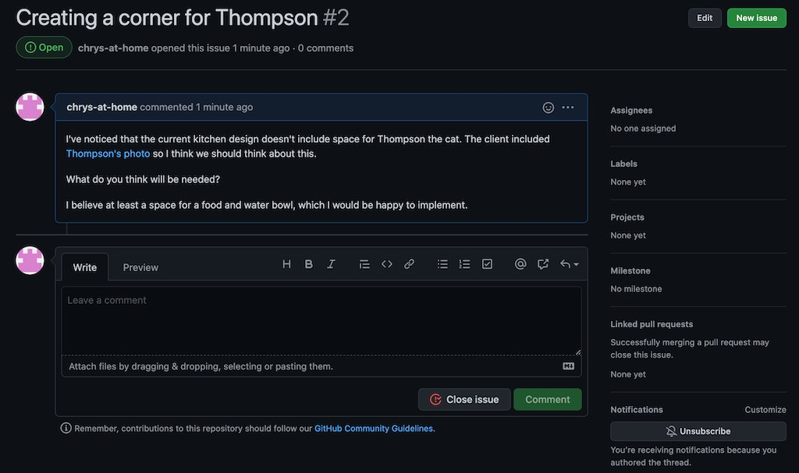
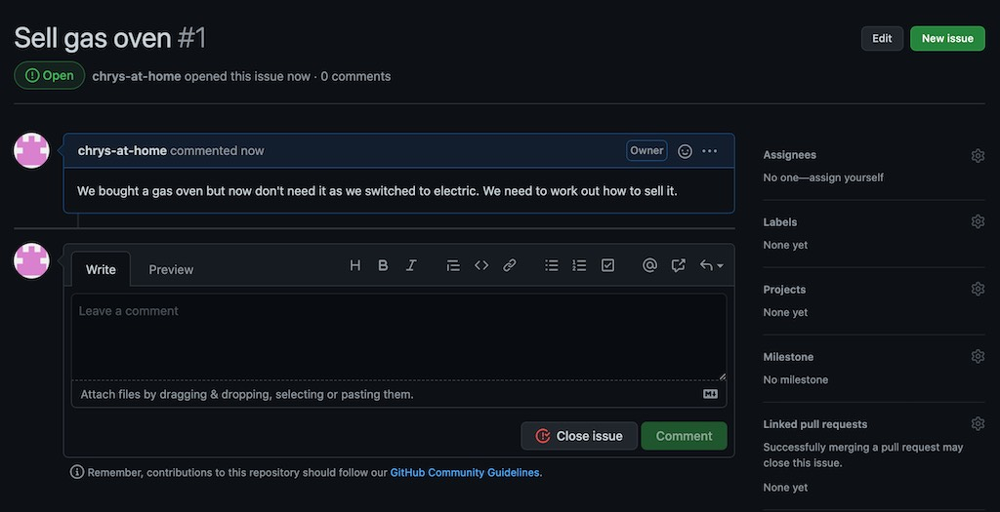

```{r setup, include=FALSE}
knitr::opts_chunk$set(echo = TRUE)
```

## Issues and milestones

Communication is the key to collaboration. You saw that in the last page, in which the communication 
around the "pull request" was key to getting your changes pulled back into `upstream`.

The communication around pull requests happens after you have completed the work. Because of this,
there is a risk that your pull request is rejected (e.g. as in the example where you decided to 
pursue gas while `upstream` pursued electric). This risk can be mitigated by communicating
*before* you start your work. GitHub provides tools to help you do this. These
are Issues and Milestones.

## Issues

The "Issues" tab is available on nearly all GitHub projects. It provides a page on which you can
post an issue that will open a conversation about a project. For example, the GitHub issues
page for the `upstream` example project is at 
[https://github.com/chryswoods/super_project/issues](https://github.com/chryswoods/super_project/issues).

If you click here you will see a page where you can create issues. If you click on `New Issue`
it will open a dialog in which you can add a title for your issue, and add a message.

Please feel free to click `New Issue` and add an issue now.

Issues are public, so writing an issue is like writing a public email to someone. Please remember
the [GitHub community guidelines](https://docs.github.com/articles/github-community-guidelines)
and be respectful and polite. A good issue should;

* be polite
* be to the point (concise)
* provide evidence, e.g. via links or output from programs
* be objective
* provide help or an offer of help to resolve

You can style your issue using [markdown](https://www.markdownguide.org), so you can include
links, pictures, bullet lists etc. to make things easier to read (and you can preview this
via the `preview` tab).

For example, let's now create a new issue about the need for a cat space in the kitchen.

Make the title `Creating a corner for Thompson` and set the issue text to;

```
I've noticed that the current kitchen design doesn't include space for 
Thompson the cat. The client included 
[Thompson's photo]()https://github.com/chryswoods/super_project/blob/main/images/thompson.jpg?raw=true) 
so I think we should think about this.

What do you think will be needed?

I believe at least a space for a food and water bowl, which I would be happy to implement.
```

and then click `Submit new issue`. This will create the new issue. 



You can see that there is now space to continue the conversation. Anyone who has a GitHub account
can contribute to the conversation. As well as adding comments, there is also the option
of closing an issue. This will archive it, although anyone is able to open it again at any point.

While everything is public, the owner of the repository has additional tools available to 
block individuals or temporarily freeze issues via cooling off periods.

## Exercise

Create some more issues in the `upstream` repository. Also engage in conversation with other workshop
attendees in issues that you see are already open. Feel free to close issues as well if you want.

## Issues in your own repository

You have additional controls for issues that are raised in repositories that you own. For example,
go to your forked repository. To
protect you from spam, GitHub may not have enabled issues for your repositories. If this is the
case, then click on the `Settings` tab to open up the settings dialog. Click `Options` on the left,
then scroll down to `Features`. Make sure that `Issues` is checked. This will turn on Issues.
Go back to your project's main page and you should see the `Issues` tab.

Click on this and create a new issue (it can contain anything you want), e.g.



Notice now when you have created the issue that there are settings cogs to the right of the 
`Assignees`, `Labels`, `Projects` etc. on the right side of the screen. These can be used 
by project owners to add additional data to an issue. For example, click the settings cog
next to `Assignees`. This will let you assign the issue to anyone who has write permissions
to your repository (so far, only you). You can use this to assign work to people, or to
assign work to yourself so that everyone else knows what you are doing.

Click on the settings cog next to `Labels`. This lets you add labels to an issue. The label can
be anything. There are a set of suggested labels, but also the option of creating your own
labels at the bottom of the list. Labels let you organise issues. A single issue can have
multiple labels, so feel free to categorise things as much as you want.

## Exercise

Create some more issues in your repository. Assign them to your self and add appropriate labels.

## Milestones

You can use issues to organise work into blocks, with identifyable milestones. Click the settings
cog next to `Milestones`. This will let you assign the issue to a milestone. At the moment
your project has no milestones, so none are listed. You can create a new milestone by
typing the name into the box. For example, type `Selling / recycling waste` and then click
`Create and assign to new milestone`. This will create a new milestone that will track our
progress in selling and recycling waste during the kitchen refit, and will assign the issue
of selling the gas oven to that milestone.

If you click on the `Issues` tab to view all issues, then you will see on the right a `Milestones`
box, showing that you now have 1 milestone. Clicking on this will open the Milestones page.
Here you can see all of the milestones associated with your project, and can click through
to see which issues are associated with each milestone. As issues are completed (and closed)
you will see the progress bar count up until it will reach 100% when all 
associated issues are closed.

Note that (currently) an issue can only be associated with a single milestone. There are lots
of times when being able to associate an issue with multiple milestones would be useful,
so I hope this is something that GitHub fixes in the future.

## Exercise

Create more issues and assign them to milestones. Close the issues and see how the 
progress bar counts up as issues are closed.

## Summary

GitHub comes with many communication and project planning tools that will make it easier
to collaborate productively with others. We have only scratched the surface of these
tools here, e.g. there are also more involved tools such as "Project boards", which 
are under the `Projects` tab, which let you visualise projects and track progress.

As ever, these are tools that will help you and your collaborators communicate.
They can't force you to communicate, and no tool can fix problems caused by team
members who don't talk to each other. Also remember that you should be professional
and polite when communicating. Clear, polite and concise communication is a key skill
needed to be successful when working in a team. It is a skill that needs practice,
but once obtained, will open lots of doors to interesting careers and will enhance
your success when working within (and perhaps one day managing) productive teams.

# [Next](blaming.html)
