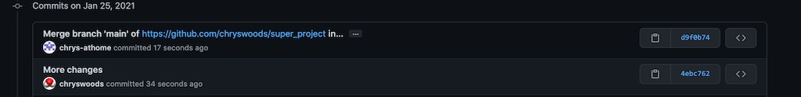

```{r setup, include=FALSE}
knitr::opts_chunk$set(echo = TRUE)
```

## Remotes and Pulling

In the last section you saw how you could create your own remote copy of a remote repository by 
forking it into your own GitHub account. You cloned your fork to create a local copy, and 
a local working tree in which you could make changes. Committing changes in your local 
working tree saved a new version in your local repository. You then pushed new versions 
from your local repository to the remote repository of your fork (your copy).

In this way, you could make changes to your copy of the project.

But what about if the original owner of the repository made changes to the original version
of the repository? How could you get a copy of those changes?

Before we find the answer to that question, we first need to learn more about 
git remotes.

## What is a remote?

A git remote is the URL (web address) of the remote git repository. You have used git remotes
a lot, e.g. `https://github.com/chryswoods/super_project.git` is the URL of the original
`super_project` remote repository.

URLs are long and error-prone to type, so git provides a way to assign an identifying name
to a URL. This identifying name is a named git remote.

For example, `origin` is the name that is given by default to the URL from which you cloned
a repository, and to which you will push changes. You can find the URL associated 
with the name `origin` by typing;

```
git remote get-url origin
```

I see output;

```
https://github.com/chryswoods/super_project.git
```

as I cloned the original GitHub repository. You will see

```
https://github.com/[YOUR USER NAME]/super_project.git
```

as you cloned your fork of `super_project` into your GitHub user space.

You can add as many remotes as you wish, and call them anything you want, e.g.

```
git remote add fluffy_kitten https://github.com/chryswoods/super_project.git
```

would add a remote called `fluffy_kitten` that maps to the URL of the original GitHub repository.
And then;

```
git remote get-url fluffy_kitten
```

would print out

```
https://github.com/chryswoods/super_project.git
```

You can list all of the remotes that have been set for your local repository by typing

```
git remote
```

I see

```
fluffy_kitten
origin
```

You can get git to show more information using

```
git remote -v
```

which, for me, shows

```
fluffy_kitten	https://github.com/chryswoods/super_project.git (fetch)
fluffy_kitten	https://github.com/chryswoods/super_project.git (push)
origin	https://github.com/chryswoods/super_project.git (fetch)
origin	https://github.com/chryswoods/super_project.git (push)
```

`origin` is the name of the remote that is used by default for `git clone` and `git push`. Indeed, you may remember
from the [first workshop](https://chryswoods.com/introducing_git/github.html) that there was the command `git remote add origin https://github.com/chryswoods/versioned_dir.git` that was used as part of initialising the remote GitHub repository, that I told
you to copy and paste without understanding. This command set the URL for `origin`, and then the next command,
`git push -u origin main` told git to use `origin` as the default label for `git push` commands.

## What is upstream?

`origin` is the name we give to the remote repository from which we cloned, and to which we push. We know, 
as humans, that our `origin` is a fork of another GitHub repository, which is 
`https://github.com/chryswoods/super_project.git`. Git does not know this, so we tell git that by
creating a new remote that we will call `upstream`. Do this by typing;

```
git remote add upstream https://github.com/chryswoods/super_project.git
```

This creates a new remote, that we call `upstream`, that refers to the URL of the original remote
git repository from which we forked our own local copy. We could have used any name - in this case
we followed a convention that `upstream` is the URL of the original repository from which we forked.

Now, when you type `git remote get-url upstream` you should see that the URL of the original
remote GitHub repository is printed;

```
https://github.com/chryswoods/super_project.git
```

## Pulling

Why have we created a remote called `upstream`? The reason is that we can now use this to pull changes
that were pushed to the original remote repository, and bring them down to the local working tree
and local repository.

I will now make a change to the original remote repository. I will add a new line to `planning/stage1.md`
and will commit and push that to the original GitHub repository...

(if you are not in a live workshop then either watch the video, or fork and clone a friends
repository and get them to make some changes)

Take a look in a web browser at the original [super_project](https://github.com/chryswoods/super_project)
website. You should see that the new line has been added.

To pull new changes that are committed to another repository, you use the `git pull` command.
The syntax is;

```
git pull [remote name] [branch name]
```

where `[remote name]` is the name of the remote you want to use, and `[branch name]` will be explained
later, but in our case will always be `main`.

In our case, we are going to pull changes from `upstream main`, so the command you should type is

```
git pull upstream main
```

You should see that this will open your text editor to write a new commit message. The commit
message will already be prepared for you, and will look something like this;

```
Merge branch 'main' of https://github.com/chryswoods/super_project into main
# Please enter a commit message to explain why this merge is necessary,
# especially if it merges an updated upstream into a topic branch.
#
# Lines starting with '#' will be ignored, and an empty message aborts
# the commit.
```

Save this message as-is, and you should then see output that looks something like this;

```
remote: Enumerating objects: 7, done.
remote: Counting objects: 100% (7/7), done.
remote: Compressing objects: 100% (1/1), done.
remote: Total 4 (delta 2), reused 4 (delta 2), pack-reused 0
Unpacking objects: 100% (4/4), done.
From https://github.com/chryswoods/super_project
 * branch            main       -> FETCH_HEAD
   74b59d9..ee1ef2c  main       -> upstream/main
Merge made by the 'recursive' strategy.
 planning/stage1.MD | 2 ++
 1 file changed, 2 insertions(+)
```

This shows that git has fetched the changes made to `upstream/main` and then merged them into
your current working directory (in this case, changing the file `planning/stage1.MD`). You 
have committed the change, so a new version has been saved to your local repository, which 
contains all of the changes that have been merged in from the original remote repository 
(`upstream`). 

You can check the status using `git status`. When you run `git status`, you should see something
like this output;

```
On branch main
Your branch is ahead of 'origin/main' by 2 commits.
  (use "git push" to publish your local commits)

nothing to commit, working tree clean
```

This shows that your local repository in your local `.git` folder is two commits ahead of
the remote repository in your fork of the `super_project` in your personal account's GitHub
user space (which is called `origin/main`).

You are ahead by two commits, because there is one commit - made by me - that
added the line, and then a second commit - made by you - that merged this change into 
your local repository.

You can now push these two commits from your local repository (`.git` folder) to your
remote GitHub repository (your fork, at `origin/main`) by typing;

```
git push
```

You should see that this is pushed, e.g.

```
Username for 'https://github.com': chrys-at-home
Password for 'https://chrys-at-home@github.com': 
Enumerating objects: 4, done.
Counting objects: 100% (4/4), done.
Compressing objects: 100% (2/2), done.
Writing objects: 100% (2/2), 318 bytes | 318.00 KiB/s, done.
Total 2 (delta 1), reused 0 (delta 0)
remote: Resolving deltas: 100% (1/1), completed with 1 local object.
To https://github.com/chrys-at-home/super_project.git
   5d80435..0fa9145  main -> main
```

and then `git status` should show that your branch is up to date with `origin/main`, e.g.

```
On branch main
Your branch is up to date with 'origin/main'.

nothing to commit, working tree clean
```

If you now check `planning/stage1.MD` on the GitHub page for your `super_project` you should
see that it now contains the new line that were added by me. You will also see the commit messages
that I used when I added the line, with that commit attributed to me, and the second merge
commit attributed to you, e.g.



## Git Cheat Sheet

We have two new commands, `git remote`, which is used to set up a name for the URL of a remote
repository, and `git pull` which is used to pull changes from a remote repository into 
the local repository, and to merge those changes into the working tree.

```
Git Cheat Sheet

(1)  git init              : Tell git to start version controlling the files in a directory
                             (initialises git in a directory)
(2)  git status            : Tell git to print the status of the files in the version 
                             controlled directory.
(3)  git add               : Tell git to start monitoring (tracking) the versions of a new
                             file, e.g. `git add README.md` will tell git to track `README.md`   
(4)  git commit -a         : Tell git to save a new snapshot version of all of the tracked
                             files in the directory. The `-a` means "all files". You can
                             commit new versions of individual files if you want, but this
                             is not recommended.
(5)  git diff              : Tell git to show the differences between the files in the working
                             directory and the last saved version in the git repository. This will
                             show the differences for all tracked files. Use
                             `git diff FILENAME` to limit to only the file `FILENAME`
(6a) git checkout VERSION FILENAME  : Tell git to bring `VERSION` version of `FILENAME` into the 
                                      current working directory. If `VERSION` is `main` then 
                                      restore the last version of `FILENAME` that was saved
                                      to the repository.
(6b) git checkout VERSION  : Tell git to change the working directory back to a specific `VERSION`
                             number. If `VERSION` is `main`, then return the working directory to
                             the last saved version in the repository.
(7)  git log               : Print a log of the versions in the repository. Use `git log -n N`
                             to limit to the last `N` versions. You may need to use `q` to exit
                             from the text viewer if there are a lot of versions to print.
(8)  git mv OLD NEW        : Rename a file from name `OLD` to name `NEW`.
(9)  git rm FILENAME       : Remove the file `FILENAME` from the working directory (it still exists
                             in the repository). Will only work if the file is tracked by
                             git and doesn't have any changes. Use `-f` to force removal of files. 
(10) git push              : Push versions that are saved in the local repository (.git folder)
                             so they are backed up to a remote repository (.git folder)
(11) git clone URL         : Clone (download) a local copy of the remote repository that is available
                             at the specified URL. You will only be allowed to push to that repository
                             if you have permission. If not, then fork the repository into your
                             own account before cloning. 
(12a) git remote -v        : Show information about all of the remotes that have been configured
                             for a local repository.
(12b) git remote add NAME URL   : Add a new remote called `NAME` that refers to the remote 
                                  repository at `URL`, e.g. 
                                  `git remote add upstream https://github.com/chryswoods/super_project.git`
                                  will add a remote called `upstream` that refers to the original
                                  `super_project` URL.
(13)  git pull REMOTE BRANCH : Pull changes from the specified BRANCH of the specified REMOTE into
                               the local repository and merge them into the working tree. For example,
                               `git pull upstream main` would pull changes from the default branch
                               of `upstream` into the local repository. By default, REMOTE is `origin`
                               and BRANCH is `main`, so `git pull` will pull changes from the same
                               remote repository that `git push` pushes to.
```

## Exercise

I will make another change to the original `super_project` repository. Use `git pull` to pull those
changes into your repository and merge them into your working tree. Commit the changes, then
`git push` them to your fork of `super_project`.

(if you are not doing this live in the workshop, then take a look at the video, or fork
a project that has regular commits, and then use `git pull` to keep your fork up to date with
the latest commits as they happen)

## Notes

`git pull` and `git push` are the commands used to push changes from a local repository to a 
remote repository, or pull changes from a remote repository back to a local repository.

By default, both will push and pull from the default branch of the default remote repository
for your local repository, e.g. `origin main` in most cases. This is why we have not specified
a remote or a branch when we used `git push`, as this is the correct location in most cases
to push. You can type `git push origin main` if you want. You can also push to *any* remote
repository that you have write access to, e.g. `git push upstream main` if you have write
access.

Similarly, `git pull` will pull by default from `origin main`, meaning that you can use
`git pull` on its own to pull any changes that have been made to your remote repository
that are not in your local repository. This may be the case if you have a clone of your repository
on two computers, e.g. home and work, and you have run `git push` from work to upload
changes from your work computer, and then run `git pull` on your home computer to 
download those changes. When working with others you will normally use `git pull REMOTE BRANCH`,
e.g. `git pull upstream main` to pull in changes made in other forks into your repository.
For example, if you and your collaborator (e.g. called Fred) were working together, 
you could set a remote called `freds_fork` to refer to the URL of Fred's fork, and then
call `git pull freds_fork main` to pull and merge in any changes made by Fred. Similarly, 
Fred would do the same for your fork, and would call `git pull ...` on thier computer
to pull in your changes.

# [Next](merging.html)