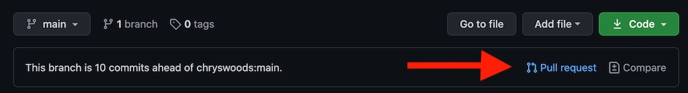
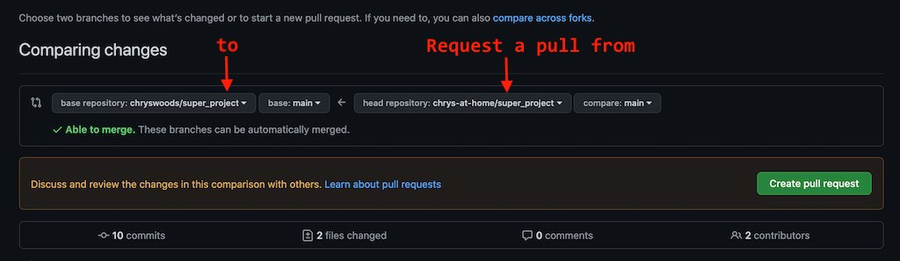
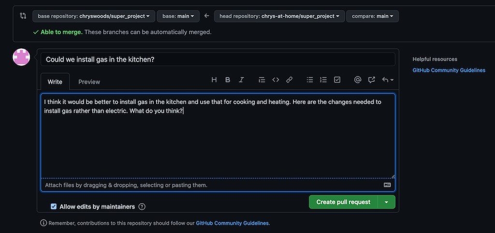
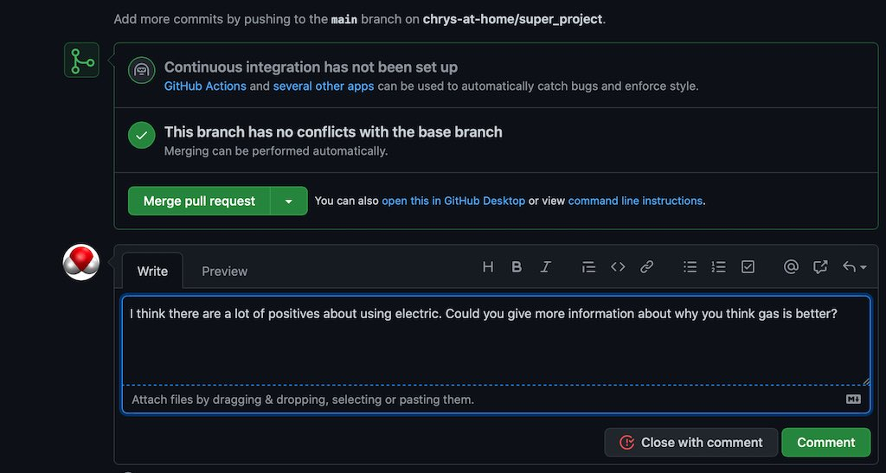
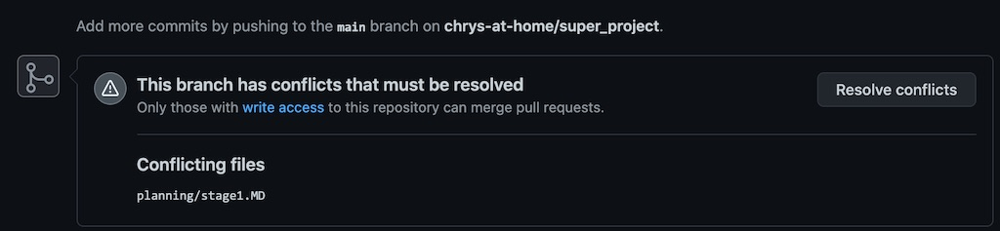

```{r setup, include=FALSE}
knitr::opts_chunk$set(echo = TRUE)
```

## Pull requests

Up till now, you have been able to push to your own fork, and to pull from both your fork and from 
my `upstream` repository. This has let you make changes to your fork, but has forced you to accept
changes that I've made to `upstream`. This is causing increasing conflict as your fork and 
my `upstream` drift apart.

What you want is an ability to push changes into my `upstream` repository. This way you can tell
me that you want to use gas, and can push in the changes in the files needed to switch from
electric to gas.

However, pushing changes to someone else's repository is considered rude. Normally you don't have
permission to push to someone else's repository, e.g. if you type `git push upstream main`
you should see an error saying that you are unable to access the repository.
Even if I did grant you permission, and you did have access, then pushing changes without
discussion could cause upset or argument.

## Don't force a push - instead request a pull

The alternative to forcing a push of your changes into someone else's repository is to 
instead ask them if they would like to pull your changes themselves. This "request to pull"
is known as a "pull request". You can make a pull request on any repository you like, even
if you don't have permission to push to that repository. GitHub makes it very easy. 

You issue a pull request from the GitHub web interface. To start, you should click on the 
`Pull Request` icon;



This will open up a dialog which will look something like this;



The repository on the right it the repository
from which you are requesting the pull. This should be your forked repository 
(so `chrys-at-home/super_project` for this example). The repository on the left is the one
which you are requesting should perform the pull. This should be the original `upstream` repository,
i.e. `chryswoods/super-project`. The best way to remember this is to 
read this dialog is "I am requesting that the repository on the left pulls in changes made 
in the repository on the right".

Note that you can see a green tick. This means that there are no conflicts, and you could create 
the pull request. Again, it is considered good manners to only raise pull requests that
have a green tick (and thus no conflicts). If there are conflicts, then you should resolve them
as you did in the last page.

Given there are no conflicts, you can now click `Create pull request`. This will open another
dialog page that will look something like this;



This provides space for you to give a subject title for the pull request, and to add a message
saying why you are submitting the pull request. This message is your way of communicating with
the owner of the `upstream` repository and (politely) making your case for your changes. Note
that there are links to the [GitHub community guidelines](https://docs.github.com/articles/github-community-guidelines),
which you should read. They can help you ensure that your message is polite and respectful, 
thereby making it more likely that the owner of the `upstream` repository will read it and
won't be offended.

Once you have written your message you can click the `Create pull request` button. This will now
actually create the pull request and will send your message to the owner of the `upstream`
repository. Your screen will now change to a "conversation" view, in which you can now engage in 
conversation if needed.

I, as the owner of `upstream`, can now see this pull request in my list of pull request. If I click
on this, I can now see a similar "conversation" view. I can use this to send messages back to you, e.g.



When I send this message, it pops up in your "conversation" view, and you are notified (if 
notifications are on). This way we can talk about the pull request.

## Changing a live request

Note that we can both continue to push changes to our repositories while the pull request is active.
It will be automatically updated by those changes. For example, I will now add a conflicting change
to `upstream`, e.g.

```
1. Install an electric boiler
1. Install electric heaters
1. Install electric circuit breaker
1. Install the cupboards
1. Install the drawers
1. Paint the ceiling
1. Tile the walls
1. Install the counter tops
1. Install the electric oven
1. Install the fridge
```

(and then I `git commit -a` and `git push`).

This change means that the pull request cannot now be automatically merged. You can see this because 
the green tick in your pull request has now changed automatically to a box warning you about
the conflict;



You could resolve this conflict in the GitHub web interface, but I prefer to continue to use
the command line. On the command line pull in the changes from `upstream` via 
`git pull upstream main`. You should see that a conflict in `planning/stage1.MD` is reported.
Edit the file and resolve the conflict by retaining the circuit breaker (it will likely still
be needed even if we are using gas), e.g.

```
1. Install a gas pipe
1. Install a gas boiler
1. Install radiators
1. Install electric circuit breaker
1. Install the cupboards
1. Install the drawers
1. Paint the ceiling
1. Tile the walls
1. Install the counter tops
1. Install the gas oven
1. Install the fridge
```

Commit and push your change to your fork (`git commit -a` and `git push`). You will now see in the 
GitHub web interface that this commit has been added to your pull request, and it can be 
automatically merge, and the green tick is restored.

## Accept or reject?

The decision to accept or reject your pull request is, ultimately, that of the owner of the 
`upstream` repository. You should remember that popular projects could have large numbers
of pull requests, so it may take a long time for the owner to respond to yours. In the meantime, 
you will need to keep pulling in changes from `upstream` and fixing and merging any
conflicting changes. It is up to you, as the person who requested the pull, to resolve conflicts
and keep your fork up to date.

Also bear in mind that the conflict may be unresolvable. You may be asking for something that 
the project doesn't want to support (e.g. maybe gas is not possible?). Or you may be asking
for something the `upstream` doesn't want to support, or that may be incompatible with the 
license terms of the project. A pull request is *just a request*. It may be rejected, 
which is not a bad thing.

If your pull request is rejected then this is an acknowledgement that your conflict is 
not resolvable, and your fork and `upstream` will diverge into two separate projects. 
Forking of projects is not a bad thing, as it allows small seeds to grow into lots
of different - but related - trees.

In this case, I am going to reject your pull request, as this kitchen is going to 
remain electric. To do this I write a message saying why I am rejecting, and then click
"Close pull request". You will see this pop up in your conversation view. Note that you 
can always open the pull request again, and you can also continue to comment. As ever,
remember to be respectful and polite.

## If accepted...

If I had accepted the pull request, then I would have pulled your changes into `upstream`
and we would have switched to a gas-powered kitchen. This would mean that you would no longer
see any conflicts when pulling from `upstream` via `git pull upstream main`. You would continue
to make changes and would then issue a new pull request when you wanted your changes
to be pulled into `upstream`.

## If rejected...

As I have rejected your pull request you have two choices. You can stay with gas, and accept
that your fork will now drift away from `upstream`. Or you can revert your changes back and 
instead follow `upstream` by using gas. The easiest way to do this is to checkout the 
version of `planning/stage1.MD` that comes from `upstream`. You can do this using
the `git checkout` command, but telling it to checkout from `upstream`, e.g.

```
git checkout upstream/main -- planning/stage1.MD
```

If you check the file, you will now see that you have the `planning/stage1.MD` from `upstream`.
A check of `git status` shows that git has recognised that this file has been modified.
You can now commit this and push to your fork via `git commit -a` and `git push`.

If I now change `upstream`, e.g.

```
1. Install an electric boiler
1. Install electric heaters
1. Install electric circuit breaker
1. Install plugs
1. Install the cupboards
```

and commit and push, then when you `git pull upstream main` you will no longer see a 
conflict, and will get the automatic merge commit.

# [Next](issues.html)
