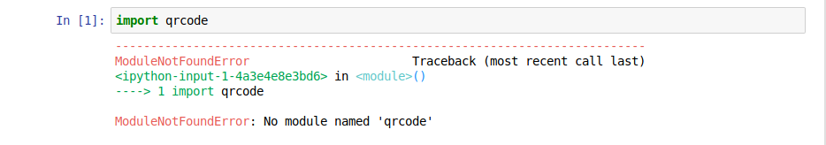

# Step 1 - Creating the actual workshop notebook

The first step when building a workshop is to create the actual Jupyter notebooks that the students will follow. It is best to build these on your own computer in a normal Python environment (e.g. such as a standard conda).

The aim is to build your workshop material and get it working on your own computer, before you then add the complexity of creating a docker image, kubernetes cluster and then upload to the cloud...

We have created an example set of notebooks that will form the basis of your workshop. These are in the `example_workshop` directory. Let's first play with these examples locally using the jupyter notebook server that is installed on this computer. To do this, type

```
$ jupyter-notebook example_workshop
```

This should print out a lot of input and then start up a web-browser with a Jupyter notebook interface, such as that shown below;


Click on `lesson01.ipynb` to start the first lesson. The lesson is our "workshop-in-a-workshop" which will teach you how to generate QR codes. Before we go any further, take a look at the layout of the workshop. It clearly sets out the learning objectives and organises the lessons in an easy-to-follow order. Everything that the learner needs to know is included in the workshop, enabling them to move through the material at their own pace.

Now, try running the workshop. You should immediately encouter a problem. As seen in the error message below, we have not got the necessary Python [qrcode](https://github.com/hcvst/pyqr) library installed on this computer.



The qrcode library is a dependency of this workshop-in-a-workshop, so would need to be installed on the computers used to run the workshop. While we could install this dependency on those computers manually, it is a chore. It is either an administrative headache for us, or a distraction for the learner at the start of the workshop.

The aim of this workshop is to teach you how to deploy Jupyter notebooks in the cloud that have all of the dependencies you need already installed :-)

***

# [Previous](../README.md) [Up](../README.md) [Next](part02.md)

