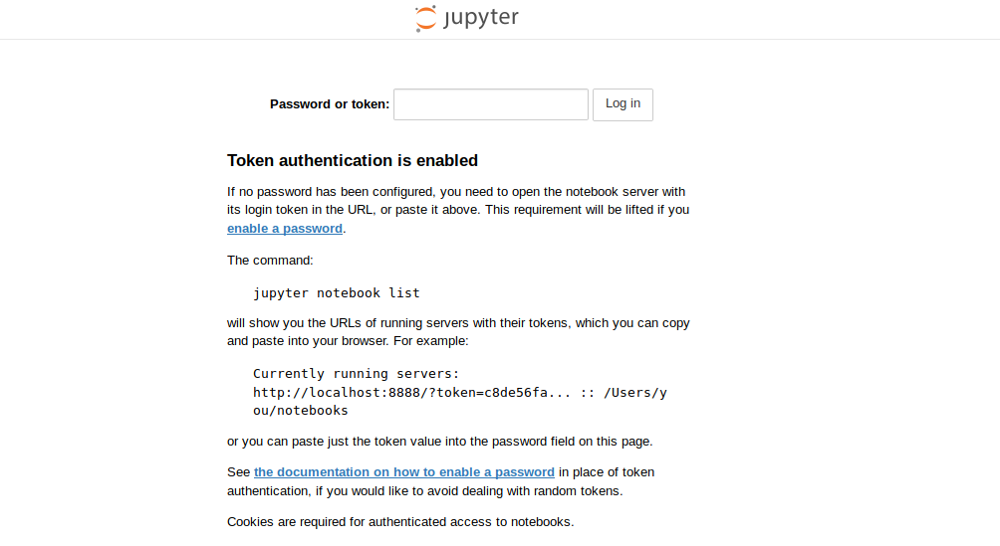
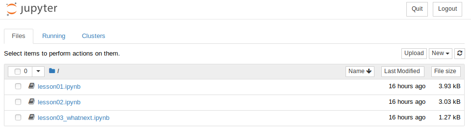

# Step 3 - Building your first docker image

In the [last lesson](part02.md) you found that the dependencies of the workshop-in-a-workshop were an installed python 3, pyqrcode, pymaging and pymaging-png.

These were installed using:

* pyqrcode: `pip install qrcode[pil]`
* pymaging: `pip install git+git://github.com/ojii/pymaging.git#egg=pymaging`
* pymaging-png: `pip install git+git://github.com/ojii/pymaging-png.git#pymaging-png`

For someone to run this workshop they would need to;

1. Download and install anaconda python
1. Install the above dependencies using pip
1. Obtain a copy of all of the notebooks in the example_workshop directory

## Building containers using Docker

Containers provide a great way to package together software and files into a single package that can be easily installed and run by end users. [Docker](https://docker.com) is the most prominant example of a containerisation platform.

With docker, you use a `DockerFile` to specify what software must be installed in the container, and what files are needed. The docker application then packages all of these files and software into a single container that can be easily downloaded and run by end users.

This workshop will not teach Docker. You can learn more about docker by following [one](https://docs.docker.com/get-started/) [of](https://docker-curriculum.com/) [these](https://www.tutorialspoint.com/docker/index.htm) [tutorials](https://stackify.com/docker-tutorial/).

Below is a fully commented `DockerFile` that can be used to build a container for the workshop-in-a-workshop.

```
# Start your container from one of the many example 
# containers on DockerHub. In this case, we will start
# with a minimal container that provides a working
# Python 3.6 environment

FROM python:3.6-slim-stretch

# Next, it is good to label your image with the maintainer
# Please feel free to put your own name and contact 
# address below
LABEL maintainer="Christopher Woods <Christopher.Woods@bristol.ac.uk>"

# First we want to install all of the Python dependencies
# We should do this as root
USER root

# We will need git to install the Pymaging dependencies.
# It is good practice to update apt before the install,
# and to then remove any unnecessary files afterwards so
# that you keep your container size small
RUN apt-get update && \
    apt-get install --no-install-recommends -qy git && \
    apt-get clean && \
    rm -rf /var/lib/apt/lists/*

# Now lets run the three pip commands
RUN pip install qrcode[pil]
RUN pip install git+git://github.com/ojii/pymaging.git#egg=pymaging
RUN pip install git+git://github.com/ojii/pymaging-png.git#pymaging-png

# We also need to ensure we install jupyter (it is required to
# run a workshop as a jupyter notebook!)
RUN pip install jupyter

# We don't want to be root when running the container,
# so lets now create a normal user account called "jovyan"
# To do this, first create some environment variables
# for this user
ENV SHELL=/bin/bash \
    NB_USER=jovyan \
    NB_UID=1000 \
    NB_GID=100

ENV HOME=/home/$NB_USER

# Now add a little script that can properly set the file
# access permissions of directories - put it into /usr/bin
ADD fix-permissions /usr/bin/fix-permissions

# We are now ready to create the user account...
RUN useradd -m -s $SHELL -N -u $NB_UID $NB_USER && \
    fix-permissions $HOME

# Now change into the HOME directory and switch
# into the $NB_USER account. All commands from now
# will execute as the user
WORKDIR $HOME
USER $NB_USER

# Add all of the workshop files to the home directory
ADD example_workshop/lesson*.ipynb $HOME/

# The jupyter notebook will run on port 8888. Make sure that
# this port is exposed by the container
EXPOSE 8888

# Set the entrypoint of the container. This is the command
# that will be run when the container starts.
ENTRYPOINT ["jupyter-notebook", "--ip=0.0.0.0"]

# Always finish a Dockerfile by changing to a normal user.
# This stops you from ever publishing a container that accidentally
# runs as root!
USER $NB_USER
```

The above Dockerfile starts from a cut-down Linux distribution that contains Python 3.6 (it is Debian-based, and the [Dockerfile](https://github.com/docker-library/python/blob/8350b865d28bc0f4a05111398392ec701d449058/3.6/stretch/slim/Dockerfile) for this can be [viewed here](https://github.com/docker-library/python/blob/8350b865d28bc0f4a05111398392ec701d449058/3.6/stretch/slim/Dockerfile)).

From that starting point, we install git, and then added in the pip commands necessary to install all of the dependencies of our workshop-in-a-workshop. We also add in a normal user account so that the "user" of the container is not root. Next, we copied in the jupyter notebook files into the home directory, and then finally exposed the jupyter notebook port (8888) and then told the container to execute the `jupyter-notebook` program when it starts.

The above Dockerfile is in the current directory. You can build the docker image using the command;

```
docker build . -t workshop
```

This tells docker to build the image described by the Dockerfile in the currect directory, and to then tag (label) the image with the name `workshop`.

Once the container has been built, run the container using the below command;

```
docker run -p 8888:8888 workshop
```

The `-p 8888:8888` option tells docker to allow access to port 8888 in the contanier via port 8888 on localhost. When you run the command you should see something similar to this printed to the screen;

```
(idp) workshops@RSE2018-workshops:~/woods$ docker run -p 8888:8888 workshop
[I 09:26:18.726 NotebookApp] Writing notebook server cookie secret to /home/jovyan/.local/share/jupyter/runtime/notebook_cookie_secret
[I 09:26:19.042 NotebookApp] Serving notebooks from local directory: /home/jovyan
[I 09:26:19.043 NotebookApp] The Jupyter Notebook is running at:
[I 09:26:19.043 NotebookApp] http://(70c77dfc0f6a or 127.0.0.1):8888/?token=fec0de57c2a7fac90e0c46a0f51698b10b083ddc22eb7796
[I 09:26:19.043 NotebookApp] Use Control-C to stop this server and shut down all kernels (twice to skip confirmation).
[W 09:26:19.043 NotebookApp] No web browser found: could not locate runnable browser.
[C 09:26:19.043 NotebookApp] 
    
    Copy/paste this URL into your browser when you connect for the first time,
    to login with a token:
        http://(70c77dfc0f6a or 127.0.0.1):8888/?token=fec0de57c2a7fac90e0c46a0f51698b10b083ddc22eb7796
```

You will see the login token printed at the bottom (e.g. my token above is `fec0de57c2a7fac90e0c46a0f51698b10b083ddc22eb7796`). Copy the token to your clipboard as you will need it for the next stage.

The docker container is now running, with port 8888 on localhost now routed to port 8888 of the container (which is the port used by the jupyter-notebook process).

Start your webbrowser and connect to the notebook by navigating to `http://127.0.0.1:8888`. You should see a screen that looks something like this;



Paste the login token you copied above into the "Password or token" box and click "Log in". You should now see your workshop notebooks in the jupyter file browser (as below);



## Exercise

Work through the notebooks from the workshop-in-a-workshop running in your container. Do they all work?

***

# [Previous](part02.md) [Up](../README.md) [Next](part04.md)

