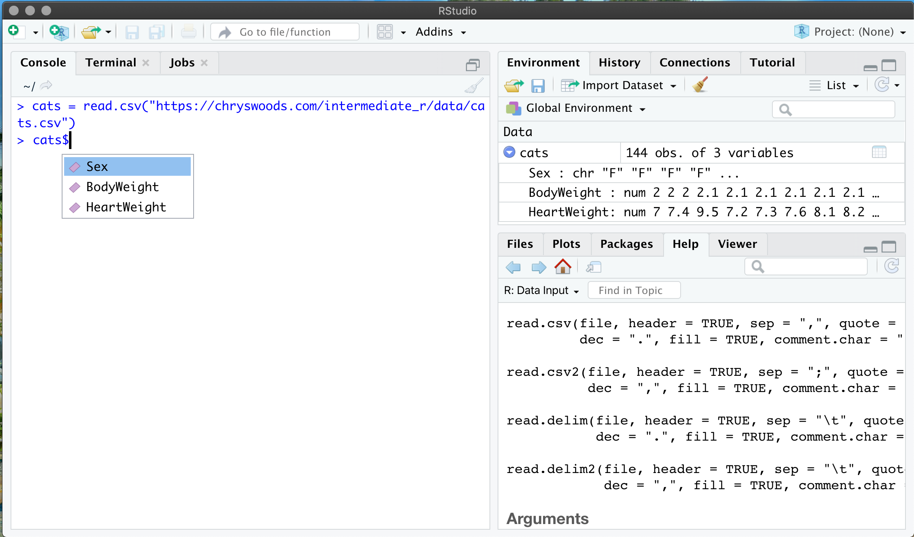

```{r setup, include=FALSE}
knitr::opts_chunk$set(echo = TRUE)
```

The below image shows how I've loaded the cats dataset into a 
`data.frame` called `cats`. When I type `cats$` I get a popup
showing the possible completions, i.e. the columns available.
These are `Sex`, `BodyWeight` and `HeartWeight`.


