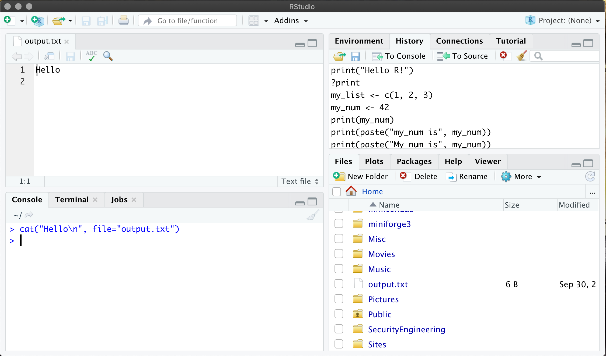
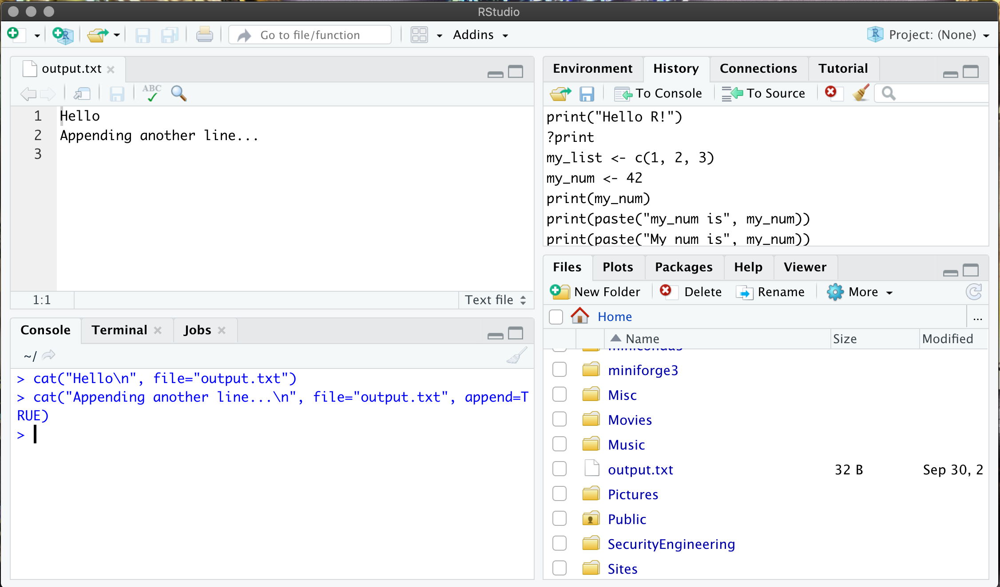
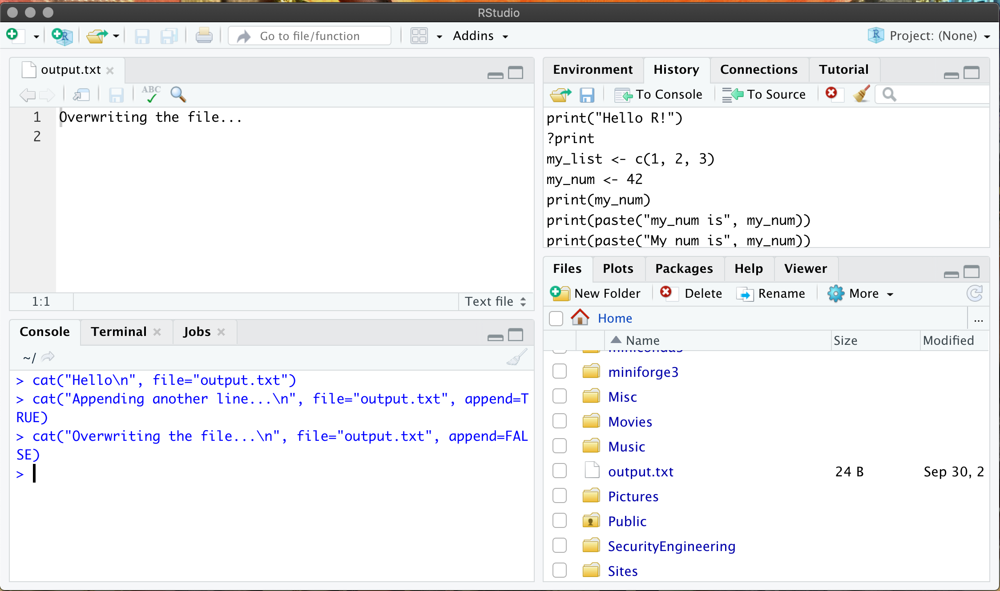

```{r setup, include=FALSE}
knitr::opts_chunk$set(echo = TRUE)
```

First create the file and write "Hello" into it...

```R
cat("Hello\n", file="output.txt")
```

Then look for the file in the "Files" pane, and click on it to open
it in the top-left, e.g.



Next, write another line in "append" mode and see how that gets
added to the file:

```R
cat("Appending another line...\n", file="output.txt", append=TRUE)
```



Finally, write a new line to this file with `append=FALSE` and see
how this overwrites the file...

```R
cat("Overwriting the file...\n", file="output.txt", append=FALSE)
```



When you have finished you can delete `output.txt` and close the
text editor window.

