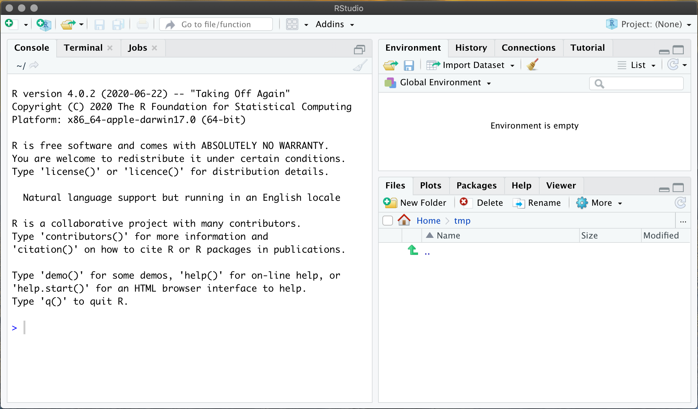
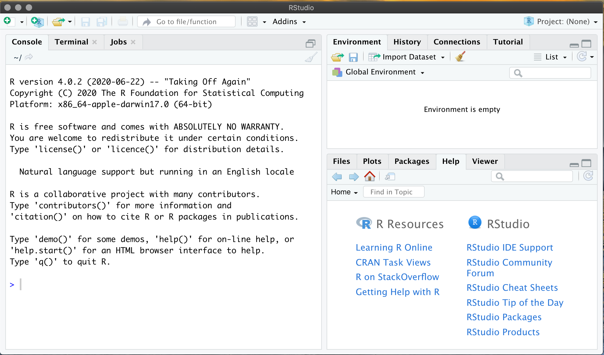
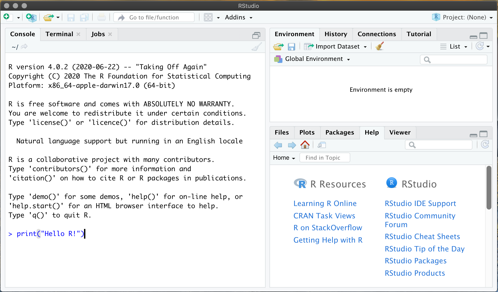
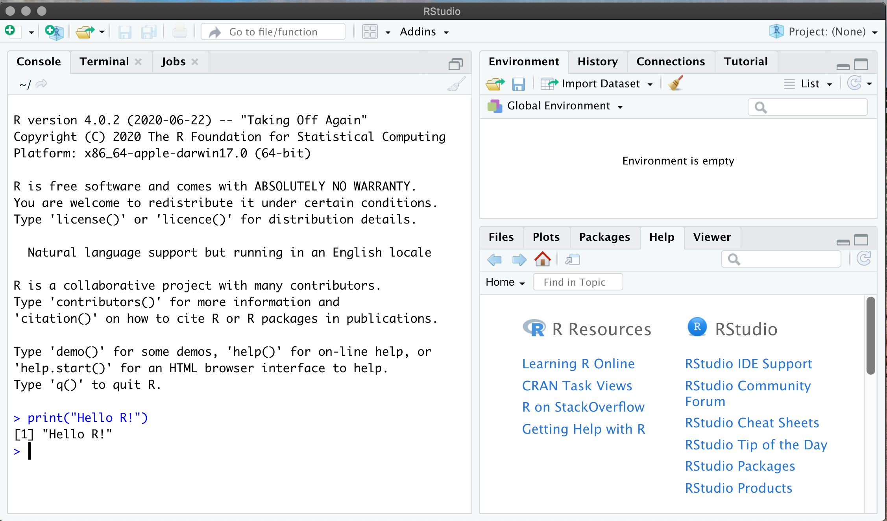
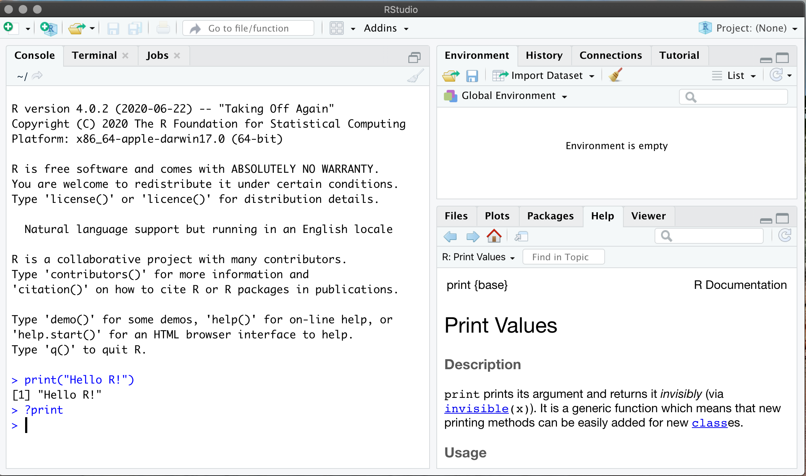
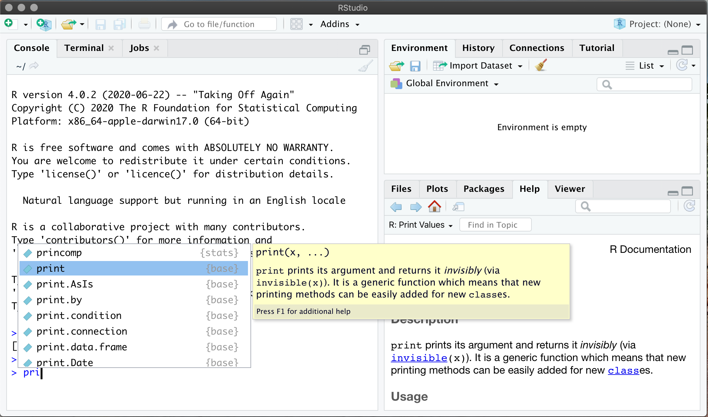
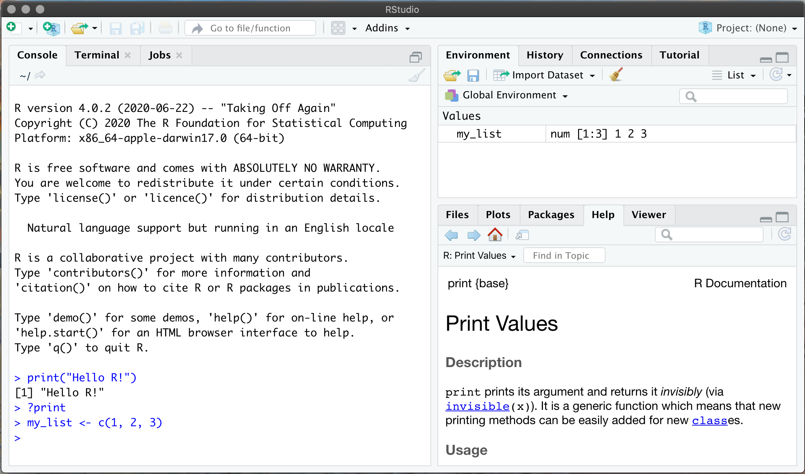
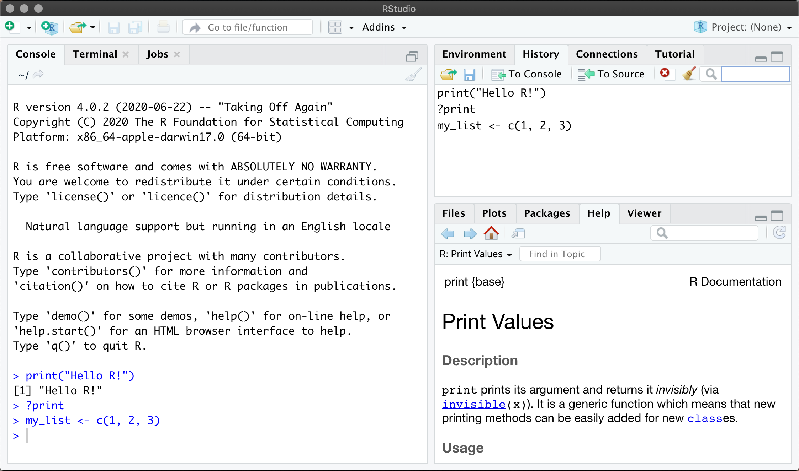

```{r setup, include=FALSE}
knitr::opts_chunk$set(echo = TRUE)
```

Welcome to a short course which will introduce you to some more of the R programming 
language. The aim of this workshop is to build on 
[Beginning R](https://chryswoods.com/beginning_r), and to then introduce
enough of the language that you will be ready to learn how to use R to 
perform data analysis and visualisation (e.g. as will be covered in 
[Introduction to Data Analysis with R](https://chryswoods.com/data_analysis_r)).

You can jump ahead to any chapter:

1. [String formatting](formatting.html)
2. [Packages and CRAN](packages.html)
3. [Functions](functions.html)
4. [Tibbles](tibbles.html)
5. [Tidyverse](tidyverse.html)
6. [`%>%` Forward pipe](magrittr.html)
7. [Summary](summary.html)

For the purposes of this workshop we will be using RStudio. If you haven't
installed and got RStudio working, then please follow the instructions
in the [Beginning R workshop](https://chryswoods.com/beginning_r).

## Setting up your workspace

Start RStudio on your computer. This should open a window that looks something
like this:



In [Beginning R](https://chryswoods.com/beginning_r) we set RStudio
to have a text editor and the terminal as our focus. In this workshop
we are going to use more of RStudio, and so will set up the workspace
in a different way.

We are going to use the "Console" on the left-hand pane, the
"Environment" in the top right, and the "Help" in the bottom
left. Click on the tabs in these panes to make sure that these
are visible, e.g. looking something like this:



## RStudio Console

In [Beginning R](https://chryswoods.com/beginning_r) you saw that R scripts
are just text files that contain instructions written in the R programming
language. You wrote text files, saved them, and then ran them via
`Rscript`, which is the R interpreter program.

The RStudio Console provides an interactive way of running R commands. 
The Console is an interactive window in which R commands are run as you write
them.

For example, click on the console window and type into it;

```R
print("Hello R!")
```



When you press "return" you will see that you see that the R command is
interpreted immediately, with the result printed directly below the command.



This is very useful, as it means that you can write and run R interactively.

You can also get help by putting a `?` before a command. For example type

```R
?print
```

and press return. You should see help for the `print` function displayed
in the help pane on the bottom left.



You may also have noticed that, as you typed, a pop-up appeared that tried
to suggest auto-completions for your typing. If you move your mouse over 
any of those auto-completions you will also see a short descriptive help
text for the function:



## The Environment

Next, type into the console

```R
my_list <- c(1, 2, 3)
```

and hit return. This will create a list. You will see this list appear
in the Environment pane on the top right;



This pane shows the values of all of the variables that are active in 
your session, which can be very useful.

Next to the Environment tab is the History tab. Click on this to 
reveal the History pane. This is the history of all of the commands
that you've typed into the console.



This has helpful tools to help you search your history, as well as copying
items from the history to the console, or to copy them to a 
text file so that they can be saved to disk.

## Reproducible Research

The console and tools in RStudio are excellent for helping you explore, learn
and play with R. As we will see in the next workshop, they are also great
for interactive data cleaning and visualisation.

HOWEVER, interactive programming can lead to non-reproducible analysis
that is difficult to share with others. You will still need to save
your R commands to text files so that your analysis can be re-run, 
your scripts can be saved in a version controlled repository
(e.g. Git), and so that your R code can be easily tested and 
shared with others.

Please remember, RStudio is just an interface to run R code interactively.
To share and reproduce your analyses you still need to write 
text file R scripts.

## Recommendation

In general I recommend that you use the RStudio Console to experiment while 
going through the examples and then, as you did in 
[Beginning R](https://chryswoods.com/beginning_r),  use the text editor 
to write the answers to the exercises before running them in the terminal.

With that, we can now get on to learning some great new things about R.

# [Next](formatting.html)
