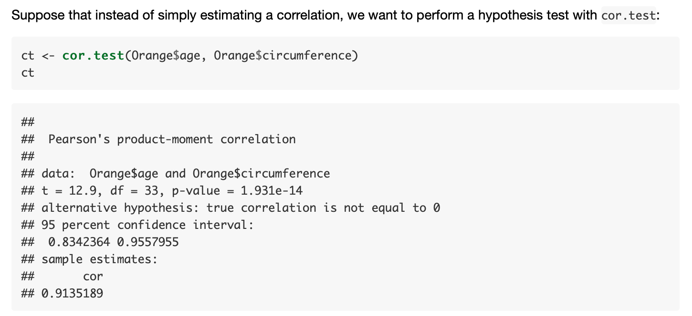
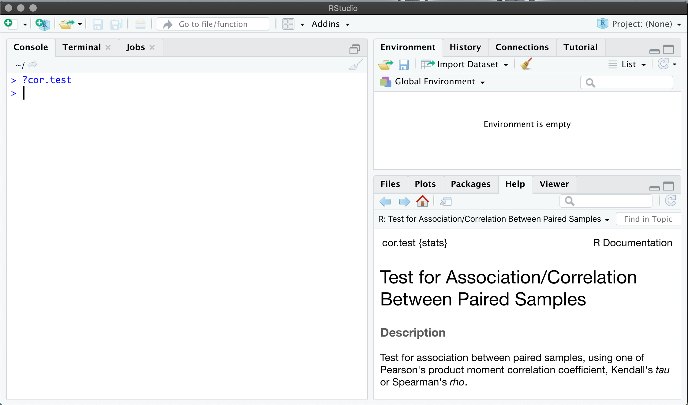

```{r setup, include=FALSE}
knitr::opts_chunk$set(echo = TRUE)
```

Go to [rseek](https://rseek.org) and search for the method we are interested
in, e.g. "pearson product-moment correlation". Set the search type 
to "Vignette", and you should see several results;


The first search result shows something "like the product-moment correlation",
so is probably not relevant. The second search result shows promise, so 
take a look at that; [broom and dply](https://cran.r-project.org/web/packages/broom/vignettes/broom_and_dplyr.html)

This page contains an example showing a calculation of Pearson's product-moment
correlation. Excellent!



From this we can see that the `cor.test` from the `stats` package is used to calculate these
correlations. We can get help with `cor.test` by typing `?cor.test` in the console, e.g.



