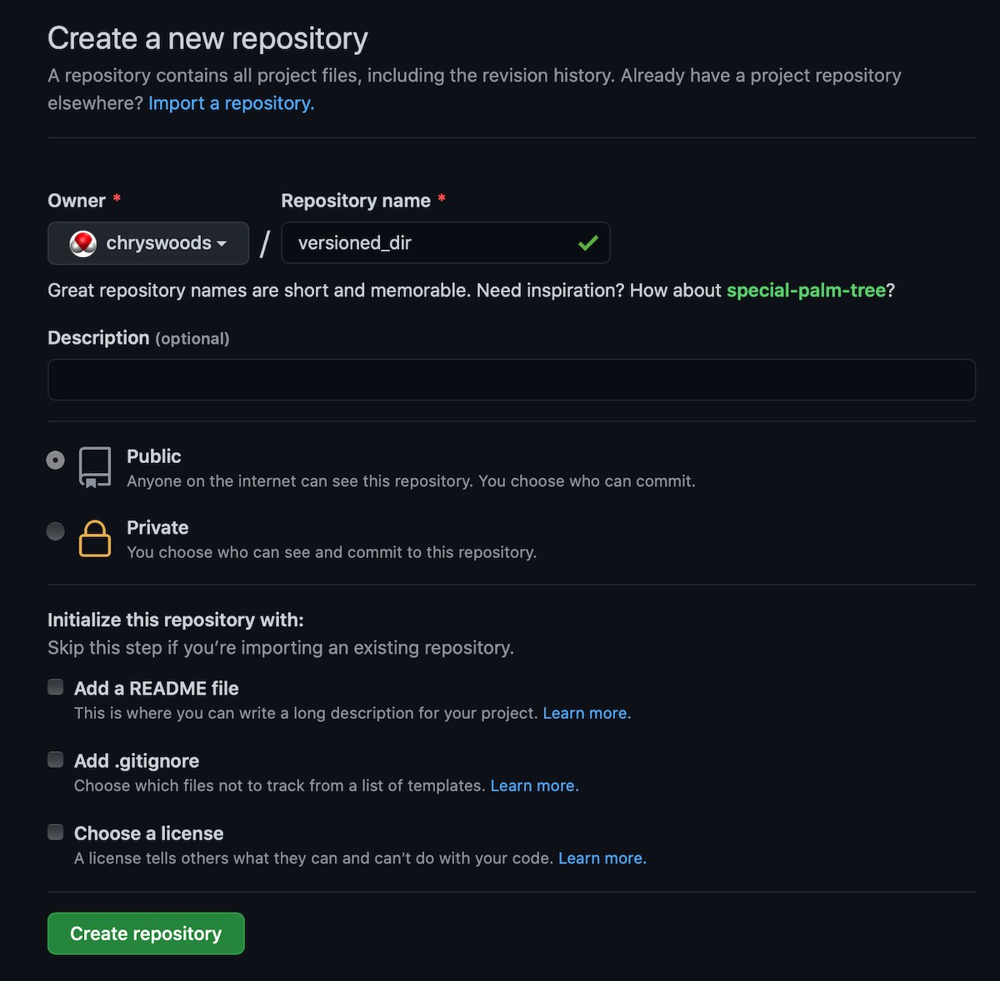
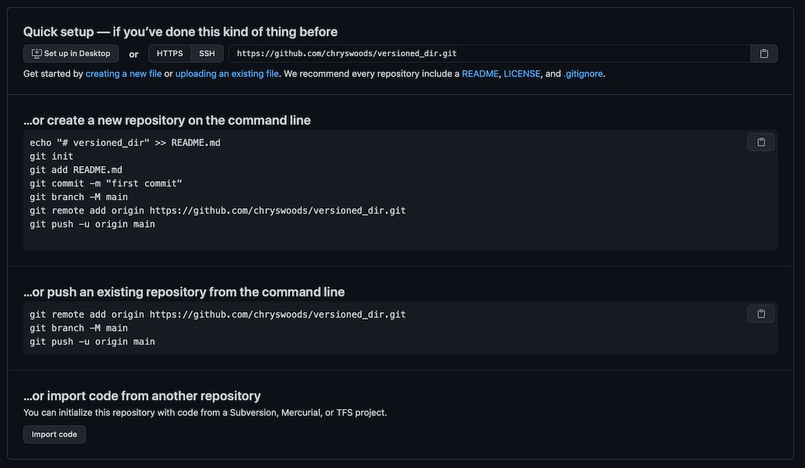
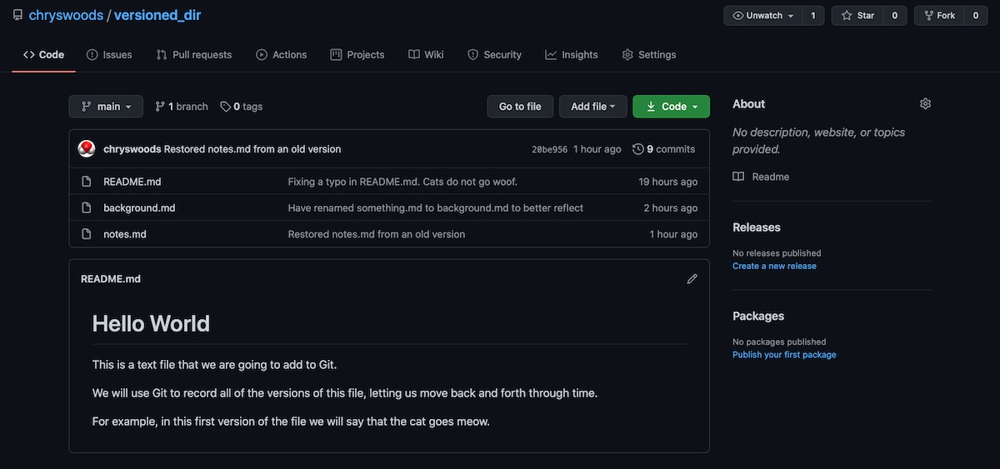
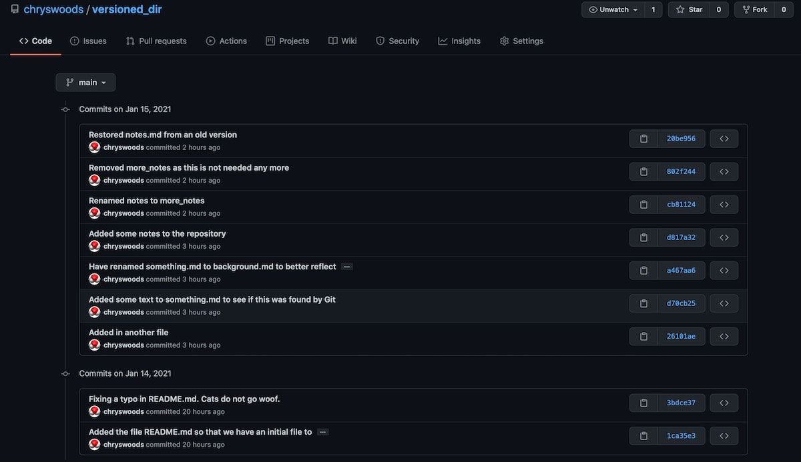

```{r setup, include=FALSE}
knitr::opts_chunk$set(echo = TRUE)
```

## Backing up to the cloud (GitHub)

A question you may have, is where is the repository stored? Where are all of the versions
of the directory that you have saved?

The can be found by typing;

```
ls -a
```

This will list all files, including hidden files in the directory.

You should see something that looks like this;

```
.git          README.md     background.md notes.md
```

Notice that there is an extra hidden file called `.git` in your directory. This is actually
a hidden directory, which you can explore via

```
ls .git
```

On my computer, the `.git` directory contains

```
COMMIT_EDITMSG config         hooks          info           objects
HEAD           description    index          logs           refs
```

The `.git` directory is where git saves the entire repository, and thus all versions of all
files that have been committed.

!!!YOU MUST NOT EDIT OR CHANGE THE .git DIRECTORY IN ANY WAY!!!

If you edit or change this directory you will break git, and thus lose all of the old
versions of files that were committed to the repository.

Because the `.git` folder is saved in `versioned_dir`, this means that it will be removed
if `versioned_dir` is removed. This means that if you accidentally delete `versioned_dir`,
then you will also have deleted the entire git repository. You will thus not be able to 
recover or restore the files.

Equally, if your computer is lost or breaks, then this may also mean that `versioned_dir`
and the `.git` directory contained within is also lost.

** Git is NOT a backup tool. It only version controls your files. It DOES NOT back them up **

## Backing up your files

One way to back up `versioned_dir` is to zip (or tar) it into a zip file (or tarball), 
and then copy that zip file (or tarball) to another computer, a USB drive, or upload it to network
storage (e.g. DropBox, OneDrive, Google Drive etc).

This would back up the data, but it would not be very convenient. You would have to remember
to back up regularly, else you would risk losing data between backups.

## Git hosting services

An alternative to backing up manually is to use a git backup service. These are 
online services that store a backup of your `.git` folder. There are special commands
in git that then integrate with these services, and which make backing up and restoring
very easy and straightforward.

There are many online git backup services, ranging from simple servers that you can
set up yourself, through to large platforms that integrate git backup with a range of
extra offerings (e.g. bug tracking, issues, release management, web hosting etc).

The three most established large platforms are [GitHub](https://github.com),
[GitLab](https://gitlab.com) and [BitBucket](https://bitbucket.com). Of the three,
GitHub is the one most people know. Indeed, you may have come to this workshop 
thinking that git and GitHub were the same thing (or maybe you didn't really
understand what the difference was between them).

To emphasise, git is the open source and free tool for version control. GitHub is
an online platform that integrates a free `.git` backup service with a range of 
extra developer tools.

## GitHub

GitHub is my favorite platform and I use it the most for a range of academic
and personal projects. GitHub is free for public repositories (those that can be 
viewed by anyone, anywhere), and you can have a small number of private
projects (those that only you have access to). 

## Installing a Git Credential Helper

Before you use GitHub, you need to install a "Git credential manager". This
is a program that will let your ``git`` command-line client manage the 
login credentials needed to connect to your GitHub account.

You can install a "Git credential manager" by following
[the instructions here](https://github.com/GitCredentialManager/git-credential-manager/blob/release/docs/install.md). This credential manager is available for 
Linux, MacOS and Windows. Note that the "Git credential manager" is included
with [Git for Windows](https://gitforwindows.org/) and would have been installed
by default as long as you left "Git Credential Manager Core" selected.

## Creating a GitHub account

To use GitHub, register to create an account, and the log in. Once you have
logged in, click the "New Repository" button to create a new repository
(this button is in the menu of the "+" button at the top right of the page).

This will bring you to the page to create a new repository. The page
will look something like this (possibly different colours or layout);



Choose a name for your repository. I've used `versioned_dir`, as this is what
I called the directory on my computer. You can use any name you want, and it
does not need to match the name on your computer.

I've left the repository type to "Public" (meaning everything is published openly),
and am not initialising the repository with anything (as we will be uploading
our existing `versioned_dir` in the next step).

Click "Create Repository" to create the new repository. It will start off being
empty, and something like this page should be seen.



This page gives instructions for the three different ways that you can add files
to this repository. In this case, we will use the "push an existing repository
from the command line" option. The commands to do this are written on the page,
so we will copy and paste;

```
git remote add origin https://github.com/chryswoods/versioned_dir.git
git push -u origin main
```

(note that we have already renamed `master` to `main`, so don't need to run the
second command. Also note that you will need to copy and paste your command - it
will have your GitHub username in the repository URL). 

If this is the first time you have used GitHub, then it is likely that you 
will be asked to log in when you ran the ``git push`` command. The method
you use to log in will depend on your account and operating system. In most
cases, the easiest is to use the option to log in via your web browser.
This will open a tab in your browser and will ask you to log in there
with your GitHub username and password (and possibly multi-factor authenticator
too).

Assuming you could log in correctly, then you should see output that looks
something like this;

```
Enumerating objects: 21, done.
Counting objects: 100% (21/21), done.
Delta compression using up to 8 threads
Compressing objects: 100% (16/16), done.
Writing objects: 100% (21/21), 2.23 KiB | 2.23 MiB/s, done.
Total 21 (delta 5), reused 0 (delta 0)
remote: Resolving deltas: 100% (5/5), done.
To https://github.com/chryswoods/versioned_dir.git
 * [new branch]      main -> main
Branch 'main' set up to track remote branch 'main' from 'origin'.
```

This shows that our local versions in our `.git` folder have been pushed up to
the `.git` folder on GitHub (in my case `https://github.com/chryswoods/versioned_dir.git`).
Git has also been set up so that the local `main` on our computer is set 
to track the remote `main` on GitHub.

If you refresh the GitHub page you should now see that your files have been
uploaded, e.g.



You can use the GitHub interface to explore the files in your repository. For example,
you can navigate to any version in the repository by clicking the "Commits" (the "9 commits"
on the right). This will show all of the versions that have been saved, together with the
log messages. Cool :-)



## Backing up new changes

You have now backed up the `.git` directory of `versioned_dir` to GitHub. But what
if we make new changes and save new versions?

Let's change `README.md`, e.g. by changing the last line to read;

```
will say that the cat goes meow and kittens are cute.
```

Commit this change to the repository using

```
git commit -a
```

Now run `git status`. You should see output that looks something like this;

```
On branch main
Your branch is ahead of 'origin/main' by 1 commit.
  (use "git push" to publish your local commits)

nothing to commit, working tree clean
```

This shows that git knows that your working tree is clean, but that the `main`
in your local repository now has one commit more than the `main` on GitHub.
It is ahead of GitHub by 1 commit. We can send this new commit to GitHub
using the command `git push`. Type this now;

```
git push
```

You should see output that looks something like this;

```
Enumerating objects: 5, done.
Counting objects: 100% (5/5), done.
Delta compression using up to 8 threads
Compressing objects: 100% (3/3), done.
Writing objects: 100% (3/3), 396 bytes | 396.00 KiB/s, done.
Total 3 (delta 1), reused 0 (delta 0)
remote: Resolving deltas: 100% (1/1), completed with 1 local object.
To https://github.com/chryswoods/versioned_dir.git
   20be956..38db1ae  main -> main
```

This shows that the new commit has been pushed (uploaded) from your local `main`
in your local `.git` folder and copied to the `main` in the `.git` folder on GitHub.

If you type `git status` again, you should see output like this;

```
On branch main
Your branch is up to date with 'origin/main'.

nothing to commit, working tree clean
```

This shows that your local `main` is up to date and level with the remote `main`
on GitHub.

## Git Cheat Sheet

We have one new command, `git push`, that pushes (backs up) versions that are committed locally to a remote git hosting service.

```
Git Cheat Sheet

(1)  git init              : Tell git to start version controlling the files in a directory
                             (initialises git in a directory)
(2)  git status            : Tell git to print the status of the files in the version 
                             controlled directory.
(3)  git add               : Tell git to start monitoring (tracking) the versions of a new
                             file, e.g. `git add README.md` will tell git to track `README.md`   
(4)  git commit -a         : Tell git to save a new snapshot version of all of the tracked
                             files in the directory. The `-a` means "all files". You can
                             commit new versions of individual files if you want, but this
                             is not recommended.
(5)  git diff              : Tell git to show the differences between the files in the working
                             directory and the last saved version in the git repository. This will
                             show the differences for all tracked files. Use
                             `git diff FILENAME` to limit to only the file `FILENAME`
(6a) git checkout VERSION FILENAME  : Tell git to bring `VERSION` version of `FILENAME` into the 
                                      current working directory. If `VERSION` is `main` then 
                                      restore the last version of `FILENAME` that was saved
                                      to the repository.
(6b) git checkout VERSION  : Tell git to change the working directory back to a specific `VERSION`
                             number. If `VERSION` is `main`, then return the working directory to
                             the last saved version in the repository.
(7)  git log               : Print a log of the versions in the repository. Use `git log -n N`
                             to limit to the last `N` versions. You may need to use `q` to exit
                             from the text viewer if there are a lot of versions to print.
(8)  git mv OLD NEW        : Rename a file from name `OLD` to name `NEW`.
(9)  git rm FILENAME       : Remove the file `FILENAME` from the working directory (it still exists
                             in the repository). Will only work if the file is tracked by
                             git and doesn't have any changes. Use `-f` to force removal of files. 
(10) git push              : Push versions that are saved in the local repository (.git folder)
                             so they are backed up to a remote repository (.git folder)
```

## Exercise

Make some changes to `background.md`. Commit those changes. Push those changes to GitHub.
Check on the GitHub webpage that you can see the changes and see the commit message
that you used.


## WARNING!!!

Note - PUBLIC REPOSITORIES ARE PUBLIC!

That means that anyone in the World can read everything within them, including all of your commit messages.

NEVER push passwords or sensitive data to the repository. Make sure that you never save a password in a version controlled directory, or else you risk accidentally uploading it to the cloud.

NEVER push private or unpublished research data. By pushing to a public repository you are making the file (and all its previous versions) public. Don’t push a file that you don’t have permission to publish. Don’t push sensitive or private research data. Don’t push grant proposals or research papers (at least, not before they have been awarded or published!).

BE CAREFUL of offensive commit messages. It is a bad idea to be abusive or condescending in your commit messages, particularly as they will become public when you push them into a public repository. Avoid commit messages like “Fixed this annoying piece of rubbish code written by Fred”, as “Fred” is likely to see that comment once it is published.

# [Next](markdown.html)
