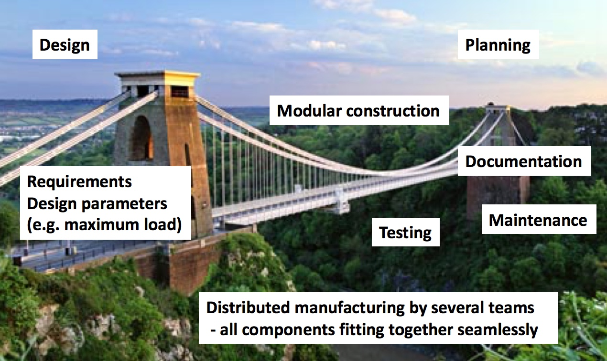

# What is good research software engineering?

Is writing good software simply about being a good programmer?

To draw a comparison, is building a bridge simply about being a good carpenter?

No, a constructing a good bridge requires good engineering. 

Engineering a good bridge encompasses skills such as design, planning, documentation and testing. Construction itself then involves manufacturing using modular components built by many (possibly geographically distributed) teams. Importantly, plans for maintenance and upkeep of the bridge are part of its engineering, with the bridge sustained and tested throughout its planned lifetime.

## Engineering good research software requires good Research Software Engineers

Similarly, engineering good research software requires good research software engineers. Research software engineers, in addition to being programmers, also understand;

* software project management,
* how to specify requirements,
* software design and architecture,
* programming as part of a (possibly distributed) team,
* documentation,
* testing,
* deployment and
* software maintenance.

Good software engineers understand the importance of unit testing, version control, documentation and modular design and development.

## What is good research software?

Good research software has to satisfy the three requirements of being:

* Trustably correct - it has to correctly calculate the "right number". It must "do what is says on the tin".
* Be performance portable - it has to perform its work quickly and efficienty, on the full range of computer hardware available to its users. As software lives much longer than hardware (software can live for decades!), it must be easy to maintain performance when porting to future hardware.
* Be Flexible - research software, by its definition, is software used in a research setting. Research is the exploration of the unknown, and so research software must be sufficiently flexible to adapt to the changing research landscape that researchers uncover. By its nature, it is difficult to fully specify the requirements of research software at the start of the project, and so it must be pliable enough to be adapted as research requirements change.

## Where to learn more?

You can learn more about how to engineer good research software by following these resources:

* [UK Research Software Engineering Association](http://rse.ac.uk)
* [Software Sustainability Institute](http://software.ac.uk)

* [Lecture, "How to Design and Engineer Good Research Software](https://drive.google.com/file/d/0B_KkGMZ8ACfaMWVqdzFYcWlib0k/view?usp=sharing)
* [Lecture, "What is good research software? How can it be engineered? Is it deliverable in academia?"](https://drive.google.com/file/d/0B-yOUgABf0mBdUUyckRFY2NMQ00/view?usp=sharing)
* [Blog - Walking Randomly](http://www.walkingrandomly.com)

If you have any other resources that you think should be listed here, then please [get in touch](mailto:christopher.woods@bristol.ac.uk).
