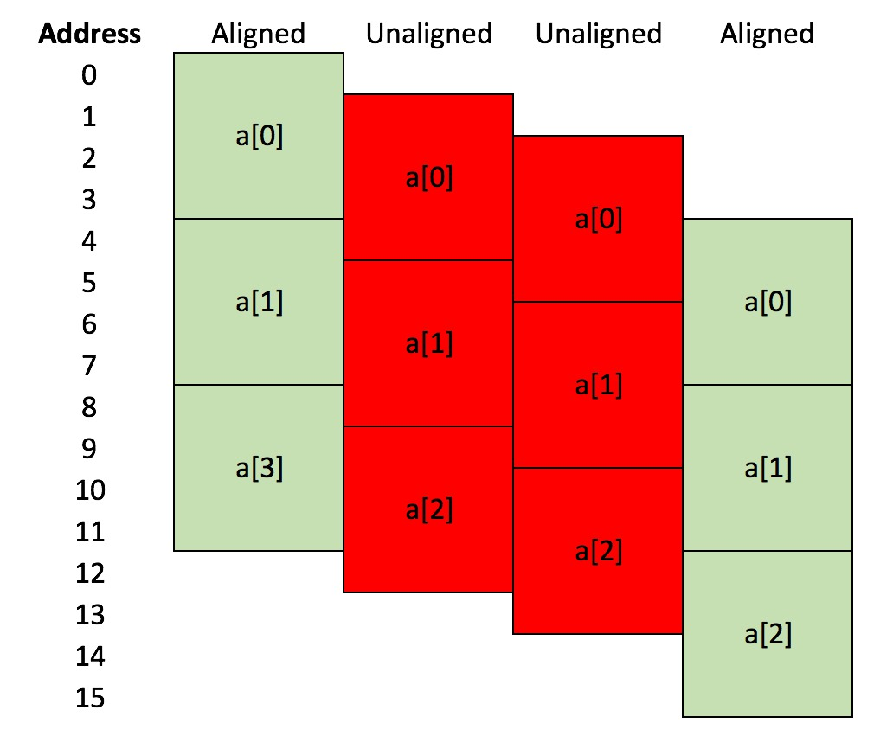

# Part 1: omp simd limitations

To work, `#pragma omp simd` is limited to vectorising relatively simple loops.

## The loop should have a fixed length that is known at run time, with each iteration following predictably one after the other.

This is because `pragma omp simd` instructs the compiler to transform the loop from a loop over, e.g. floats, into
a loop over vectors. For example, the compiler would transform;

```c++
for (int i=0; i<12; ++i)
{
    c[i] = a[i] * b[i];
}
```

into (pseudocode)

```c++
for (int i=0; i<12; i+=4)
{
    c[i,i+1,i+2,i+3] = a[i,i+1,i+2,i+3] * b[i,i+1,i+2,i+3];
}
```

where the above variables are all floats, and the compiler is producing code that runs on a processor with a 128 bit (4-float)
vector unit.

The compiler can do this for all standard loops, e.g. those with form `for (int i=start; i<end; i+=count){...}`.

However, complex loops, e.g. `for (int i=start(); at_end(i); i = increase(i)){...}`,
where function calls mask the evaluation of the loop cannot be vectorised, as it is impossible for the 
compiler to work out which iterations can be grouped together.

## The code in the loop should avoid conditions ("if" statements).

Conditions make it hard for the compiler to vectorise the code. This is because the
compiler needs to block together separate iterations into a single iteration
over a vector, and the condition means that different iterations may
involve different calculations.

For example

```c++
for (int i=0; i<16; ++i)
{
    if (i % 2 == 0)
    {
        c[i] = a[i] * b[i];
    }
    else
    {
        c[i] = a[i] + b[i];
    }
}
```

is difficult to vectorise, as even iterations use one operation (multiplication), while odd
iterations use another (addition). To vectorise, either you (or sometimes very clever compilers)
would need to break the loop into two parts, for each option of the condition, e.g.

```c++
// loop over even values of i
for (int i=0; i<16; i+=2)
{
    c[i] = a[i] * b[i];
}

// loop over odd values of i
for (int i=1; i<16; i+=2)
{
    c[i] = a[i] + b[i];
}
```

The compiler is then able to vectorise the two loops by transforming them
into (pseudocode)

```c++
// loop over even values of i
for (int i=0; i<16; i+=8)
{
    c[i,i+2,i+4,i+6] = a[i,i+2,i+4,i+6] * b[i,i+2,i+4,i+6]
}

// loop over odd values of i
for (int i=0; i<16; i+=8)
{
    c[i+1,i+3,i+5,i+7] = a[i+1,i+3,i+5,i+7] + b[i+1,i+3,i+5,i+7];
}
```

## The calculation for one iteration of the loop should not depend on results calculated by previous iterations.

This is because a vector of iterations will be calculated at the same time, so the result of previous
iterations may not be available. For example;

```c++
for (int i=1; i<16; ++i)
{
    a[i] = a[i-1] * 2;
}
```

is difficult to vectorise, as the value of `a` calculated at iteration `i` depends on the value
at the previous iteration (`i-1`).

However, sometimes the dependency is on a loop that is completed many iterations previously, i.e.

```c++
for (int i=10; i<20; ++i)
{
    a[i] = a[i-10] * 2;
}
```

In this case, the value of `a[i]` depends on the result of the calculation 10 iterations previous (`a[i-10]`).
If this number of iterations grouped together into a vector is less than this, then it is safe to vectorise.
You have to tell the compiler this safe length explicitly, using `safelen`, i.e. in the above loop you would
use;

```c++
#pragma omp simd safelen(10)
for (int i=10; i<20; ++i)
{
    a[i] = a[i-10] * 2;
}
```

This tells the compiler that it is safe to vectorise this loop, as long as the vector holds 10 or less
values.

## `#pragma omp simd` allows you to write portable code, but not performance portable code

As you may have seen, while `pragma omp simd` let's you write code that is portably
vectorisable, any performance improvements you see will depend on the quality of your
compiler and the processor on which your code will run. The only route to writing
performance portable code is to compile and run your software on lots of different
processors and compile using different compilers. You should experiment to see
what makes your code fast or slow, and use timers (e.g. like that used in 
`workshop::start_timer()`) to actually measure the speed of your code. It is not
possible to guess how much faster your code will be - you really have to measure
the speed and experiment. If you can, get hold of a compiler with profiler
(e.g. [Intel vTune](https://software.intel.com/en-us/get-started-with-vtune)).
This can give you reports on how your code is being vectorised, and can
be used to measure the performance of your code (profile your code).

## You (may) need to be aware of the alignment of your data

We saw in the [last section](memory.md) that the most efficient way to 
load data into a vector register is if the data to be loaded is contiguous
in memory. An additional optimisation is that the memory that holds the data
is also properly aligned. To understand alignment, look at the diagram
below;



This shows a small array of three floats, `a[0]`, `a[1]` and `a[2]`.
Each float uses 4 bytes (32 bits) to store the data. In the left-hand
case, `a[0]` occupies memory from byte address 0 to byte address 3, `a[1]` occupies
memory from byte address 4 to byte address 7, and `a[2]` occupies memory from byte
address 8 to byte address 11. The array `a` is 4-byte aligned, as the 
address of the first byte of each entry is divisible by four.

In the middle two cases, the array `a` is allocated at byte addresses that
are shifted by one byte down compared to the first case, i.e. `a[0]` is at byte
1 for the second case, and at byte 2 for the third case. The address of the
first byte of each entry is not evenly divisible by four in these cases, and
so that arrays are not 4-byte aligned. In the last case, `a[0]` has been 
shifted down by four bytes, meaning that `a[0]` starts at byte address 4, 
`a[1]` starts at byte address 8 and `a[2]` starts at byte address 12. These addresses
are evenly divisable by four, so this last case is 4-byte aligned.

The physical hardware of the processor, registers and memory subsystem of 
a computer work most efficiently when data is aligned in a particular way, 
e.g. normally 4-byte aligned (32 bit) or 8-byte aligned (64 bit). However,
as a programmer, you have the power to align data however you wish.

Memory is allocated by the memory allocator that is provided by the C++ standard
library. Most of the time, this will be allocating data so that it is either
4-byte aligned or 8-byte aligned, as this leads to most efficient use of hardware.
However, if your class has a size that is not divisible by 4, e.g. 3 bytes, 
then it isn't possible
for the allocator to allocate memory for an array of objects of your class
that allows each object to be 4-byte aligned. Normally, you will create
classes that are made from `int`, `long`, `float` and `double`, all of which
are multiples of 4-bytes in size. You will only see this problem if your class
has `bool` or `char` data, which use less than 4-bytes (`char` is 1-byte, while
`bool` can be as little as a single bit).

Vectorisation can add additional alignment requirements. For example, 
for SSE, efficient vectorisation is achieved only when the data is 16-byte aligned.
This is because the SSE vector registers are 16-bytes in size, and it is most
efficient to block-copy 16-byte aligned data from memory straight into the register.
If the data is not aligned in memory, then it needs to be shifted by the 
memory subsystem of the processor before it can be loaded into the register.

For AVX, the vector register is 32 bytes, and it is most efficiently used with
32-byte aligned data. Again, this is because it is easiest for 32-byte aligned
data to be block-copied from memory to the vector register.

You haven't had to worry about alignment in this workshop because arrays
of floats are 4-byte aligned, and we always processed them from index 0 upwards,
i.e. the vector copied from `a[0]-a[3]`, then `a[4]-a[7]` etc. These vectors
were always 16-byte aligned, so already efficient. As long as you use
arrays of floats, or arrays of doubles, then alignment is something that
you don't need to worry about. However, as you code becomes more advanced,
you will need to look at techniques for aligning data, e.g. [using an
aligned memory allocator in C++](http://stackoverflow.com/questions/8456236/how-is-a-vectors-data-aligned), 
or using [compiler attributes](https://gcc.gnu.org/onlinedocs/gcc-3.3/gcc/Type-Attributes.html) 
to tell the compiler that a particular class must be aligned.

***

# [Previous](memory.md) [Up](README.md) [Next](part2.md)

