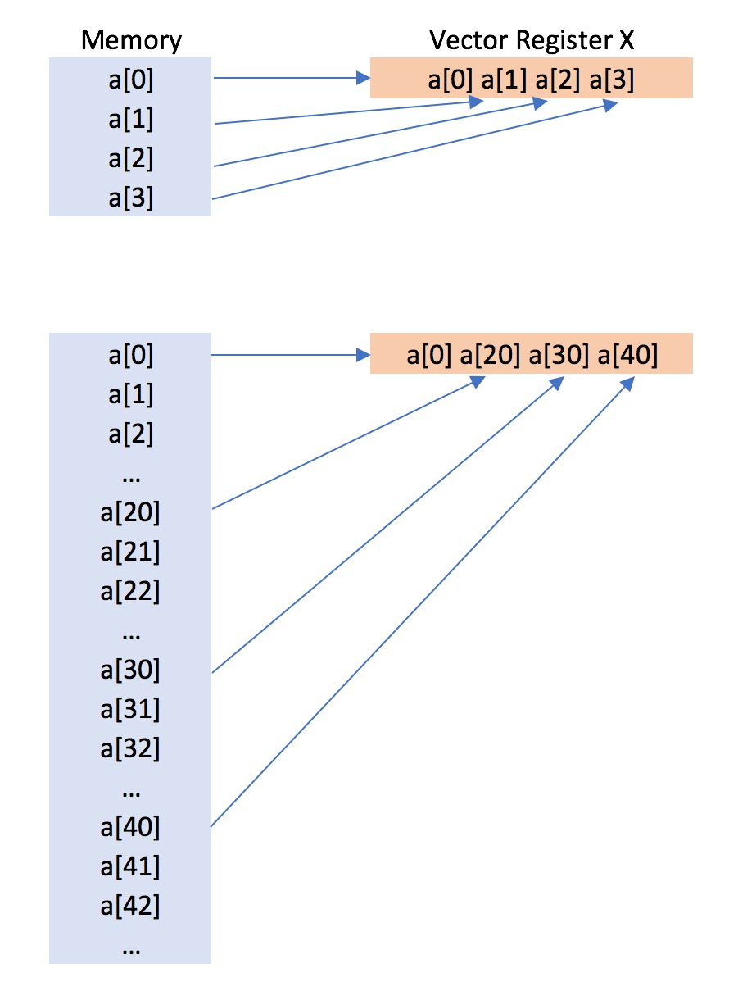
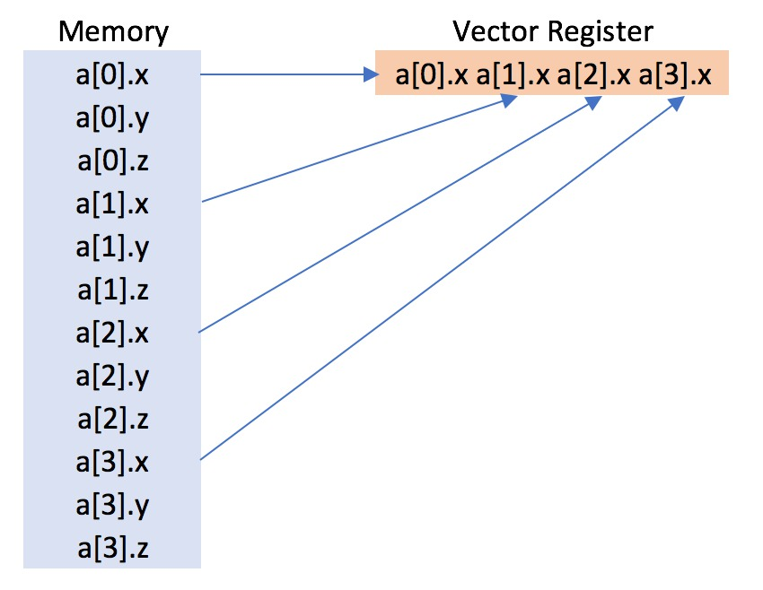
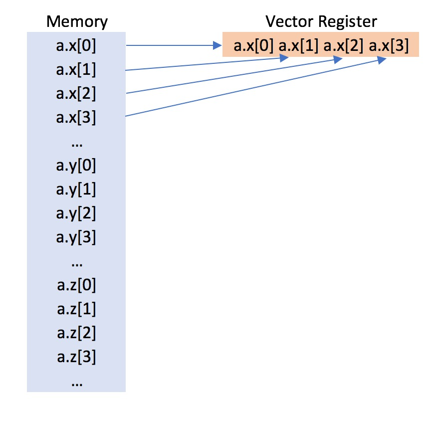

# Part 1: Memory Layout

The way you put data in memory is crucial to achieve a speed-up
when vectorising your code. For example, in the diagram below you can see the a vector
register being loading with contiguous memory (`a[0] a[1] a[2] a[3]`),
compared to being loaded with non-contiguous memory (`a[0] a[10] a[20] a[30]`).



We can compare the speed of using contiguous and non-contiguous memory
using the code below. Create a new file called `loop2.cpp` and copy
into it;

```c++
#include "workshop.h"

int main(int argc, char **argv)
{
    const int size = 512;

    auto a = workshop::Array<float>(10*size);
    auto b = workshop::Array<float>(10*size);
    auto c = workshop::Array<float>(size);

    for (int i=0; i<size; ++i)
    {
        a[i*10] = 1.0*(i+1);
        b[i*10] = 2.5*(i+1);
        c[i] = 0.0;
    }

    auto timer = workshop::start_timer();

    for (int j=0; j<100000; ++j)
    {
        for (int i=0; i<size; ++i)
        {
            c[i] = a[i*10] + b[i*10];
        }
    }

    auto duration = workshop::get_duration(timer);

    timer = workshop::start_timer();

    for (int j=0; j<100000; ++j)
    {    
        #pragma omp simd
        for (int i=0; i<size; ++i)
        {
            c[i] = a[i*10] + b[i*10];
        }
    }

    auto vector_duration = workshop::get_duration(timer);

    std::cout << "The standard loop took " << duration
              << " microseconds to complete." << std::endl;

    std::cout << "The vectorised loop took " << vector_duration
              << " microseconds to complete." << std::endl;

    return 0;
}
```

Compile and run using 

```
g++ -O2 --std=c++14 -fopenmp-simd -Iinclude loop2.cpp -o loop2
./loop2
```

This program is almost identical to the `loop.cpp` that you used at the
[start of this workshop](part1.md). The only difference is that 
the loop sums every 10th element of the array rather than every element.
This means that the vector registers are being filled by data that 
is not contiguous in memory (e.g. `a[10]` is separated from `a[20]` by
ten floats, which is separated from `a[30]` by ten floats, which is 
separated from `a[40]` by ten floats. In comparison `a[0]` is next
to `a[1]`, which is next to `a[2]` which is next to `a[3]`).

Do you still see the same speed-up for the vectorised loop over the scalar
loop as you did for the original `loop.cpp`.

On an older Intel processor, I see that the speed up of the vectorised loop
compared to the scalar loop of `loop2` is only ~1.7x. The speed up for 
the vectorised loop in `loop`, which loads from contiguous memory is
is ~4x. This shows that loading non-contiguous data into a vector register reduces 
performance. However, on a new Intel processor (2016) I don't see any difference in speed-up
between `loop2` and `loop`. This suggests that newer processors are less sensitive.

The reason for this is that the processor has to do more work to load
data from non-contiguous memory, compared to loading from contiguous memory.
Newer processors have features that aim to hide or minimise this extra work.

To maintain performance portability, and make sure that your vector code
runs efficiently on both old and new processors, you should make sure you 
load vectors from contiguous memory whenever possible.

## Array of structs versus structs of arrays

It is easy to load vectors from contiguous memory when you are working
with simple data types (i.e. floats or doubles). However, the main benefit 
of using C++ is that you create more complex data types. For example, create
a new file called `a_of_s.cpp` and copy into it the below code;

```c++
#include "workshop.h"

int main(int argc, char **argv)
{
    int size = 512;

    auto a = workshop::Array<workshop::Point>(size);
    auto b = workshop::Array<workshop::Point>(size);
    auto c = workshop::Array<float>(size);

    for (int i=0; i<size; ++i)
    {
        a[i] = workshop::Point(i,i+1,i+2);
        b[i] = workshop::Point(2*i, 2*i+1, 2*i+2);
        c[i] = 0;
    }

    auto timer = workshop::start_timer();

    for (int j=0; j<100000; ++j)
    {
        for (int i=0; i<size; ++i)
        {
            float dx = a[i].x - b[i].x;
            float dy = a[i].y - b[i].y;
            float dz = a[i].z - b[i].z;

            c[i] = dx*dx + dy*dy + dz*dz;
        }
    }

    auto duration = workshop::get_duration(timer);

    timer = workshop::start_timer();

    for (int j=0; j<100000; ++j)
    {    
        #pragma omp simd
        for (int i=0; i<size; ++i)
        {
            float dx = a[i].x - b[i].x;
            float dy = a[i].y - b[i].y;
            float dz = a[i].z - b[i].z;

            c[i] = dx*dx + dy*dy + dz*dz;
        }
    }

    auto vector_duration = workshop::get_duration(timer);

    std::cout << "The standard loop took " << duration
              << " microseconds to complete." << std::endl;

    std::cout << "The vectorised loop took " << vector_duration
              << " microseconds to complete." << std::endl;    

    return 0;
}
```

Compile and run using

```
g++ -O2 -fopenmp-simd --std=c++14 -Iinclude a_of_s.cpp -o a_of_s
./a_of_s
```

This program uses a `Point` class that is defined in `include/workshop.h`.
This is a simple class with floats to hold the `x`, `y` and `z` coordinates,
as seen here;

```c++
/** A simple class that holds the coordinates
    for a three-dimensional point */
class Point
{
public:
    Point(float _x=0, float _y=0, float _z=0)
      : x(_x), y(_y), z(_z)
    {}

    float x;
    float y;
    float z;
};
```

The program creates two arrays of `Point` objects, `a` and `b`. The square
of the distance between pairs of points is calculated and stored in `c`,
using the code

```c++
float dx = a[i].x - b[i].x;
float dy = a[i].y - b[i].y;
float dz = a[i].z - b[i].z;

c[i] = dx*dx + dy*dy + dz*dz;
```

As with the previous examples, this is performed as part of a scalar loop,
and a loop vectorised using `#pragma omp simd`.

On most computers, you should see vectorisation has made the calculation
faster, but this speed-up is limited (i.e. on my older computer the
vector loop is only ~1.25x faster than the scalar loop). Why is this the case?

The reason is that the array stores the `Point` objects one after another 
in memory, as seen in the diagram below.



This means that the `x` value of `p[1]` is separated from the `x` value
of `p[0]` by the `y` and `z` values of `p[0]`. This array of objects
(or, more often called "array of structs") means that the `x` values
cannot be stored contiguously in memory. We can show that this is the reason
for the less-efficient vectorisation by comparing this against an equivalent
program where the `x`, `y` and `z` values are collected together into their
own arrays. Create a new file called `s_of_a.cpp` and copy into it;

```c++
#include "workshop.h"

int main(int argc, char **argv)
{
    int size = 512;

    auto ax = workshop::Array<float>(size);
    auto ay = workshop::Array<float>(size);
    auto az = workshop::Array<float>(size);

    auto bx = workshop::Array<float>(size);
    auto by = workshop::Array<float>(size);
    auto bz = workshop::Array<float>(size);

    auto c = workshop::Array<float>(size);

    for (int i=0; i<size; ++i)
    {
        ax[i] = i;
        ay[i] = i+1;
        az[i] = i+2;

        bx[i] = 2*i;
        by[i] = 2*i+1;
        bz[i] = 2*i+2;

        c[i] = 0;
    }

    auto timer = workshop::start_timer();

    for (int j=0; j<100000; ++j)
    {
        for (int i=0; i<size; ++i)
        {
            float dx = ax[i] - bx[i];
            float dy = ay[i] - by[i];
            float dz = az[i] - bz[i];

            c[i] = dx*dx + dy*dy + dz*dz;
        }
    }

    auto duration = workshop::get_duration(timer);

    timer = workshop::start_timer();

    for (int j=0; j<100000; ++j)
    {    
        #pragma omp simd
        for (int i=0; i<size; ++i)
        {
            float dx = ax[i] - bx[i];
            float dy = ay[i] - by[i];
            float dz = az[i] - bz[i];

            c[i] = dx*dx + dy*dy + dz*dz;
        }
    }

    auto vector_duration = workshop::get_duration(timer);

    std::cout << "The standard loop took " << duration
              << " microseconds to complete." << std::endl;

    std::cout << "The vectorised loop took " << vector_duration
              << " microseconds to complete." << std::endl;    

    return 0;
}
```

Compile and run using;

```
g++ -O2 -fopenmp-simd --std=c++14 -Iinclude s_of_a.cpp -o s_of_a
./s_of_a
```

In this case, we have stopped using the `Point` class, and instead use
three arrays (`ax`, `ay`, and `az`) to hold the coordinates of the first
group of points, and three arrays (`bx`, `by` and `bz`) to hold the
coordinates of the second point. The square distances are calculated using

```c++
float dx = ax[i] - bx[i];
float dy = ay[i] - by[i];
float dz = az[i] - bz[i];

c[i] = dx*dx + dy*dy + dz*dz;
```

Now, the x coordinates are stored contiguously in memory, as are the 
y coordinates and z coordinates. You should find that this set of
arrays shows a greater speed-up from vectorisation than the 
"array of structs" example above.

On my older Intel processor, the vectorisation speed-up for an
array of structs is only ~1.25x. The speed-up for the set of arrays
is ~3.4x. However, on my new Intel processor (2016), there is almost
no difference in speed-up. This suggests that newer processors
are less sensitive to memory layout, and are better able to load
vectors from non-contiguous memory.

This suggests that, to maintain performance portability, and ensure that your
code runs efficiently on both old and new processors, you should
lay out your data using structs of arrays, rather than arrays
of structs.

## Strategy for writing a vectorisable container

The above section suggests that it is better, at least on older processors,
to write code that uses sets of arrays, rather than arrays of structs 
(or arrays of objects). However, writing code in this way is clumsy
and cumbersome, and means sacrificing the readability, ease-of-use and
flexibility that C++ object-orientated programming provides. 

One strategy to maintain the power of C++ object-orientation, while
maintaining vectorisation efficiency, is to write specialist containers
that are, in effect, structs of arrays. For example, if we need an 
array of `Point` objects, then we should write a new class, e.g. `Points`,
that stores the data as a struct of arrays, as opposed to an array of structs.
Such a class is shown below;

```c++
/** A simple class that holds the coordinates
    for an array of three-dimensional points, 
    automatically converting the "array of structs"
    into a "struct of arrays"
*/
class Points
{
public:
    Points(int size=0)
    {
        if (size > 0)
        {
            x = Array<float>(size, 0.0);
            y = Array<float>(size, 0.0);
            z = Array<float>(size, 0.0);
        }
    }

    Points(const Array<Point> &points)
    {
        x = Array<float>(points.size());
        y = Array<float>(points.size());
        z = Array<float>(points.size());

        for (int i=0; i<points.size(); ++i)
        {
            x[i] = points[i].x;
            y[i] = points[i].y;
            z[i] = points[i].z;
        }
    }

    Point operator[](int i) const
    {
        return Point( x[i], y[i], z[i] );
    }

    void set(int i, Point p)
    {
        x[i] = p.x;
        y[i] = p.y;
        z[i] = p.z;
    }

    Array<Point> toArray() const
    {
        Array<Point> p( x.size() );

        for (int i=0; i<x.size(); ++i)
        {
            p[i] = Point(x[i], y[i], z[i]);
        }

        return p;
    }

    Array<float> x;
    Array<float> y;
    Array<float> z;
};
```

This `Points` class is written with a constructor that converts an array
of `Point` objects into separate arrays of floats for the `x`, `y` and `z` coordinates.
This has converted the array of structs into a struct of arrays.

An `operator[](int i)` function is added to provide easy read-only access to
the `Point` at index `i`. A `set(int i, Point p)` function is provided
to provide write-only access to the `Point` at index `i`. In addition,
there is a `toArray()` function that converts this struct of 
arrays back to an `Array<Point>` array of structs.

To use this `Points` class, create a new file called `points.cpp` and 
copy into it;

```c++
#include "workshop.h"

int main(int argc, char **argv)
{
    int size = 512;

    auto a = workshop::Points(size);
    auto b = workshop::Points(size);
    auto c = workshop::Array<float>(size);

    for (int i=0; i<size; ++i)
    {
        a.set(i, workshop::Point(i,i+1,i+2));
        b.set(i, workshop::Point(2*i, 2*i+1, 2*i+2));
        c[i] = 0;
    }

    auto timer = workshop::start_timer();

    for (int j=0; j<100000; ++j)
    {
        for (int i=0; i<size; ++i)
        {
            float dx = a.x[i] - b.x[i];
            float dy = a.y[i] - b.y[i];
            float dz = a.z[i] - b.z[i];

            c[i] = dx*dx + dy*dy + dz*dz;
        }
    }

    auto duration = workshop::get_duration(timer);

    timer = workshop::start_timer();

    for (int j=0; j<100000; ++j)
    {    
        #pragma omp simd
        for (int i=0; i<size; ++i)
        {
            float dx = a.x[i] - b.x[i];
            float dy = a.y[i] - b.y[i];
            float dz = a.z[i] - b.z[i];

            c[i] = dx*dx + dy*dy + dz*dz;
        }
    }

    auto vector_duration = workshop::get_duration(timer);

    std::cout << "The standard loop took " << duration
              << " microseconds to complete." << std::endl;

    std::cout << "The vectorised loop took " << vector_duration
              << " microseconds to complete." << std::endl;    

    return 0;
}
```

Compile and run using

```
g++ -O2 -fopenmp-simd --std=c++14 -Iinclude points.cpp -o points
./points
```

You should see the same (or very similar) vector speed-up using this
`points.cpp` code as you did for `s_of_a.cpp`. The use of the `Points`
container object has the benefit of a convenient C++ object-orientated
interface, while supporting a vectorisation-friendly struct of arrays
data layout in memory (as seen in the diagram below).



## Exercise

* Copy the following code into a file called `avg.cpp`.

```c++
#include "workshop.h"

int main(int argc, char **argv)
{
    const int npeople = 1024;

    auto people = workshop::Array<workshop::Person>(npeople);

    //construct a random sample of people (in reality, you would
    //read this from real data - here we are just randomly generating
    //it using functions already provided in workshop.h
    for (int i=0; i<npeople; ++i)
    {
        people[i] = workshop::Person( workshop::getRandomHeight(), 
                                      workshop::getRandomWeight() );
    }

    auto timer = workshop::start_timer();

    float avg_ratio = 0;

    for (int j=0; j<100000; ++j)
    {
        avg_ratio = 0;

        for (int i=0; i<npeople; ++i)
        {
            avg_ratio += (people[i].height / people[i].weight);
        }

        avg_ratio /= npeople;
    }

    auto duration = workshop::get_duration(timer);

    timer = workshop::start_timer();

    float vec_avg_ratio = 0;

    for (int j=0; j<100000; ++j)
    {
        vec_avg_ratio = 0;

        #pragma omp simd reduction(+:vec_avg_ratio)
        for (int i=0; i<npeople; ++i)
        {
            vec_avg_ratio += (people[i].height / people[i].weight);
        }

        vec_avg_ratio /= npeople;
    }

    auto vector_duration = workshop::get_duration(timer);

    std::cout << "The standard loop took " << duration
              << " microseconds to complete. The average ratio is " 
              << avg_ratio << std::endl;

    std::cout << "The vectorised loop took " << vector_duration
              << " microseconds to complete. The average ratio is " 
              << vec_avg_ratio << std::endl;

    return 0;
}
```

This code calculates the average ratio of the height over the weight
of a random sample of 1024 people. The data for each person is held
in a `Person` class which is defined in the `include/workshop.h` header
file, and is as showed below;

```c++
/** A simple class that holds measurement data
    about a person */
class Person
{
public:
    Person(float _height=0, float _weight=0, float _girth=0)
      : height(_height), weight(_weight), girth(_girth)
    {}

    float height;
    float weight;
    float girth;
};
```

Compile and run the code using

```
g++ -O2 -fopenmp-simd --std=c++14 -Iinclude avg.cpp -o avg
./avg
```

* What is the speed-up of the vectorised loop versus the scalar loop?

* Edit this code to create a `People` class. This class should provide a 
container for an array of `Person` objects, converting the data from being
held as an array of structs to a struct of arrays. Recompile and rerun your
code, and see if this has improved the speed-up of the vectorised loop
versus the scalar loop. If you need some help, take a look at an example
answer [here](memory_answer.md).

* Calculate the speed of the vectorised loop in GFLOPs. How does this
compare to the theoretical speed of your processor?

***

# [Previous](features.md) [Up](README.md) [Next](limitations.md)

