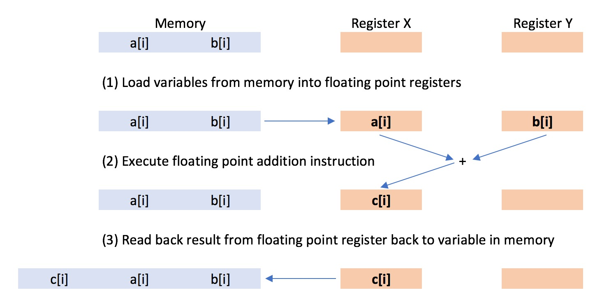
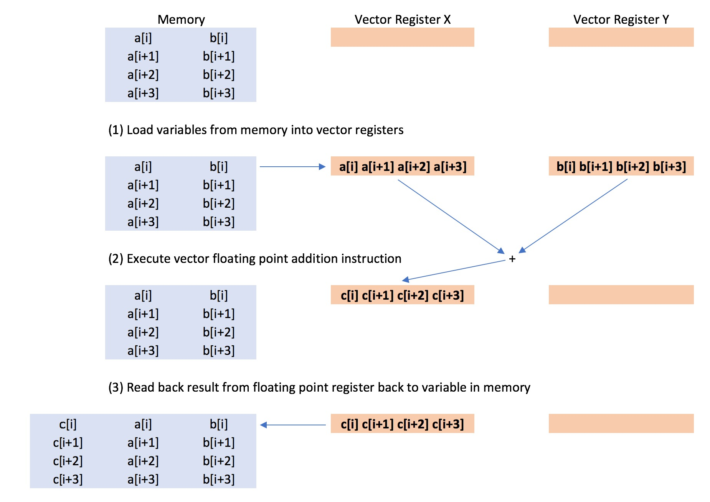

# Part 1: What is vectorisation?

In the last example you compiled and compared two loops. The first was
a standard loop;

```c++
for (int i=0; i<size; ++i)
{
    c[i] = a[i] + b[i];
}
```

while the second was a vectorised loop

```c++
#pragma omp simd
for (int i=0; i<size; ++i)
{
    c[i] = a[i] + b[i];
}
```

The vectorised loop was about four times faster on my computer than
the standard loop.

The reason is that, in the standard loop, each iteration of the loop
was performed serially, one after another. This meant that the 
calculation of the sum of

```c++
c[2] = a[2] + b[2]
```

was performed after the calculation of

```c++
c[1] = a[1] + b[1]
```

which was performed after the calculation of

```c++
c[0] = a[0] + b[1]
```

etc. etc.

This fits in with our traditional view that a single core in a computer processor 
can only perform one floating point calculation at a time.

However, this view is not strictly correct. A single compute core can actually perform many
floating point calculations simultaneously. The compute core achieves this by batching
the floating point calculations together into groups (called vectors), and performing
the entire group of floating points calculations at once using a vector floating point
instruction. In the case of my computer, the compute core batched the floating point
additions together into groups (vectors) of length 4. This meant that the four
additions for

```c++
c[0] = a[0] + b[0];
c[1] = a[1] + b[1];
c[2] = a[2] + b[2];
c[3] = a[3] + b[3];
```

were all performed simultanously. Then, 

```c++
c[4] = a[4] + b[4];
c[5] = a[5] + b[5];
c[6] = a[6] + b[6];
c[7] = a[7] + b[7];
```

were next all performed simultanously.

The vectorised loop was therefore four times faster, as the processor compute
core performed four additions at once for the vectorised loop, in the
same time as the standard loop performed just one addition.

## What is happening inside the processor?

So, how does a processor compute core perform multiple floating point
additions at the same time?

### Floating point processing...

In normal use, arithmetic floating point calculations, such as addition,  
are performed using the floating point processing unit (FPU) built into each processor core.
Floating point numbers are loaded onto a register in the floating point processing unit, 
and an arithmetic operation is performed on those numbers in response
to the processor issuing a floating point processor instruction.

The floating point unit can perform a range of arithmetic operations
in response to different arithmetic instructions, e.g.
addition, multiplication, division etc. The size of the registers in the floating point unit
determines the maximum size of the numbers that can be loaded into the unit,
thus determining the maximum precision of the arithmetic calculation. 

Most modern processors have floating point units with 64 bit registers.
This means that floating point calculations
can be performed with a maximum of 64 bits of precision. 64 bits (8 bytes)
is commonly called "double precision", and is what is normally used in C++
when we create a `double` variable. The floating point unit can also perform arithmetic
operations using less precision, e.g. 32 bits (4 bytes). 32 bit precision
is commonly called "single precision", and is normally used in C++ as the
`float` variable. 

In the standard loop;

```c++
for (int i=0; i<size; ++i)
{
    c[i] = a[i] + b[i];
}
```

the two 32 bit floating point numbers `a[i]` and `b[i]` were loaded onto 
two 64 bit registers of the floating point unit.
Once the numbers were loaded, the processor issued a 
"floating point addition" instruction, which instructed the floating point
unit to add the two numbers together. This one floating point instruction
caused a single addition to take place, to give the result `c[i]`.



### Vector processing...

In the vectorised loop, floating point operations were performed using
the vector processing unit (VPU). A vector processing unit is similar
to a floating point unit, in that it has registers on which you load
numbers, and it performs arithmetic operations in response to instructions.

The difference is that the registers on a vector unit are much larger, e.g.
128 bits (16 bytes), 256 bits (32 bytes) or 512 bits (64 bytes). Rather than using this increased
size to support higher floating point precision, this larger size is used
to pack multiple floating point numbers together, so that multiple 
arithmetic operations can be performed in response to a single instruction.

Vector processing units are built into most modern processors, and typically they come with a fixed
size. On my computer, the vector register is 128 bits. This means that it
can hold four 32 bit floats, or two 64 bit doubles.

In the vectorised loop;

```c++
#pragma omp simd
for (int i=0; i<size; ++i)
{
    c[i] = a[i] + b[i];
}
```

two vectors of four 32 bit floating point numbers `a[i] a[i+1] a[i+2] a[i+3]` 
and `b[i] b[i+1] b[i+2] b[i+3]` were loaded onto two 128 bit vector registers
of the vector processing unit. Once the vectors were loaded, the processor
issued a "vector floating point addition" instruction, which instructed the
vector processing unit to add the two vectors of numbers together. This 
one vector instruction caused four additions to take place, to give the
results `c[i] c[i+1] c[i+2] c[i+3]`.



On X86-64 processors (i.e. those produced by Intel), the vector processing
unit is also called the SIMD unit. SIMD stands for "single instruction, multiple data",
referring to the fact that a single vector instruction results in
arithmetic operations being performed simultaneously on multiple numbers (data).

The capabilities of the SIMD
unit has evolved with each new generation of processors, and has gone through
several standards;

* SSE - This stands for "Streaming SIMD Extensions", and became available with 
the Pentium 3 processor in 1999. The vector registers are 128 bits in size.
This means that an SSE-capable processor can perform four 32 bit float 
operations for every vector instruction, or two 64 bit double operations.
* SSE2 - This was a refinement of SSE, available since the Pentium 4 in 2001.
The vector registers are 128 bits in size. All X86-64 processors support SSE2.
* SSE3/SSSE4/SSE4 - These are subtle extensions to SSE2 first made available 
in processors released between 2004-2006, which added more esoteric
arithmetic operations.
* AVX - This stands for Advanced Vector eXtensions, and first became available on
Intel processors from early 2011. This was a major upgrade over SSE2, as it 
doubles the size of the vector register from 128 bits to 256 bits. All AVX-capable
processors fully support all versions of SSE. AVX-capable processors can perform
eight 32 bit float operations for every vector instruction, or four
64 bit double operations.
* AVX2 - This is a subtle extension of AVX.
* AVX-512 - This is a major upgrade over AVX as it doubles the size of the 
vector register from 256 bits to 512 bits. This became available in Xeon Phi
in 2016, and will become available in new Xeon processors from 2017.
AVX-512-capable processors can perform sixteen 32 bit float operations
for every vector instruction, or eight 64 bit double operations.

***

# [Previous](part1.md) [Up](README.md) [Next](vectorisation.md)
