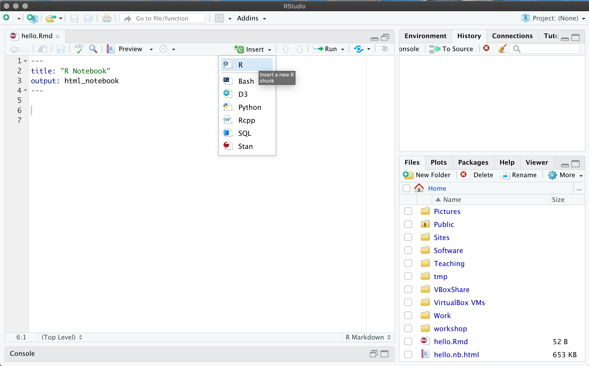
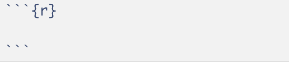
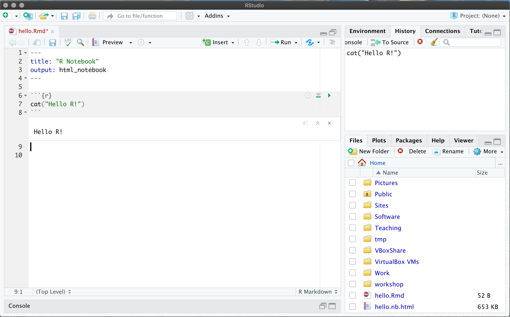
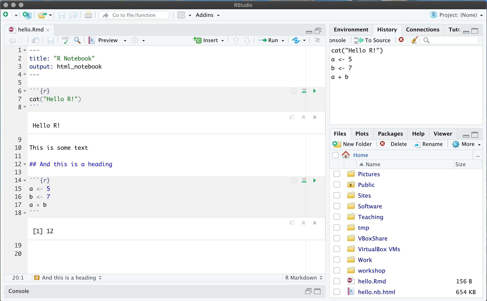

```{r setup, include=FALSE}
knitr::opts_chunk$set(echo = TRUE)
```

This is the rapid introduction to the R programming language. We assume that 
you are familar with another programming language, e.g. Python. Given this,
we will now provide enough background info that you can undertake the 
[Introduction to Data Analysis in R](https://chryswoods.com/data_analysis_r)
workshop.

R is a well-established language, initially released in 1995 (with version 1.0 in 2000),
and the latest release (4.3.1) released in June 2023. R is a general programming language, 
but has found particular application in statistical and data driven programming. It has
become the de facto standard programming language of data science.

R is available for all operating systems, including Windows, OS X and Linux. It
is not installed by default. It is typically installed as part of an R programming
environment, e.g. [RStudio](https://rstudio.com), the Open Source version of which
can be [downloaded from here](https://rstudio.com/products/rstudio).

## Installation videos

To follow this workshop you must install both R and RStudio. Instructions to 
do this are below. Videos demonstrating installation on Windows 10, Ubuntu Linux
and macOS Catalina are here;

* [Installing on Windows](https://youtu.be/K5FQoepK8YI)
* [Installing on Linux](https://youtu.be/WpNd6j1nvEE)
* [Installing on macOS](https://youtu.be/N2Jt1-iC5MU)

## Installing R

Because R is not installed by default on most computers, you will need to download
and install it before continuing with this workshop. R is available for many
operating systems, including Windows, Linux and OS X. You will need administrator
access to install R on your computer. If you don't have administrator access,
then your IT Services may have made it available via a software catalogue
or software center. If not, then get in contact with your IT Services to
install R.

If you have administrator access or elevated user rights, you can download and install
R by following the [links on this page](https://cran.r-project.org). For convenience,
the download links are;

* [Windows](https://cran.r-project.org/bin/windows/base/)
* [Linux](https://cran.r-project.org/bin/linux/) - choose your distribution from here
* [macOS](https://cran.r-project.org/bin/macosx/)

Follow the instructions on those pages to download and install R. 

## Installing RStudio

There are lots of different ways to run R code and many tools to help you write it. 
You don't require any special tools to create a R script, a simple text editor 
like Notepad on Windows is sufficient. More advanced tools include things 
like Jupyter Notebooks and IDEs like RStudio or Visual Studio Code.

For this workshop we will be keeping things as simple as possible in order to 
allow us to focus on the topics we're learning without having to learn too 
many extra tools along the way.

For the purpose of this course we will be using a free and open source version 
of RStudio. This provides a graphical interface with a local text editor,
interface to the operating system terminal, and an interactive R console.
Again, you need administrator access or elevated user rights to install
RStudio on your computer. If you don't have this, then your IT Services
may have made RStudio available via a software catalogue or software center.
If not, then get in touch with your IT Services to install RStudio for you.

If you do have administrator access or elevated user rights, then 
the easiest way to get access to RStudio is to download the free "open source edition"
of "RStudio Desktop" [from the website](https://rstudio.com/products/rstudio/),
and to then follow the instructions on the website to install the version
that is appropriate for your operating system.

## Setting up your workspace

This course will use a tool called R Notebooks (or R Markdown Notebooks) to run your R code. It operates a 
lot like a Jupyter Notebook.


The notebook is initially untitled. Give it a name by saving it (either CTRL or CMD + S,
or click on the "Save" icon). Call it something like `hello.Rmd` (Rmd is the
extension used for R Markdown Notebooks).

Throughout this course you will likely want to start a new notebook for
each section of the course so name them appropriately to make it easier to find them later.

Once the notebook is launched, you will see a lot of example text. Clear everything
except for the title at the top, e.g. as in


The notebook is just a text file, which is formatted using
[markdown](https://www.markdownguide.org/cheat-sheet/). This is a simple
markup language that lets you write rich documents.

You can add R code to this file by placing into R code blocks.
You can do this by clicking "Insert | R", e.g. as in;



When you click this, it will add the following text to your R notebook;



(note, you can type this yourself if you want - you don't need to click
"Insert | R")

You can write any R code you want into this block. For example, type;

```R
cat("Hello R!\n")
```

Next, click on the "Run current chunk" button (the green triangle on the right)


This will run the R code in the R block, printing the output directly
on the screen.



Pretty cool!

You can also write text, for example now write;

```
This is some text

## And this is a heading
```

Next, add another R block, e.g.

```
a <- 5
b <- 7
a + b
```

(remembering to use "Insert R" or typing in the ` ```{r} `)
   
and then click "Run". You should now see;


   
The R blocks in a notebook are linked together so a variable defined in one
is available in all the R blocks from that point on. So in the second cell
you can use the variables `a` and `b`:
   
```
a - b
```


## Further reading
 
Note that R markdown notebooks are very powerful and support more than just
R. You can embed a whole range of languages, including Python, Fortran,
Julia etc. and can generate books, websites, powerpoint presentations etc.

For more information please take a look at this free
online book, [R Markdown: The definitive guide, by Yihui Xie,
J. J. Allaire, and Garrett Grolemund](https://bookdown.org/yihui/rmarkdown/).

# [Next](dataframes.html)
