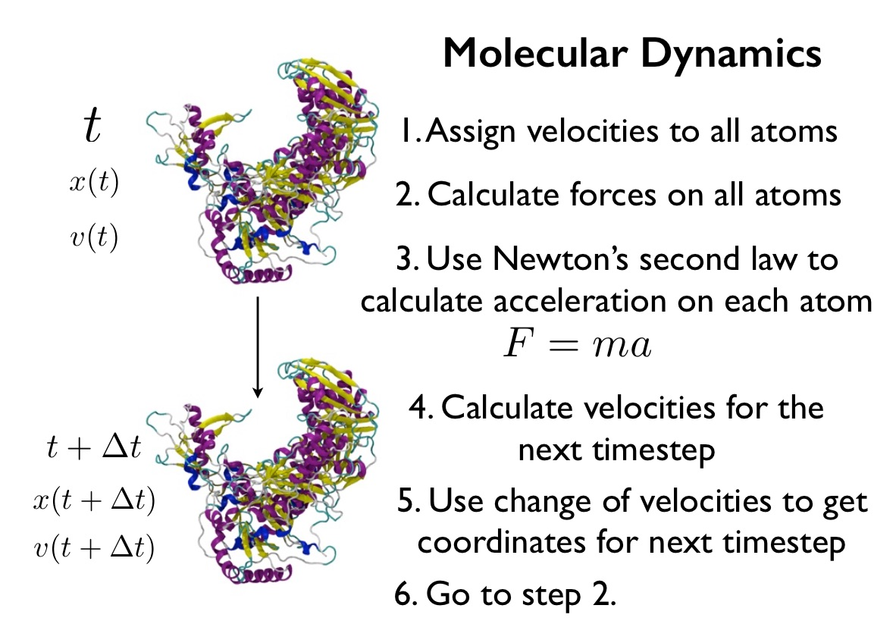

# Part 2: Molecular Dynamics
## What is Molecular Dynamics?

In the last section you performed a molecular dynamics simulation of zanamivir in the gas phase. So, what is molecule dynamics? Molecular dynamics (also called MD) is a simulation technique that is used to give motion to molecular structures. A diagram showing how molecular dynamics works is shown below;



As you can see, there are 6 steps to the algorithm;

1. We start at time 't', with the coordinates of the molecule at this time given symbol x(t). We then randomly assign a velocity to each atom, which is called v(t).

2. All of the forces acting on each atom are calculated. These are called f(t)

3. Using Newton's second law (F = ma) we can work out the acceleration of each atom at time t, a(t), from the force acting on each atom, f(t).

4. We advance time by a small timestep, called &delta;t. Based on the acceleration of each atom at time t, we can calculate the change in velocity of each atom between times t and t+&delta;t, to give a new velocity, v(t + &delta;t).

5. From the change in velocity between times t and t+&delta;t, we can work out how each atom will have moved during this timestep, and thus calculate the new coordinates of the atoms at time t+&delta;t, which are x(t + &delta;t).

6. We now repeat this process from step 2, each time advancing time by &delta;t. Assuming we do this thousands, millions or even billions of times, we will build up a picture of how the molecule moves over time. 

Now introduce all of the parts of the mdconfig file

```
# Input file to control a molecular dynamics simulation
# of zanamivir in the gas phase

# Number of molecular dynamics steps
numsteps 50000

# Time, in femtoseconds, between each step.
# Total simulation length will be numsteps * timestep,
# so, for 50000 steps, each of 1 femtoseconds, the
# total simulation time will be 50 picoseconds
timestep 1

# Name of the input Amber-format topology and
# coordinate files
parmfile       zan.prmtop
ambercoor      zan.rst

# Root name of all of the output files. They will all
# be called 'output.something', e.g. the output DCD coordinate
# file will be called 'output.dcd'
outputname     output

# Options used to set the temperature of the simulation
# to 300 K
temperature 300
langevin on
langevinDamping 5
langevinTemp 300

# Frequency of printing out the total energy of the
# molecule to the screen - print every 500 steps
outputEnergies 500

# Frequency of writing the restart file - we will write
# a restart file only once at the end of the simulation
restartFreq 50000

# Frequency of writing the coordinates to the
# DCD trajectory file
DCDfreq 5

# The maximum range of interatomic interactions. Any
# atoms separated by more than 7.5 angstroms will not
# interact with one another
cutoff 7.5

# We will not use 'switching', which is a way of softening
# the implementation of the cutoff
switching off

# Parameters that you must include if you are using namd
# to simulate Amber-format molecules
amber          on
exclude        scaled1-4
1-4scaling     0.833333
```

# [Previous](getting_started.md) [Up](README.md) [Next](time.md)
