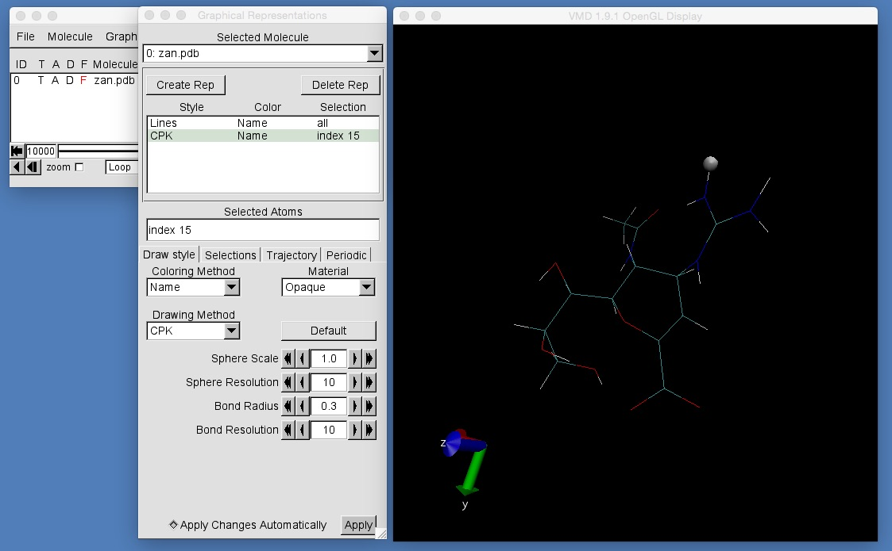
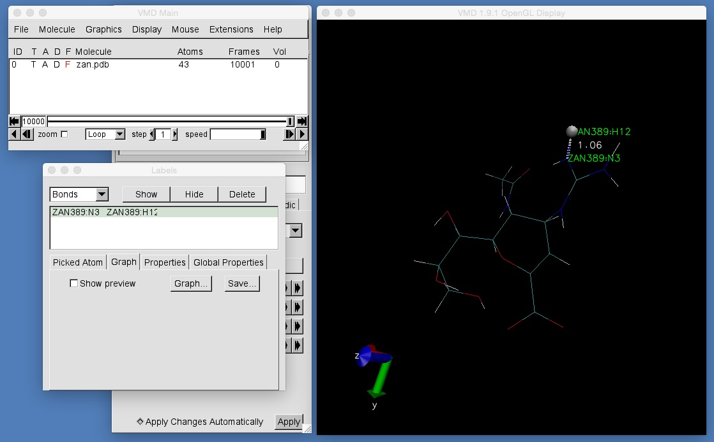
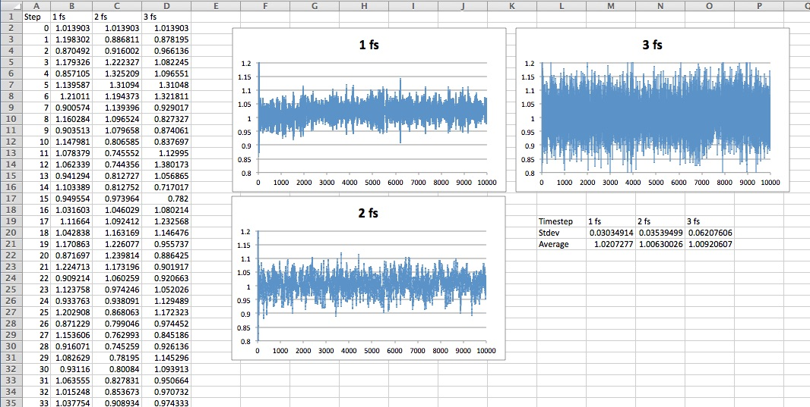

# Part 2: Molecular Dynamics
## Time

Molecular dynamics simulations provide a computational microscope that lets you watch how a molecular behaves over time. However, the amount of time that you can observe is very small. In the simulation you have just run, you performed 50,000 steps of dynamics, with each step covering only 1 femtosecond (1x10-15 seconds). This means that the simulation only showed 50 picoseconds in the life of zanamivir. This is only 50 million millionths of a second! Assuming that these 50 picoseconds took one minute to simulate, then this would mean that simulating one second of dynamics of zanamivir would take nearly 40,000 years!

One way to speed up the simulation is to increase the amount of time between each step of dynamics (the timestep). Try now to increase the timestep and see what happens. To do this, edit the file 'mdconfig' by typing

```
nano mdconfig
```

(or you can use vim, emacs or another text editor if you prefer).

Change the line

```
timestep 1
```

to read

```
timestep 4
```

This will increase the timestep to 4 femtoseconds, meaning that 50,000 steps of dynamics will cover 200 picoseconds in the life of zanamivir. Rerun namd2 using

```
$NAMD/namd2 ++ppn 4 mdconfig
```

Immediately, you should see that something went wrong. You should see something like this printed to the screen;

```
ERROR: Atom 15 velocity is 2349.09 -2102.39 3783.96 (limit is 1875, atom 16 of 43 on patch 0 pe 2)
ERROR: Atoms moving too fast; simulation has become unstable (1 atoms on patch 0 pe 2).
ERROR: Exiting prematurely; see error messages above.
====================================================

WallClock: 0.168349  CPUTime: 0.168349  Memory: 2429.300781 MB
Program finished.
```

What has gone wrong? The error message says that Atom 15 is moving too quickly. To understand what has gone wrong, let's now reset the timestep back to 1 femtosecond and rerun the simulation. Edit mdconfig again, set 'timestep' to '1', and then run namd2 using;

```
$NAMD/namd2 ++ppn 4 mdconfig
```

Once the simulation has finished, view the output using VMD using the command

```
vmd zan.pdb output.dcd
```

and then align the trajectory using the VMD Trajectory Tool (as you did before).

Now, to identify atom 15 (the atom that was moving too quickly) create a new Graphical Representation for the selection "index 15", and drawn using CPK. You should see something like this;



The string 'index 15' selects atom number 15. You should see that this is a hydrogen atom. To measure how this hydrogen is moving, measure the length of the hydrogen-nitrogen bond length. Do this by entering VMD's bond selection mode and selecting both this hydrogen and its neighbouring nitrogen. Then, open the Labels window, change to "Bonds", click on the bond you have selected and then click graph. You should see the following;




Click "File | Export to ASCII matrix..." in the graph window to save the graph to a file called "distance_1fs.txt". Now exit VMD.

Now we have measured how this hydrogen moves with a timestep of 1 femtosecond, repeat the process to measure the motion of the hydrogen for timesteps of 2 femtoseconds and 3 femtoseconds (edit mdconfig, change the time from 1 to 2, then rerun namd2 using the command above. Then load up VMD, align the trajectory, highlight the hydrogen, select the bond and draw the graph in the same way as before. Then save the graph to a text file called "distance_2fs.txt". Then, repeat the whole process with a timestep of 3 femtoseconds, and save the resulting VMD graph to a text file called "distance_3fs.txt").

Once you have finished, import the data from the three text files into a spreadsheet. Draw a graph for each text file (bond length versus timestep) and calculate the average bond length and standard deviation of the bond length. You should end up with something that looks like this;



You should see that the distance graphs for 1 femtosecond and 2 femtoseconds are very similar, with similar shapes, averages and standard deviations. The graph for 3 femtoseconds is very different. This graph shows that the hydrogen was moving significantly more than for 1 and 2 femtoseconds, with a bigger amplitude (shown by the standard deviation being nearly twice that for 1 and 2 femtoseconds). The reason for this is that hydrogen is a light atom, and so the frequency of vibration of bonds involving hydrogen is very high (around 10^14 Hz). Since 1 femtosecond is 10^-15 seconds, this means that a complete N-H bond vibration occurs in less than 10x1 femtosecond timesteps, less than 5x2 femtosecond timesteps, and less than 3x3 femtosecond time steps. As the number of timesteps available to model a complete bond vibration decreases, the numerical error introduced when integrating the equations of motion that drive molecular dynamics increases. This is because there are fewer timesteps available to capture the turning points of bond vibration (as the atoms move apart when the bond gets long, the motion will turn when the bond reaches the maximum bond length, and then the atoms change direction and beginning moving closer together again). With fewer timesteps, it is more likely that molecular dynamics will 'miss' these turning points, resulting in the atoms moving further apart from one another than they should. This causes the maximum bond length sampled to increase beyond the chemically correct value, and for the atoms to then begin to move faster. As the atoms move faster, they miss more of these turning points, causing the bonds to get even longer and the atoms to move yet faster. Eventually, the atoms are moving too quickly and the molecule has "exploded" (and the program will exit telling us that something has gone wrong).

You can see in the above graph that the atoms were beginning to move too quickly and the N-H bond was growing to be too long when the timestep was 3 femtoseconds. This suggests that 3 femtoseconds is too long a timestep, and so a maximum value of 2 femtoseconds should be used for gas phase zanamivir.

# [Previous](theory.md) [Up](README.md) [Next](shake.md)
