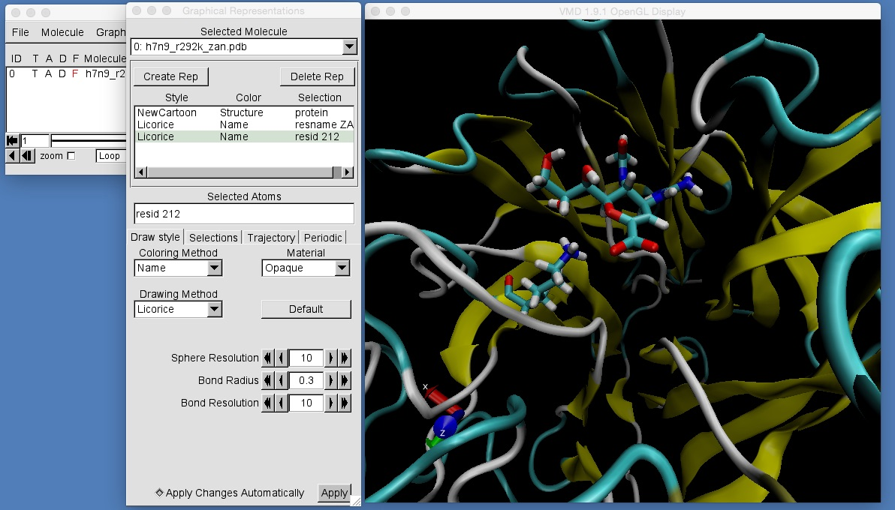

# Part 3: Mutating Proteins and MD Setup
## Minimising the System

Now that you have solvated the protein in a periodic box of water, there are a sequence of steps that you must go through to actually run a molecular dynamics simulation. 

1. Minimisation. To remove any bad contacts between atoms that have been added (e.g. hydrogen atoms that have been added in a position that is too close to another atom of the protein), you first need to minimise the system. This involves calculating the force on all atoms, and then using this force to push the atoms towards stable, minimum energy configurations. The result will be a minimum energy conformation of the system.

2. Heating. The minimum energy conformation of the system is an approximation of the conformation that the molecules would adopt at near freezing conditions (near absolute zero kelvin). Molecular dynamics simulations of biomolecules are normally run at room temperature or body temperature. To prepare the system for simulation, you now have to slowly heat the molecules. This is to prevent the frozen atoms from exploding if you instantly ran the simulation at room (or body) temperature (imagine what happens if you throw an ice-cube into an extremely hot frying pan - I should add, you should not try this experiment at home as it can be dangerous).

3. Equilibration (NVT). The next step is to equilibrate the system using a short run of canonical (NVT) molecular dynamics. This will help the added water molecules find a stable (equilibrium) distribution around the protein and drug.

4. Equilibration (NPT). The final step is to equilibrate the system using a short run of isothermal-isobaric (NPT) molecular dynamics. This will adjust the box size, ensuring that the density of water in the periodic box is correct for the simulation temperature and pressure.

5. Production (NPT or NVT). The final step is the actual molecular dynamics simulation. This can be run either NPT or NVT depending on your choice (some people prefer NVT as it is quicker, and they argue that, once equilibrated, the volume will not change much). In our case, we will use NPT, and will combine steps 4 and 5 together.

To begin, we will run step 1, which is minimisation. We will namd for this step, using namd configuration file "minconfig". Take a look at this file in a text editor. The main differences between this file and the ones we have used previously for dynamics are in these lines;

```
# Turn on minimisation
minimization on

# Number of steps of minimisation
numsteps  1000
```

The first line tells namd that we are performing a minimisation calculation rather than a dynamics simulation. The "numsteps" variable gives the number of minimisation steps to perform (in this case 1000). This means that the minimisation algorithm will keep moving the atoms to lower the energy until either (1) the minimum energy conformation has been found, or (2) 1000 steps have been completed. In reality, you should perform between 5000 and 50,000 steps of minimisation, although for this workshop, time is precious, so we will only perform 1000 steps.

At the end of the file you have these lines;

```
# Set the basis vectors of the periodic box. These numbers
# come from the last three numbers in the h7n9_r292k_zan.crd file above,
# and give the size of the X, Y and Z dimensions of the periodic box.
# Also supply the coordinates of the centre of the box (the coordinates
# of one of the atoms of zanamivir)
cellBasisVector1   79.6613730  0  0
cellBasisVector2   0  90.4230920  0
cellBasisVector3   0  0  91.2766940
cellOrigin   -39.8306865 -45.211546 -45.638347
wrapAll on
```

As previously, these are used to provide information about the size of the periodic water box. You need to make sure that these numbers match up with the size of your box. You can get the size of your box by typing;

```
tail h7n9_r292k_zan.crd
```

and looking at the last line,

```
  79.6613730  90.4230920  91.2766940  90.0000000  90.0000000  90.0000000
```

If the first three numbers do not match up with what you have in "minconfig", then edit "minconfig" and copy these numbers into the spaces in "cellBasisVector1", "cellBasisVector2" and "cellBasisVector3". Each "cellOrigin" value should be negative half of the corresponding "cellBasisVector" value (e.g. -39.8306865 is -0.5 * 79.6613730).

Once everything is correct, run the minimisation simulation using the command;

```
$NAMD/namd2 ++ppn 4 minconfig
```

Minimisation will take a few minutes. While it is running you should see the step number and the energy of the molecules printed to the screen, e.g.

```
ETITLE:      TS           BOND          ANGLE          DIHED          IMPRP               ELECT            VDW       BOUNDARY           MISC        KINETIC               TOTAL           TEMP      POTENTIAL         TOTAL3        TEMPAVG            PRESSURE      GPRESSURE         VOLUME       PRESSAVG      GPRESSAVG

ENERGY:     100     16336.8093      2208.0758      3846.4587         0.0000        -210619.0246     26562.2497         0.0000         0.0000         0.0000        -161665.4312         0.0000   -161665.4312   -161665.4312         0.0000          -6171.2964     -3271.2897    657486.8069     -6171.2964     -3271.2897
```

This line shows that the energies of different parts of the molecular system at step 100. The interesting energy is "TOTAL", which is the 11th number in the list, which is "-161665.4312 kcal mol-1" (most molecular simulation programs use kcal mol-1 as the energy unit).

In comparison, the total energy at step 1000 (the last step of minimisation)...

```
ENERGY:    1000     15731.8866       796.1543      3627.2871         0.0000        -269009.0421     40421.6331         0.0000         0.0000         0.0000        -208432.0810         0.0000   -208432.0810   -208432.0810         0.0000          -3356.1568     -3347.3963    657486.8069     -3356.1568     -3347.3963
```

...is -208432.0810 kcal mol-1, which is, as you would hope, lower (more negative) than at step 100. In this case, lack of time means that we are only minimising the system for 1000 steps. Ideally you would use more steps, and would keep running until the total energy finds a minimum value and stays there for a few hundred steps. This can typically take from 5000-50,000 steps.

Once minimisation is complete, you should find that you have three new files in your directory; "minimised.coor", which contains the coordinates of the minimised atoms, "minimised.vel", which contains the velocities of the minimised atoms, and "minimised.xsc" which contains the size of the periodic box for the minimised atoms. You can view a movie of the system before and after minimisation by typing;

```
vmd h7n9_r292k_zan.pdb -pdb minimised.coor
```

You will need to use the RMSD Trajectory Tool to align the protein.


Add graphical representations that will let you get a good look at the protein, zanamivir and lysine 292 (resid 212). How does the structure of zanamivir and lysine 292 compare before and after minimisation?



# [Previous](solvation.md) [Up](README.md) [Next](heating.md)
