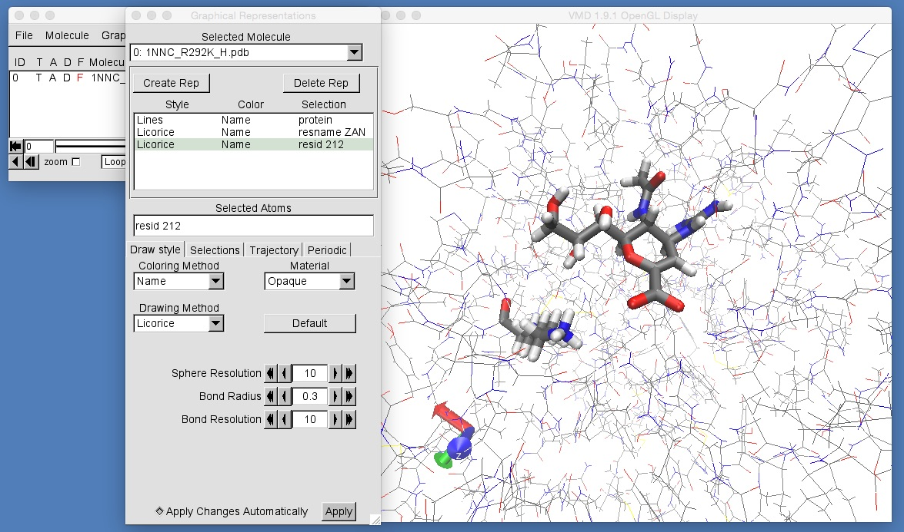

# Part 3: Mutating Proteins and MD Setup
## Mutating the Protein

The first thing we need to do is to mutate the protein. We will need to change the arginine 292 residue into lysine 292. To do this, we will first copy 1NNC.pdb to 1NNC_R292K.pdb by using the command;

```
cp 1NNC.pdb 1NNC_R292K.pdb
```

Now edit 1NNC_R292K.pdb by typing;

```
nano 1NNC_R292K.pdb
```

Now scroll down this file until you reach the arginine 292 residue;

```
ATOM   1658  N   ARG A 292      26.659  26.406  55.828  1.00 12.03           N
ATOM   1659  CA  ARG A 292      26.980  26.755  57.197  1.00 13.50           C
ATOM   1660  C   ARG A 292      28.487  26.772  57.423  1.00 13.83           C
ATOM   1661  O   ARG A 292      29.181  25.796  57.122  1.00 13.74           O
ATOM   1662  CB  ARG A 292      26.327  25.726  58.129  1.00 13.16           C
ATOM   1663  CG  ARG A 292      26.891  25.635  59.549  1.00 12.29           C
ATOM   1664  CD  ARG A 292      26.367  24.374  60.220  1.00 12.35           C
ATOM   1665  NE  ARG A 292      26.868  24.176  61.571  1.00 12.99           N
ATOM   1666  CZ  ARG A 292      26.318  23.353  62.464  1.00 13.13           C
ATOM   1667  NH1 ARG A 292      25.200  22.696  62.187  1.00 12.45           N
ATOM   1668  NH2 ARG A 292      26.857  23.230  63.664  1.00 13.02           N
```

To mutate a residue, you need to change the residue name and remove the atoms that are not common to both residues. In the case of arginine mutating to lysine, we must change "ARG" to "LYS" and must delete all atoms from "CG" to "NH2", as these are part of arginine, but are not in lysine. Once you have edited the scripts, you should have something that looks like this;

```
ATOM   1658  N   LYS A 292      26.659  26.406  55.828  1.00 12.03           N
ATOM   1659  CA  LYS A 292      26.980  26.755  57.197  1.00 13.50           C
ATOM   1660  C   LYS A 292      28.487  26.772  57.423  1.00 13.83           C
ATOM   1661  O   LYS A 292      29.181  25.796  57.122  1.00 13.74           O
ATOM   1662  CB  LYS A 292      26.327  25.726  58.129  1.00 13.16           C
```

Once you have edited the file, you can then use the "tleap" program that is part of AmberTools. This program will automatically add all of the hydrogen atoms to zanamivir and the protein, and will also add in the extra atoms for lysine 292. This is controlled using a tleap command file called "add_atoms.in". If you are interested, you can take a look at this file using a text editor to see what it is doing.

To run tleap type;

```
$AMBERHOME/bin/tleap -s -f add_atoms.in
```

This will create a new PDB file called "1NNC_R292K_H.pdb". Take a look at this file in VMD by typing;

```
vmd 1NNC_R292K_H.pdb
```



As you can see, all missing hydrogens and lysine atoms have been added correctly. You should also be able to see that tleap has renumbered the residues, so lysine 292 has been renumbered to lysine 212 (hence, to view this residue, you need to use "resid 212" rather than "resid 292" in VMD).

# [Previous](gettingstarted.md) [Up](README.md) [Next](solvation.md)
