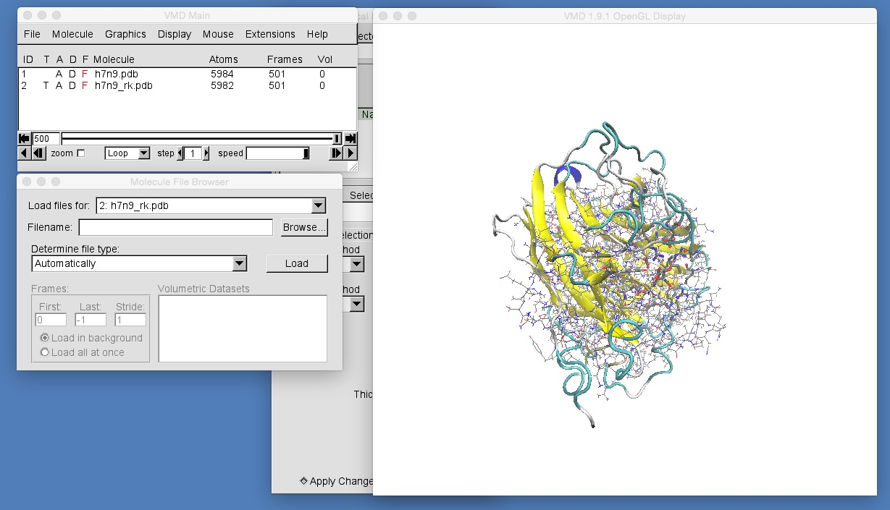
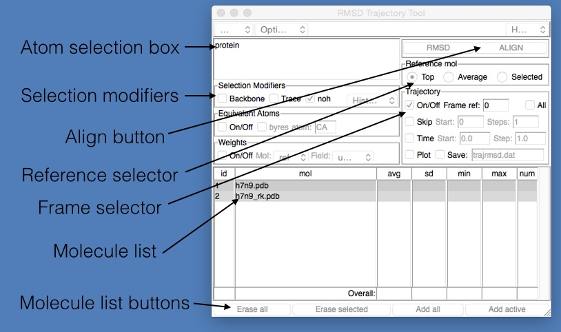
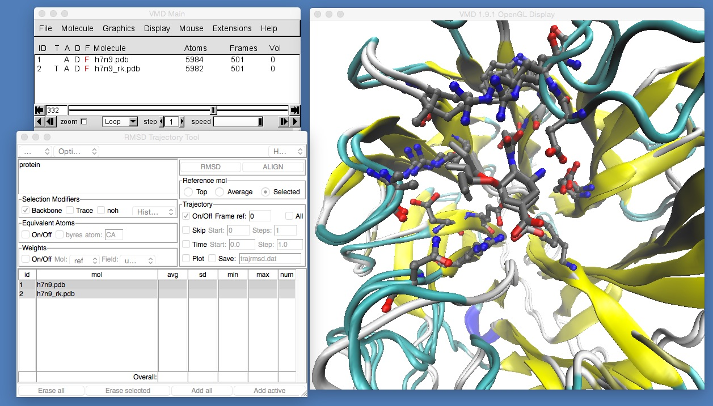
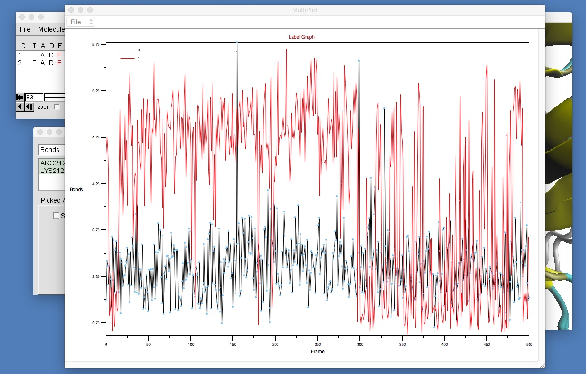

# Part 1: Molecular Visualisation
## Comparing Trajectories

The final thing we will learn in VMD is how to load up and compare the output of two different molecular dynamics trajectories. Please download the below two files and place them into the same directory as h7n9.pdb and h7n9.dcd

* [h7n9_rk.pdb](https://raw.githubusercontent.com/chryswoods/python_for_bio/master/dynamics/visualisation/h7n9_rk.pdb) : This is a PDB file containing oseltamivir bound to the R292K mutant of H7N9 neuraminidase
* [h7n9_rk.dcd](https://docs.google.com/uc?id=0B_KkGMZ8ACfaUWR4eUN6emxfQlk&export=download) : This contains the trajectory from a 50 nanosecond molecular dynamics simulation of oseltamivir bound to the R292K mutant of H7N9 neuraminidase.

Next, we will load up the h7n9_rk.pdb file in addition to the h7n9.pdb file that is already loaded into your VMD session. To do this, click "File | New Molecule..." in the VMD main window to open the "Molecule File Browser" window. Then, ensuring that the "Load files for:" selector is selecting "New Molecule", click "Browse" and find the h7n9_rk.pdb file that you downloaded. Select this and click "Load" to load this file.

Next, we will load the trajectory in h7n9_rk.dcd into the molecules loaded from h7n9_rk.pdb. To do this, in the "Molecule File Browser" window change the "Load files for:" selector to select "2: h7n9_rk.pdb". Then click "Browse" and find the h7n9_rk.dcd file that you downloaded. Select this and click "Load" to load this file.

The molecules in h7n9_rk.pdb are currently visualised using the "lines" representation. Go into the graphical representations window and add representations to match those for h7n9.pdb. To do this, you will need to ensure that the "Selected Molecule" selector at the top of the "Graphical Representations" window is selecting "2: h7n9_rk.pdb", e.g.

Once you have done this, zoom in to get a view similar to that in the above picture. You should be able to see that the molecules in h7n9_rk.pdb are not aligned with those in h7n9.pdb, and so oseltamivir in h7n9_rk.pdb appears rotated by about 90 degrees compared to oseltamivir in h7n9.pdb. This makes comparison of the two trajectories difficult. What we need to do is to ensure that all of the frames from both trajectories are aligned against a common frame of reference. In general, the best frame of reference for any bimolecular alignment is the protein backbone at the start of the trajectory for one of the structures. In this case we will use the backbone of h7n9 neuraminidase. To align the structures, we need to use the "RMSD Trajectory Tool" that comes with VMD. Open this by clicking "Extensions | Analysis | RMSD Trajectory Tool" in the VMD main window. This will open up the "RMSD Trajectory Tool" window, which is described in the image below.

* *Atom selection box* : This is an atom selection string used to pick the atoms that will be used to align the molecules from the two files. The selection string has the same format as that used in the Graphical Representations window.
* *Selection modifiers* : These provide a quick and easy way to modify the selection so that only the protein backbone is matched (if "Backbone" is ticked), or that only the alpha carbons are matched (if "Trace" is ticked) or that only match non-hydrogen atoms (if "noh" is ticked).
* *Align button* : Click this to align every frame from every selected molecule file. May take a while for large trajectories or lots of molecules.
* *Reference selector* : Chooses which molecule is used as the reference for the alignment (the molecule against which everything will be aligned). Can either be the "Top" molecule (the last one loaded), the "Average" of all loaded molecules, or the "Selected" molecule (the one picked in the Molecule list below)
* *Frame selector* : The choice of which frame to use to align the molecules. The number next to "ref:" is the frame number, which is currently 0. This means that all frames will be aligned against the molecules loaded from the reference file at frame 0.
* *Molecule list* : This lists the molecules that will be affected by the alignment request. By default, this will contain all molecules loaded from all files (so in this case, both h7n9.pdb and h7n9_rk.pdb). You can choose which molecule is used as the reference by clicking and selecting it from this list.
* *Molecule list buttons* : These are buttons used to edit the above molecule list. You can click either; "Erase all" - removes all molecules from the list, "Erase selected" - removes the currently selected molecule from the list, "Add all" - add all molecules that have been loaded into VMD into this list, and "Add active" - add the molecules that are labelled as "active" (have an "A" written next to them in the VMD main window).

We would like to align all frames of both h7n9.pdb and h7n9_rk.pdb against the first frame of h7n9.pdb. We want to align only the protein backbone, so we need to ensure that (1) the "Atom selection box" contains "protein", (2) that "Backbone" is ticked, (3) that we have selected h7n9.pdb in the "Molecule list", (4) that "Selected" is chosen in the "Reference selector" and (5) that the reference frame "ref:" is "0" in the "Frame selector". Once this is set, click "Align" to align the frames, and you should see something like this (you may need to rotate and zoom back into the molecule).

If you now play the movie you should be able to see that the binding position of oseltamivir in H7N9 and H7N9-R292K neuraminidase is slightly different. The mutation has changed the arginine (which was hydrogen bonding with the oxygen at the bottom of oseltamivir) into a lysine. The lysine is too short to hydrogen bond with the oxygen, so it is rotated away to the left. Here, it pushes away what is called the "bulky group" of oseltamivir, pushing that up and out of the binding site. You can see this more clearly by temporarily switching off the view of h7n9.pdb by double-clicking on the letter "D" next to h7n9.pdb in the VMD main window (the "D" stands for "Draw", and double clicking it will toggle between "draw the molecule", when the "D" is coloured black, and "hide the molecule" when the "D" is drawn red).

If this is not clear, try rotating and zooming in around h7n9.pdb and h7n9_rk.pdb while the movie is playing until you are happy that you can see that oseltamivir has been tilted up and slightly out of the binding site.

While this change in binding mode of oseltamivir can be seen in the movie, you would need to back up this qualitative visual observation with a quantitative measurement if you were going to report it in a paper. To do this, we will use the graphing tools introduced in the [previous section](picking.md) to graph the distance between the oxygen of oseltamivir and the nitrogens of arginine 292 and lysine 292 from H7N9 and H7N9-R292K neuraminidase. 

First, make sure that only h7n9.pdb is drawn. Enter "Bond selection mode" and select the oxygen in oseltamivir that is closest to arginine 292, and the nitrogen in arginine 292 that is closest to oseltamivir. Next, make sure that only h7n9_rk.pdb is drawn. Make sure that you are still in "Bond selection mode" and select the oxygen in oseltamivir that is closest to lysine 292, and the (only) nitrogen in lysine 292.

Once you have selected both pairs of atoms, open the "Labels" window (click "Graphics | Labels..." in the VMD main window) and then make sure that you have selected "Bonds" in the top-left selector. Select both of the atom pairs in the window (click on each of them). Then enter the "Graph" tab. You should see something like this;

Once everything is set, click the "Graph..." button and you should see something like this;

This shows clearly that the oxygen-nitrogen distance in the mutant H7N9-R292K neuraminidase is much larger and more variable than that for the wild type. If you want, you can save these distances to a text file by using the option "File | Export to ASCII Matrix". This can then be loaded into a spreadsheet package (e.g. Excel or LibreOffice) to produce a publication-quality graph.

On its own, this single oxygen-nitrogen distance is not enough to fully quantify the change in binding mode of oseltamivir. Have a look at the movie and try to come up with other distances (and angles) that will let you quantify the change that you can observe qualitatively in the movie. Once you have identified suitable distances and angles, use the above procedure to create graphs that would be of publication quality.

Finally, play the movie and rotate and zoom the view until you can find a single frame and viewpoint that clearly shows the difference in binding position of oseltamivir in H7N9 and H7N9-R292K. Once you have found a suitable viewpoint, use what you learned in [this section](rendering.md) to create a publication quality image that can provide context for your distance / angle graphs.

# [Previous](picking.md) [Up](README.md) [Next](whatnext.md)
