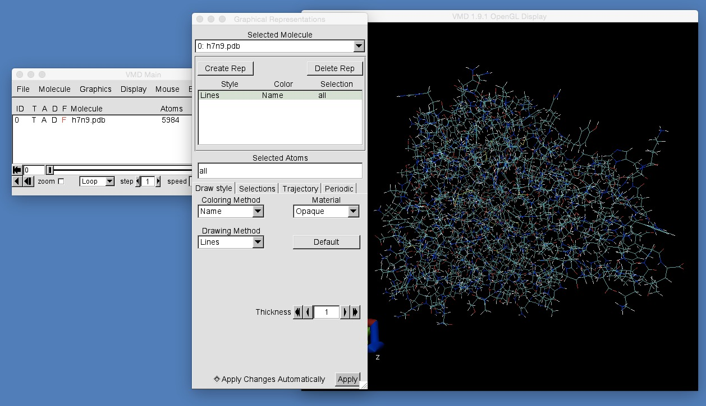
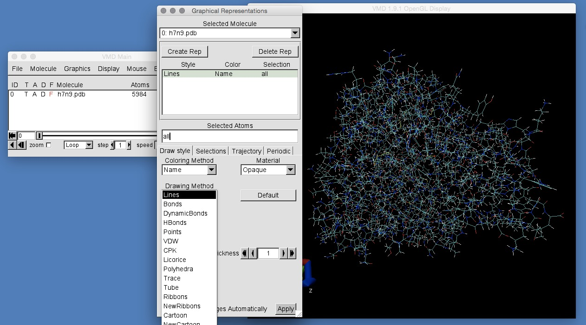

# Part 1: Molecular Visualisation
## Manipulating the view

You can rotate the camera around the molecule by pressing the left mouse button and dragging inside the VMD graphical window. You can zoom in and out by scrolling the mouse wheel.

Try rotating and zooming until you can manipulate the protein into this view (copy the orientation of the axes in the bottom left of the screen if you get stuck).

This view of the protein represents all atoms as points connected with bonds as lines. This representation, known as "lines", can be very confusing for large biomolecules such as this. To get a better view of the protein, we need to change its graphical representation. To do this, click "Graphics | Representations" in the "VMD Main" window. This will open up the "Graphical Representations" dialog box that you can see here;

This is quite an involved dialog box, and one you will use it a lot during this workshop. For the moment, the most important part is the "Drawing Method" drop-down menu. Currently, the selected "Drawing Method" is "Lines". Click on the triangle next to "Lines" and this will show you all of the different drawing methods available;

From the list of methods, choose "NewCartoon". This will view the protein with what is know as a "cartoon" representation. This representation draws the protein as a single tube, passing through all of the alpha carbon atoms, with any alpha helices or beta sheets highlighted. You can make the alpha helices and beta sheets more apparant by changing the coloring method. Do this by changing the "Coloring Method" in the drop-down menu above "Drawing Method" from "Name" to "Secondary Structure". This should give you this view, with the alpha helix drawing in purple, the beta sheets drawn in yellow and cyan and white used for different disordered regions.

# [Previous](opening_files.md) [Up](README.md) [Next](representations.md)
