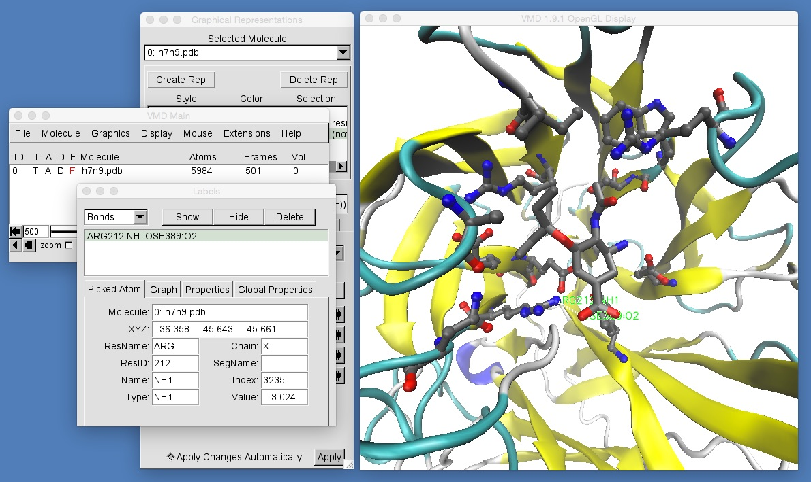

# Part 1: Molecular Visualisation
## Picking Atoms

As well as allowing you to view molecules, VMD also allows to you select atoms. You can do this by clicking "Mouse | Label | Atoms" in the VMD main window, and then clicking on individual atoms in the VMD graphics window. For example, in the [original paper](http://www.nature.com/srep/2013/131220/srep03561/full/srep03561.html) on which this workshop is based it was noted that there were two variants of H7N9 neuraminidase; the wild type form, and a mutant form in which the arginine (R) residue at position 292 was mutated to lysine (K).

We will now use the "select atoms" feature to label the Arginine 292 residue in the wild type H7N9 neuraminidase that you have loaded into VMD. This residue is to the bottom right of oseltamivir. Make sure that you are ready to select atoms (you have clicked "Mouse | Label | Atoms" and then click on one of the atoms of Arginine 292 as shown in the below picture;

Clicking on the atom adds a (barely visible!) green label to that atom. You can get more detail by opening the "Labels" window. Do this by clicking "Graphics | Labels...".

The "Labels" window shows you the molecule file to which the atom belongs (h7n9.pdb), the X, Y and Z coordinates of the atom (the exact values will depend on the frame of the movie that you are viewing. For frame 500, these will be [36.358, 45.643, 45.661]). The residue that contains this atom is also shown (ARG, short for arginine), as is the name of the selected atom (in this case NH1), and the residue ID number (212). Note that the residue ID number is the number given in the PDB file. It is common that the PDB file residue number does not match up with the "canonical" residue number that is used in the literature. In this case, the literature number is 292 (for Arginine 292), but the PDB residue number is 212.

Feel free to click on as many atoms as you want, looking at their information as it appears in the "Labels" window. Every atom you click on will be highlighted in the VMD graphics window with a (barely visible) green text label. If you want to remove this label, then you can click on the selected atom a second time. This will toggle the label on and off.

Once you have finished selecting atoms, you should remove all of the labels. You can do this by selecting all of the atoms in the "Labels" window (left click on the top label in the list, then press shift and left click on the bottom label in the list - this will select all of the labels in the list) and then click the delete button on the top right of the window, e.g.

 
This will delete and remove all atom labels.

As well as labelling atoms, VMD can also be used to label "bonds", which in VMD-speak, are actually just pairs of atoms. Switch into bond selecting mode by clicking "Mouse | Label | Bonds" in the VMD main window. Then click on two atoms (one after another), e.g. the oxygen on oseltamivir that is closest to Arginine 292, and the nitrogen on Arginine 292 that is closest to oseltamivir.

This will add a label to both of these atoms, and will also draw a (still barely visible!) white line between these two atoms. To get information about the bond you have selected, go to the "Labels" window and select "Bonds" from the top-right menu.

This shows the distance between these two atoms in the "Value" box in the bottom right of the window (this distance will depend on which frame of the movie you are viewing. In this case, for frame 500, the distance is 3.024 angstroms). You can graph this distance across the entire movie by clicking "Graph" in the "Labels" window, and then clicking the "Graph..." button that will appear below, e.g.

From this graph, you can see that the distance between the oxygen of oseltamivir and nitrogen of arginine 292 mostly fluctuated between 2.75 and 3.75 angstroms. However, there are three occasions then the distance jumped to higher values (frame 155, frame 299 and frame 329). Use the "scrubber" movie control in the VMD main window to scan through your movie to see what is happening at these three frames. Why is the oxygen-nitrogen distance so much larger? What is happening to oseltamivir?

If you want to save this graph, you can use the "File" menu at the top-left of the graph window itself to export the graph either to postscript (for printing), Xmgrace (a graphing package) or to an "ASCII matrix" or "ASCII vector". The last two options are essentially the same, and save the raw data for the graph to a text file that you can then easily load up into a spreadsheet.

In addition to measuring and graphing the distances between atoms, VMD can also measure and graph the angles between three atoms and the torsion (dihedral) angle between four atoms. The process is very similar to that for measuring distances. To measure angles, click "Mouse | Label | Angles" in the VMD main window to enter angle selection mode, and then click on three atoms. This will highlight an angle. You can then select "Angles" in the "Labels" window, click on the angle you have selected, and then graph the angle by clicking on the "Graph" tab and then the "Graph..." button. For torsion angles, click "Mouse | Label | Dihedrals" to enter torsion angle selected mode, and then click on four atoms. This will highlight a torsion angle. You can then select "Dihedrals" in the "Labels" window, click on the dihedral that you have selected, and then graph the torsion angle by clicking on the "Graph" tab and then the "Graph..." button.

Have a go measuring and graphing different distances, angles and dihedrals. Can you find any other frames in the movie in which oseltamivir is doing something unusual?

# [Previous](movies.md) [Up](README.md) [Next](comparing.md)
