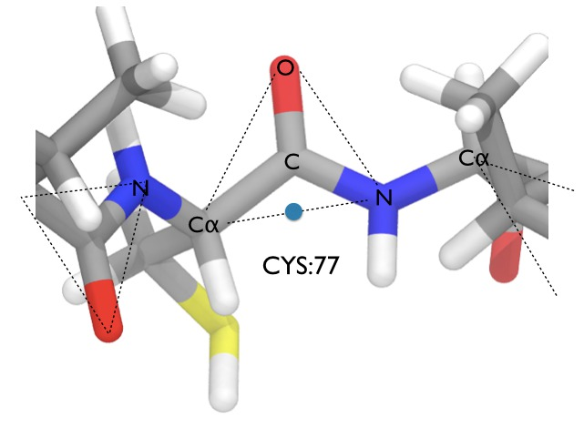

# Sampling the Protein - Backbone Moves

A combination of rigid body moves with internal moves are sufficient to sample most molecules. However, they will not allow you to efficiently sample the conformations of a protein. To understand why, let's take a look at the script `protein_angle.py`, by typing

```
nano protein_angle.py
```

This is a very similar script to `angle.py`, except this has been modified to change the angle between the C, CA and N atoms of random residues along the backbone of a protein. The lines;

```python
## Set the maximum amount to change each angle
max_delta = 2.5 * degrees

## Set the temperature
temperature = 298.15 * kelvin

## Load the protein from the Sire restart file
system = Sire.Stream.load("protein.s3")
```

specify the temperature, maximum amount to move each angle during the simulation, and then load the protein from the s3 file `protein.s3`. This is a copy of the protein that has been extracted from the `l7n.top` and `l7n.crd` Amber topology / coordinate files, using the script `make_protein.py`.

In the definition of the `mcMove()` function we have the code;

```python
    ## get the version of the protein
    ## currently in the system
    protein = system[ MolWithResID("ALA") ].molecule()
```

This selects the protein from the system by finding a molecule that contains a residue called "ALA" (most proteins contain an alanine residue ;-)). Next,

```python
    ## choose a random residue to move (will change the backbone angle)
    res = ResIdx( rangen.randInt(0, protein.nResidues()-1) )

    angleid = AngleID( res + AtomName("C"), res + AtomName("CA"), res + AtomName("N") )

    print("\nRandomly chosen angle %s" % angleid)
```

we have randomly chosen one of the residues in the protein by generating a random number between 0 and `protein.nResidues()-1`. The `ResIdx` object is a selector that selects the residue at that index in the protein. We then combine this residue selector with an `AtomName` selector, e.g. `res + AtomName("C")` would select the atom called "C" in the randomly chosen residue. We thus build an `AngleID` angle identifier that selects the C, CA and N atoms in that random residue. Next...

```python
    ## randomly choose an amount to move the angle
    delta = rangen.rand(-max_delta.to(degrees), max_delta.to(degrees)) * degrees

    print("Randomly changing the angle by %s" % delta)

    ## change the angle
    new_protein = protein.move().change(angleid, delta).commit()
```


...we randomly change that angle in the protein using the `.move().change()` function as before.

Try running this script using;

```
$SIRE/bin/python protein_angle.py
```

The output is the same format as the previous scripts and you can view the trajectory using

```
vmd output*.pdb
```

* By eye, can you see if the acceptance ratio of these moves is high or low? Are most moves accepted, or are most moves rejects, or is it about 50/50?

* What are the typical values for the change in energy for the move? Are any of these changes in energy greater than 30 kcal mol-1? What is the probability of accepting a move that has a change in energy of 30 kcal mol-1 at 298.15 K?

* In the VMD movie, can you see where most of the moves are accepted? Are they located in the center of the protein, ends of the protein or at the hinge regions of the protein?

What you should see is that the majority of the moves are rejected. This is because moving an angle in the middle of the protein can result in large movements at the end of the protein (think of it like putting a small bend in the middle of a sheet of paper versus a small bend at the end of the paper - the bend in the middle will cause large changes at the ends). Moves in the middle cause big changes in the position of atoms nearer the ends of the protein, leading to steric clashes and thus large increases in energy. You should see that it was not uncommon to have seen increases in energy over 30 kcal mol-1 or even over 100 kcal mol-1 during the `protein_angle.py` simulation. If this is not clear, take a look at the protein backbone move section in [this PDF file](https://docs.google.com/file/d/0B_KkGMZ8ACfaa2k4eVljODN3X1k/edit).

What this demonstrates is that internal bond, angle and dihedral moves cannot be used to sample the backbones of proteins. They can (and are) used to sample the bonds, angles and dihedrals in protein sidechains, but different types of move are needed to sample the backbone. There are several different algorithms (e.g. CONROT / concerted rotation), but the one used in Sire is perhaps the simplest. It is demonstrated in `protein_backbone.py`. The move works by recognising that the protein backbone can be viewed as a series of semi-rigid triangles formed by the C, O and N atoms of each residue, e.g. as shown here;




