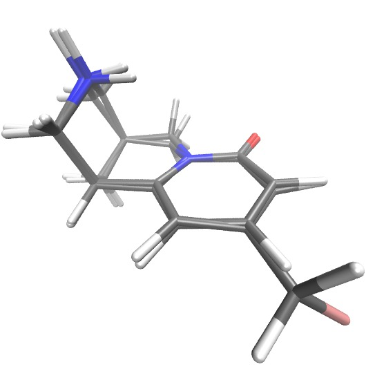

# Running a ligandswap calculation

The general way to run a ligandswap calculation is by typing;

```
$SIRE/bin/ligandswap -t0 complex_a.top -c0 complex_a.crd -l0 NAME_A -t1 lig_b.top -c1 lig_b.crd -l1 NAME_B -C config
```

where

* `complex_a.top` is the name of the topology file containing the protein bound to ligand A in a periodic cubic box of water
* `complex_a.crd` is the corresponding coordinate file to `complex_a.top`
* `NAME_A` is the residue name of one of the residues in ligand A. Note that only one molecule in `complex_a.top` should have this name, as ligandswap can only swap one ligand at a time.
* `lig_b.top` is the name of the topology file containing ligand B
* `lig_b.crd` is the corresponding coordinate file to `lig_b.crd`
* `NAMD_B` is the residue name of one of the residues in ligand B. Again, note that only one molecule in `lig_b.top` should have this name.
* `config` is the name of the config file to control ligandswap.

In our case, we can run a ligandswap calculation using the following command, which you should type now;

```
$SIRE/bin/ligandswap -t0 rec_fmc.top -c0 fmc.30.crd -l0 FM1 -t1 cti_gas.top -c1 cti_gas.crd -l1 CTI -C config
```

When you press `return` the ligandswap simulation should start. You will see the progress of the calculation printed to the screen. This will start with something like;

```
"/home/ccpbiosim/chzcjw/sire.app/pkgs/sire-2016.2.0/share/Sire/scripts/ligandswap.py" 
Starting /home/ccpbiosim/chzcjw/sire.app/bin/ligandswap: number of threads equals 8

Loading configuration information from file config

 Ligand 0 will be located by finding the first molecule containing residue FM1
Ligand 1 will be located by finding the first molecule containing residue CTI

Running a ligandswap calculation calculating the difference in free energy between
ligands 0 and 1 using files rec_fmc.top|fmc.30.crd and cti_gas.top|cti_gas.crd.
Using parameters:
===============
crdfile0 == fmc.30.crd
crdfile1 == cti_gas.crd
ligand0 == FM1
ligand1 == CTI
nequilmoves == 100
nmoves == 5
nsubmoves == 10
topfile0 == rec_fmc.top
topfile1 == cti_gas.top
===============
```

ligandswap is fully automatic. This means that you don't need to do anything to get the calculation to run. However, ligandswap will print a lot of output to let you know what it is doing, and to give you a chance to check that everything is ok.

For example, the above lines show that ligandswap has confirmed the parameters with which you have setup the simulation. Next, the output shows that ligandswap has loaded up the protein-ligand complex from `rec_fmc.top` and `fmc.30.crd`. 

```
Loading from Amber files rec_fmc.top / fmc.30.crd...
Loading the molecules from the Amber files "fmc.30.crd" and "rec_fmc.top"...

==============================================================
Sending anonymous Sire usage statistics to http://siremol.org.
For more information, see http://siremol.org/analytics
To disable, set the environment variable 'SIRE_DONT_PHONEHOME' to 1
To see the information sent, set the environment variable 
Assigning molecules to molecule groups...
SIRE_VERBOSE_PHONEHOME equal to 1. To silence this message, set
the environment variable SIRE_SILENT_PHONEHOME to 1.
==============================================================

Number of molecules == 44095
System space == PeriodicBox( ( 120.212, 116.603, 105.492 ) )
Number of solute molecules == 1
Number of protein molecules == 5
Number of ions == 40
Number of water molecules == 44045
Number of solvent molecules == 44089
(solvent group is waters + ions + unidentified single-residue molecules)
Returning the constructed system
Setting the origin of the system to the center of molecule Molecule(  : 6 : 397 : UID == {2b287e50-2121-49aa-b740-bce55a315017} ) (MolNum(6))...
This requires translating everything by ( -53.4281, 39.2431, 34.8554 )...
Adding flexibility to the system...
Only moving molecules/residues that are within a distance 15.0 A of the point ( 0, 0, 0 ).
```

The whole system is loaded, but as the last line shows, to keep the computational cost down, only molecules that are within 15 angstroms of the ligand (FM1) are moved.

Next, the CTI ligand is loaded from its topology and coordinate files...

```
Loading from Amber files cti_gas.top / cti_gas.crd...
Loading the molecules from the Amber files "cti_gas.crd" and "cti_gas.top"...
Number of molecules == 1
System space == Infinite cartesian space
Assigning molecules to molecule groups...
Number of solute molecules == 1
Number of protein molecules == 0
Number of ions == 0
Number of water molecules == 0
Number of solvent molecules == 0
(solvent group is waters + ions + unidentified single-residue molecules)
Returning the constructed system
```

Once this has been loaded, the next step is to load up an empty, equilibrated box of water. This is the box in which the free ligand will be placed. Sire comes with its own pre-equilibrated box of water, which is loaded next...

```
Loading from Amber files /home/ccpbiosim/chzcjw/sire.app/pkgs/sire-2016.2.0/share/Sire/Tools/WSRC/waterbox.top / /home/ccpbiosim/chzcjw/sire.app/pkgs/sire-2016.2.0/share/Sire/Tools/WSRC/waterbox.crd...
Loading the molecules from the Amber files "/home/ccpbiosim/chzcjw/sire.app/pkgs/sire-2016.2.0/share/Sire/Tools/WSRC/waterbox.crd" and "/home/ccpbiosim/chzcjw/sire.app/pkgs/sire-2016.2.0/share/Sire/Tools/WSRC/waterbox.top"...
Number of molecules == 35394
System space == PeriodicBox( ( 102.562, 102.637, 102.219 ) )
Assigning molecules to molecule groups...
Number of solute molecules == 0
Number of protein molecules == 0
Number of ions == 0
Number of water molecules == 35394
Number of solvent molecules == 35394
(solvent group is waters + ions + unidentified single-residue molecules)
Returning the constructed system
Adding flexibility to the system...
```

Once all of the molecules have been loaded, the next step is to combine them all together into the ligandswap system. This involves building two simulation boxes;

* a "protein box", containing the protein in water,
* and a "water box" containing just water

Both ligands FM1 and CTI are placed in both boxes, and a λ-coordinate created that will swap these two ligands between the protein box and water box.

```
Merging the two ligand complexes with the water system to create the ligandswap system...
```

For this swap to work, the second ligand (CTI) has to be translated and rotated so that it is aligned on top of the first ligand (FM1). This is to make sure that, as CTI is swapped in, it has the best chance of making favourable interactions with the protein, and that it causes the minimum amount of disruption to the protein binding site.

There are many ways to align molecules. ligandswap uses a "maximum common substructure" alignment. The program looks at the connectivity (bonding) of the atoms to find the largest common substructure (framework / scaffold) of the two ligands. The second ligand is then aligned onto the first such that the root mean square deviation (RMSD) between equivalent atoms on this common scaffold is minimised. The below lines are printed when ligandswap is finding the maximum common substructure...

```
First, mapping the atoms from the first ligand to the atoms of the second...
Still searching... 501.625 ms 
Still searching... 1008.33 ms 
Still searching... 1510.97 ms 
Still searching... 2032.68 ms 
Still searching... 2532.92 ms 
Still searching... 3082.5 ms 
Still searching... 3600.68 ms 
Still searching... 4125.33 ms 
MATCH TOOK 5602.97 ms 
Initial match timed out, so trying the reverse match... 
Still searching... 555.747 ms 
MATCH TOOK 717.746 ms 
...the reverse map is better. Using that :-) 
Mapping:
C1 <=> C1
C12 <=> C12
C17 <=> C17
C18 <=> C18
C19 <=> C19
C2 <=> C2
C21 <=> C22
C28 <=> C20
C3 <=> C3
C6 <=> C6
C9 <=> C9
N23 <=> N25
N25 <=> N27
O24 <=> O26


PLEASE CHECK: Writing alignment of ligands to the file aligned_ligands.pdb.
PLEASE CHECK: View this file in a PDB viewer to check that the ligands are aligned.
```

After the ligands have been aligned, their coordinates are printed out into the file `aligned_ligands.pdb`. You should always look at this file, e.g. in VMD, to double-check that ligandswap has properly aligned the two ligands. For example, the figure below shows a snapshot from VMD of `aligned_ligands.pdb`. In this, you can see that swapping FM1 with CTI will just involve losing the flouromethyl group and replacing it with a hydrogen. This swap does not involve a large change in the shape or volume occupied by the ligands in the protein binding site, so there is a good chance that the ligandswap free energy calculation will converge well and give a more robust prediction of relative binding free energy.



Next, this ligandswap system (protein box plus water box with both ligands) is equilibrated. This helps adjust both boxes to the presence of both ligands and removes any atom clashes. The energy components (a lot of them!) before and after equilibration are printed, to give you a chance to see if any have become too large.

```
Performing 100 moves of equilibration...
```

Ligandswap calculates the relative free energy along the λ-coordinate using [replica exchange](http://dx.doi.org/10.1021/jp0356620). By default, ligandswap uses 16 windows along λ, and so needs 16 copies (replicas) of the ligandswap system (combined protein box / water box containing the two ligands). The creation of these, and the λ-values to which they are assigned, are printed out, as shown below;

```
RETI system using generated random number seed 118440
Setting replica 0 to lambda 0.005
Setting replica 1 to lambda 0.071
Setting replica 2 to lambda 0.137
Setting replica 3 to lambda 0.203
Setting replica 4 to lambda 0.269
Setting replica 5 to lambda 0.335
Setting replica 6 to lambda 0.401
Setting replica 7 to lambda 0.467
Setting replica 8 to lambda 0.533
Setting replica 9 to lambda 0.599
Setting replica 10 to lambda 0.665
Setting replica 11 to lambda 0.731
Setting replica 12 to lambda 0.797
Setting replica 13 to lambda 0.863
Setting replica 14 to lambda 0.929
Setting replica 15 to lambda 0.995
```

Now that the setup is complete, ligandswap will perform the simulation. This involves using Monte Carlo to sample all of the mobile molecules in each replica of the protein box and water box. The Monte Carlo moves that are performed are all of those that are described in [this workshop](http://chryswoods.com/intro_to_mc/part2/). These Monte Carlo moves are performed as a series of iterations, e.g. here is the output for iteration 1.

```
Performing iteration 1...
Test replicas 0 1 
Test replicas 2 3 
Test replicas 4 5 
Test replicas 6 7 
Test replicas 8 9 
Test replicas 10 11 
Test replicas 12 13 
Test replicas 14 15 
...iteration complete. Took 5284 ms
Analysing iteration 1...
...analysis complete (took 159 ms)
```

After each iteration, replica exchange Monte Carlo moves are applied to swap replicas between different λ-values (e.g. an attempt is made to swap replica 0 at λ=0.005 withe replica 1 at λ=0.071). These replica exchange moves enhance sampling across λ, both aiding convergence of the free energy, and allowing the free energy cost of ligand-induced changes in protein conformation to be accounted for in the final results.

After the replica exchange tests, the statistics generated during this iteration's block of Monte Carlo sampling is analysed. We will discuss this analysis later...

After analysis, the next iterations of Monte Carlo moves are applied, until the maximum number of iterations that were requested for the ligandswap calculation. 

```
Performing iteration 2...
Test replicas 1 2 
Test replicas 3 4 
Test replicas 5 6 
Test replicas 7 8 
Test replicas 9 10 
Test replicas 11 12 
Test replicas 13 14 
...iteration complete. Took 5246 ms
Analysing iteration 2...
...analysis complete (took 89 ms)
Performing iteration 3...
Test replicas 1 2 
Test replicas 3 4 
Test replicas 5 6 
Test replicas 7 8 
Test replicas 9 10 
Test replicas 11 12 
Test replicas 13 14 
...iteration complete. Took 5237 ms
Analysing iteration 3...
...analysis complete (took 23 ms)
Performing iteration 4...
Test replicas 0 1 
Test replicas 2 3 
Test replicas 4 5 
Test replicas 6 7 
Test replicas 8 9 
Test replicas 10 11 
Test replicas 12 13 
Test replicas 14 15 
...iteration complete. Took 5230 ms
Analysing iteration 4...
...analysis complete (took 32 ms)
Performing iteration 5...
Test replicas 0 1 
Test replicas 2 3 
Test replicas 4 5 
Test replicas 6 7 
Test replicas 8 9 
Test replicas 10 11 
Test replicas 12 13 
Test replicas 14 15 
...iteration complete. Took 5216 ms
Analysing iteration 5...
...analysis complete (took 24 ms)
Saving the free energy analysis files from iteration 5...
...save complete (took 12 ms)
Saving the restart file from iteration 5...
...save complete (took 16107 ms)
All iterations complete.
```

In this case, only 5 iterations were requested, so the calculation is now complete.

***

# [Previous](files.md) [Up](README.md) [Next](output.md)
