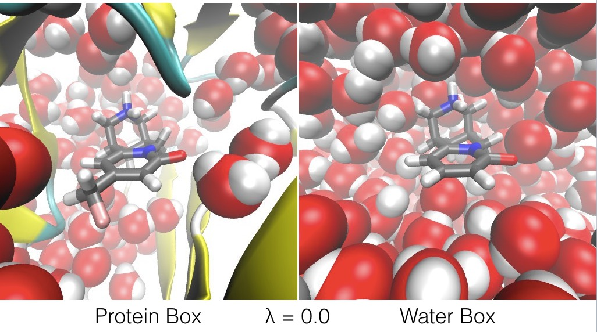
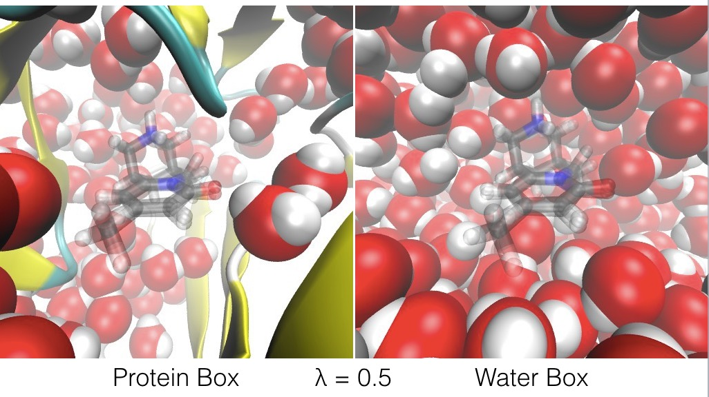
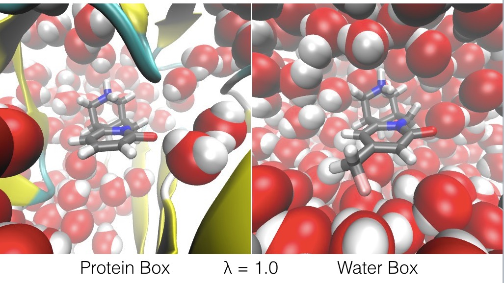

# Appendix: Ligandswap theory

Ligandswap is based on the same underlying idea as waterswap, which is described in full 
[here](http://dx.doi.org/10.1063/1.3519057) and [here](http://dx.doi.org/10.1039/c3fd00125c).

The method works by constructing and connecting two simulation boxes;

* a `protein box`, which contains the protein in a periodic box of explicit water molecules,
* and a `water box`, which is just a periodic box of explicit water molecules.

Both boxes are placed into the same heat bath and connected to the same thermostat, meaning that
they can exchange energy.

Spatially, the two boxes are placed directly on top of each other. Except for the exchange of
energy, atoms in one box **do not interact** with atoms in the other box. Effectively, the atoms 
in one box are invisible to the atoms in the other box.

Next, two ligands are added, called ligand A and ligand B. These ligands **can interact** with 
atoms in **both** the protein box and the atoms in the water box. However, the two ligands **cannot interact** with one another.

An energy expression is used to calculate the total energies of both boxes. This energy expression
uses λ to scale the interactions between both 

* the atoms in ligand A with the atoms in the protein box and water box, 
* and the atoms in ligand B with the atoms in the water box and protein box.

This λ reaction coordinate acts such that;

* at λ = 0.0, ligand A **only** interacts with the atoms in the protein box, and ligand B **only** interacts with the atoms in the water box, 
* at λ = 1.0, ligand B **only** interacts with the atoms in the protein box, and ligand A **only** interacts with the atoms in the water box,
* and at λ values in-between, ligand A's interactions with the protein box are scaled by (1-λ), while its interactions with the water box are scaled by λ, while ligand B's interactions with the protein box are scaled by λ, while its interactions with the water box are scaled by (1-λ). This means that, at λ = 0.5, the atoms of ligand A and ligand B both equally interact with the atoms in both the protein box and the water box.

The effect of λ is to swap ligand A and ligand B between the protein box and water box, as shown in the figures below.

The energy expression is given below;

Because the ligandswap λ reaction coordinate switches from ligand A being bound to the protein, and ligand B being bound to the protein, this means that the free energy difference between λ=1 and λ=0 is the relative binding free energy of the two ligands. Positive values indicate a penalty for switching A with B, meaning that ligand A is the stronger binder. Negative values indicate a benefit of switching A with B, meaning that ligand B is the stronger binder.

Any standard free energy method can be used to evaluate the free energy change along this λ coordinate. The `ligandswap` program uses [Free Energy Perturbation (FEP)](https://en.wikipedia.org/wiki/Free_energy_perturbation), 
[Bennetts Acceptance Ratio (BAR)](https://en.wikipedia.org/wiki/Bennett_acceptance_ratio) and
[Thermodynamic Integration (TI)](https://en.wikipedia.org/wiki/Thermodynamic_integration) simultaneously. To improve convergence, [replica exchange moves](http://dx.doi.org/10.1021/jp0356620) are applied across λ to allow sampling along this coordinate. In addition, to improve convergence and smooth the resulting potentials of mean force (PMFs), 
a [soft-core potential](http://dx.doi.org/10.1063/1.3519057) is used to soften the interactions between the atoms of the ligands and the atoms of the protein and water boxes at λ values between 0 and 1.

Because the free energy is evaluated over a single reaction coordinate, it is possible to decompose the energy expression into components. For example, we can evalute the contribution to the relative binding energy caused by interactions between the ligands and a single residue, e.g.

Thermodynamic integration can be used to average dE(λ)/dλ during the ligandswap calculation, thereby returning estimates of the relative free energy of binding for the ligands to each residue of the protein. These are estimates, and should not themselves be called free energies. This is because they are formed using the ensemble of structures generated using the total energy expression, and not the decomposed expression. However, they will include entropy, and they will give an indication of whether an individual residue contributes to the relative binding free energy, and if so, to which ligand the residue binds most strongly. As such, they are a very useful tool that help guide the process of rational drug design. The mathematics underlying this decomposition as applied to waterswap is [described in more detail here](http://dx.doi.org/10.1039/c3fd00125c).

***

# [Previous](README.md) [Up](README.md) [Next](README.md)
