# Visualisation

One of the major advantages of ligandswap over other relative binding free energy methods is that it supports decomposition of the free energy averages into per-residue components. How it does this is [described in detail here](theory.md).

What does this mean? Well, it means that ligandswap can give you an indication of which residues contribute most to the preference of a protein for binding to one ligand or another. We have developed a plugin for Chimera that enables you to visualise these free energy decompositions. The plugin is new and under development, with instructions for installing it [available here](chimera.md).

With the plugin installed, you can use it by starting chimera, e.g. by typing 

```
$CHIMERA/bin/chimera
```

where `$CHIMERA` is an environment variable pointing to the installation directory of chimera.

The plugin is located in the menu `Tools | Utilities | Sire Energy Visualizer`. Clicking on this option will open the below GUI dialog;

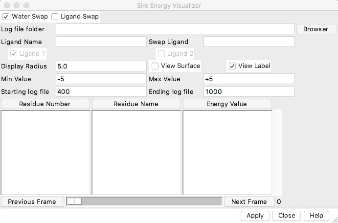

Click "Browser" to open a file browser. Navigate to and select the `example_output` directory containing all of the example results.

Next, make sure that the `Ligand Swap` box is checked at the top of the dialog. This puts the plugin into ligandswap mode.

Next, set the `Ligand Name` to `FM1` (the name of ligand A). Then set the `Swap Ligand` to `CTI` (the name of ligand B).

Doing this, you should see that the dialog looks something like this;

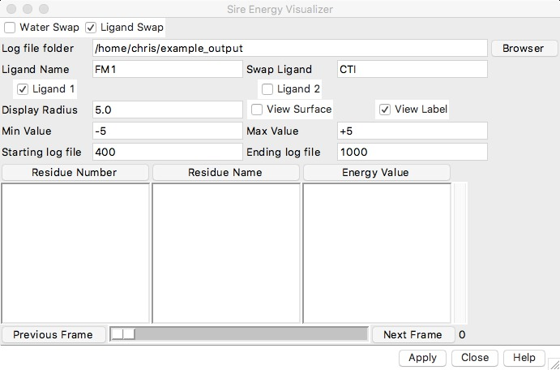

Now click `Apply`. This will take a while to load up all of the output.

Once loaded, you should see that the main chimera window looks something like this;

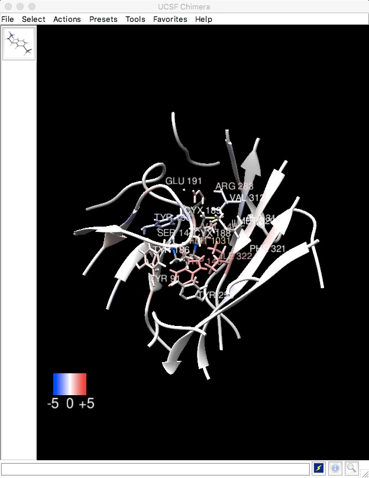

This shows a cutout of the full protein-ligand-water system, showing only the protein and ligand atoms that were mobile during the ligandswap calculation (everything within 15 angstroms of the swapped ligands). The residues are colour-coded according to their preference for either ligand A (FM1) or ligand B (CTI). Red shows a preference for FM1, with stronger colours indicating a stronger preference. Blue shows a preference for CTI, again with a stronger colour implying a stronger preference.

The exact values of these "free energy component" preferences are shown in the `Sire Energy Visualizer` dialog, which looks something like this;


The values are shown in the column `Energy Value`, and correspond to the decomposition of the relative binding free energy (in kcal mol-1) for the corresponding residue whose name is in the `Residue Name` column, and whose residue number is in the `Residue Number` column. Clicking the heading of each column will sort this table, e.g. now click on `Energy Value`. This will sort the residue energies from most positive (favours binding FM1 the most) to most negative (favours binding CTI the most), as shown here;

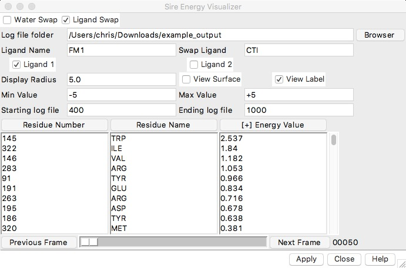

Clicking on `Energy Value` again will reverse the sort, i.e. it will now sort from most negative (favours CTI binding) to most positive (favours FM1 binding), as shown here;

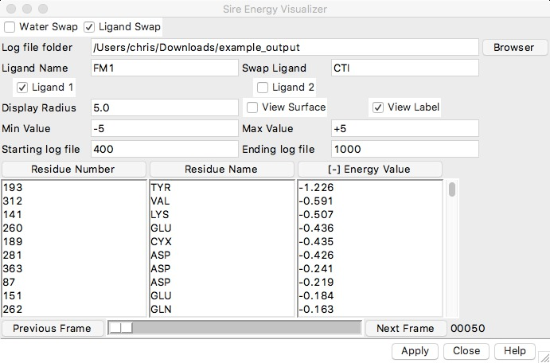

If you click on an energy value, it will highlight the corresponding residue in the 3D view. For example, click on the most negative value (-1.226), which is for TYR 193. If you rotate the 3D view, you should see that this residue is highlighted using a ball-and-stick representation, as seen here in the top left.

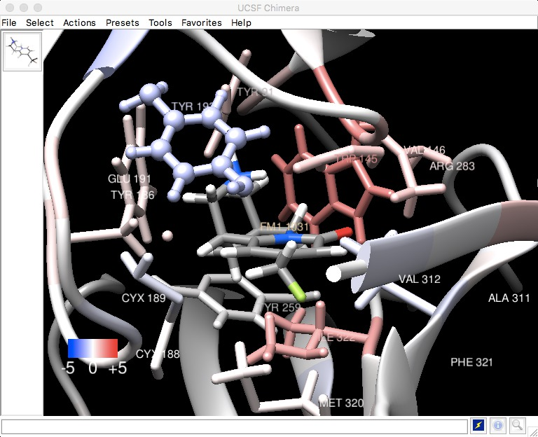

This is highlighting the residue that most favours binding to CTI. Now, let's highlight the residue that most favours binding to FM1. To do this, sort the energy values from most positive to most negative, and then select the residue that has the most positive value. You should now see a result similar to this;

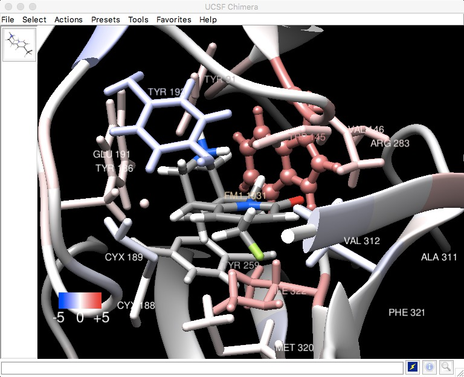

This shows the TRP 145 residue, which most favours binding to FM1.

Currently, the coordinates shown in the 3D view are that of FM1 bound to the protein. This is indicated by the tick in the `Ligand 1` box. You can change to view ligand 2 (CTI) by clicking the box next to `Ligand 2`. Try this now. You should see something like this;

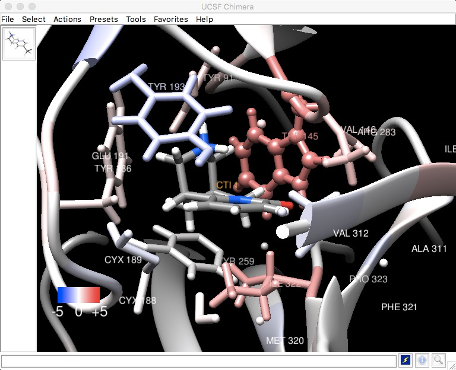

You can switch between viewing the two ligands by switching between ticking these two boxes.

The coordinates of the atoms shown in the 3D view are taken from the ligandswap calculation itself. You can play through the structures sampled during the ligandswap calculation by either dragging the slider at the bottom of the GUI dialog, or clicking the `Next Frame` button (both are a bit slow in this pre-release version of the tool...). For example, here is the last frame of the trajectory, showing FM1 binding...

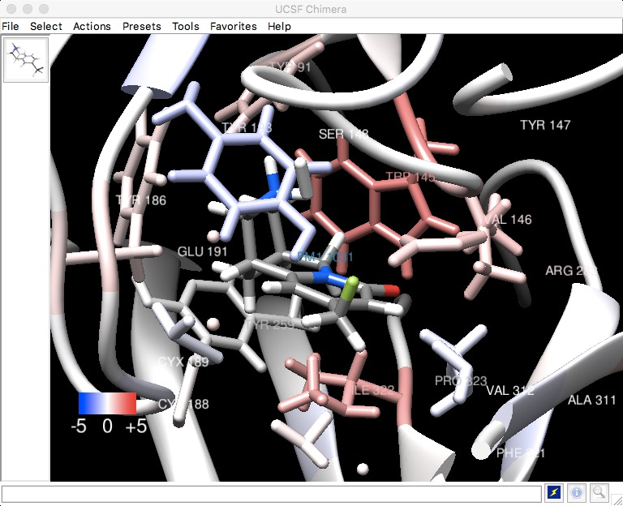

...in which you can see that the fluorine is now pointing upwards towards the NH2+ group of ARG 283. This results in a binding interaction that is stronger than for CTI (as indicated by the red colour). However, it also places the fluorine close to the OH group of TYR 193, which results in weaker binding than CTI (as indicated by the blue colour). Does this make chemical sense, considering the functional groups involved?

The colour scale used runs from +5 kcal mol-1 to -5 kcal mol-1, meaning that only strong preferences are obvious in the current view. You can change the colour scale by setting the `Min Value` and `Max Value` fields in the GUI dialog. For example, lets highlight weaker interactions by setting the scale from -1.5 kcal mol-1 to +1.5 kcal mol-1, as shown here;

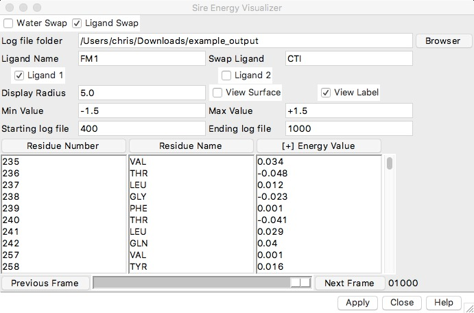

Once you have set the values, you will need to apply the changes by clicking `Apply`. The resulting 3D view should look something like this;

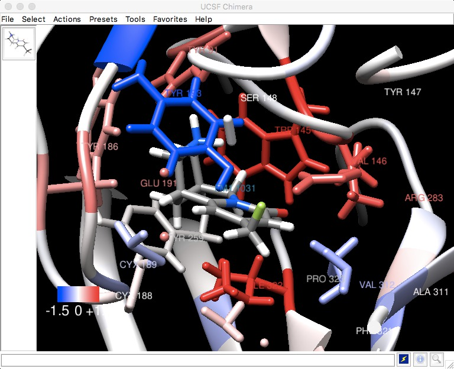

You should now be able to see clearly which residues have a preference for FM1 (shown in red), which have a preference for CTI (shown in blue), and which have no preference (shown in white).

Feel free to play with this GUI. Try to work out from this, why FM1 is a stronger binder to the protein than CTI. Looking at this, do you have any ideas how you could make either CTI or FM1 a stronger binder? 

***

# [Previous](analysis.md) [Up](README.md) [Next](whatnext.md)
