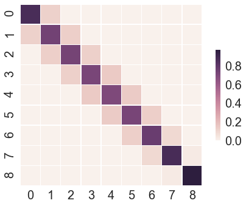
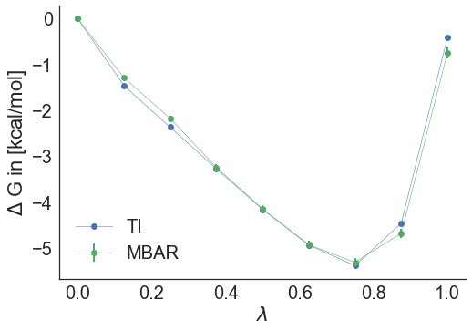

#<center>SOMD Free Energy of Binding Tutorial</center>
####<center>Step Three: Analysis </center>


### Thermodynamic cycles
In order to compute a free energy of binding we make use of thermodynamic cycles. 


*Thermodynamic cycle for the relative free energy of binding for benzene and xylene.*

The free energy of binding can be computed as the free energy difference of the alchemical transformation of the ligand bound to the protein and the ligand in solution, i.e. water. 


The individual terms can be computed in different ways. Two common approaches are implemented in `somd`, which are thermodynamic integration and multi state Bennet's acceptance ration (MBAR). 

The recommended free energy computation method is MBAR.

### Computing a free energy difference with analyse_freenrg mbar

In Sire the app `analyse_freenrg mbar` is used to compute free energy differences from simulations generated with `somd-freenrg`.

Navigate to one of the output directories:

```bash
cd Tutorial_free_energy/production/sire/benzol~o-xylene/run001/bound/output
```

This directory should now contain 9 further directories with the different simulations run at the different lambdas. The content of each of the lambda directories looks like this:
```bash
gradients.dat moves.dat simfile.dat SYSTEM.s3 sim_restart.s3 traj000000001.dcd
```
Each of the lambda directories contains a file called `simfile.dat`. This contains all relevant information for extracting free energies. 
We can now simply run the analysis script in the following way. 

```bash 
analyse_freenrg mbar --lam -i lam*/simfile.dat --temperature 298 -o out.dat --subsampling --overlap
```

This generates the file `out.dat`. Every simulation will be different, but [here](Data/out.txt) is an example of the `out.dat` file. 


The first element is the overlap matrix, which indicated how good the energy overlap between neighbouring lambda is. If the overlap is not good enough, then a warning is printed. It may also be helpful to plot the matrix as a matrix plot:

  

The overlap matrix shown here does not have optimal overlap and it may be advisable to add additional lambda values in running this bout leg of the simulation. For the purpose of illustration this is good enough though. 

Next, we can look at the potential mean force estimated from thermodynamic integration (TI) and MBAR. TI is mainly used as a sanity check to make sure the MBAR estimate and TI agree relatively well. 

  

From a single simulation there is no error estimate of the PMF, error available for TI, but the error estimated from MBAR is plotted. The PMF sections in the `out.dat` files are clearly labelled. 

[Here](Data/plot.txt) is the python script to plot the matrix plot and PMF of the example output file. 

Lastly, the value we are really interested in is the free energy difference ΔG_bound, both estimated with MBAR and TI. For the example file these are: -0.7 kcal/mol for MBAR and -0.4 kcal/mol for TI. 

For the overall free energy difference of binding we also have to run the free energy analysis for the ligand in solution simulations:

```bash
cd ~/Tutorial_free_energy/production/sire/benzol~o-xylene/run001/free/output
analyse_freenrg mbar --lam -i lam*/simfile.dat --temperature 298 -o out.dat --subsampling --overlap
```

After running the analysis we can look at the free energy difference of the solvated simulation, i.e. ΔG_sol from MBAR is -2.1 kcal/mol and -2.1 kcal/mol from TI. This leads to an overall relative free energy of binding for benzol and o-xylene of: ΔΔG = ΔG\_bound-ΔG\_sol = -0.7-(-2.1) = 1.4 ± 0.2 kcal/mol. 
The experimental value for the relative free energy difference of o-xylene with respect to benzol is: 0.6 ± 0.2 kcal/mol. 

Since we also simulated the transformation o-xylene to benzol we can no calculate the free energy difference in the reverse direction as a sanity check for the simulations. Running the same analysis as before in the `~/Tutorial_free_energy/production/sire/o-xylene~benzol/` directory. In our example the ΔΔG = ΔG\_bound-ΔG\_sol = 1.4-(2.4) = -1.0 ± 0.2 kcal/mol. 

You may find that your results will differ from this, due to the induced randomness into the simulation and relatively short sampling. 

While in an ideal world the forward and the backward simulation should give the same result with an opposing sign usually a divergence of up to 1.0 kcal/mol is acceptable.  


**NOTE**: The purpose of this tutorial was not to try and exactly reproduce experimental results, but show how a relative free energy between two compounds (benzol and o-xylene) can be computed using somd-freenrg. For more accurate results there are various strategies that can be employed to improve the quality of the simulations. Furthermore, averaging of multiple simulations should be used to get valid error estimates. Employing these different strategies and how to analyse larger data sets, will be covered elsewhere. 


<center> <a href="../README.html"> </a> </center>

&nbsp;
&nbsp;
&nbsp;
<center>
<a href="FESetup.md"></a> 
<a href="Production.md"></a> 
<a href="Analysis.md"></a>
</center>