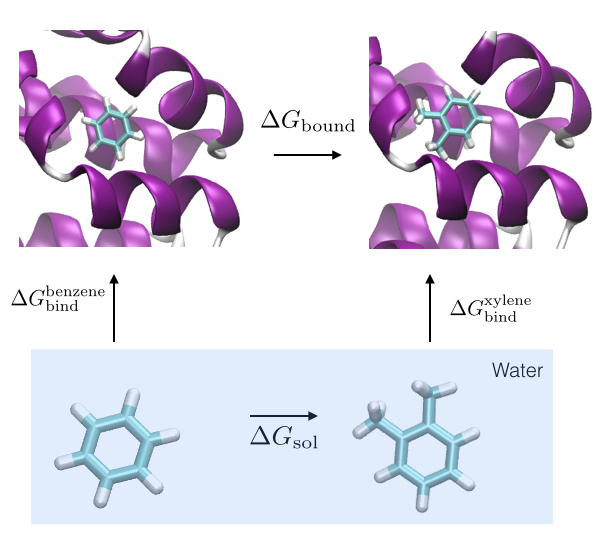
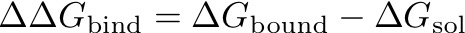

#<center>SOMD Free Energy of Binding Tutorial</center>
####<center>Step Three: Analysis </center>


### Thermodynamic cycles
In order to compute a free energy of binding we make use of thermodynamic cycles. 



*Thermodynamic cycle for the relative free energy of binding for benzene and xylene.*

The free energy of binding can be computed as the free energy difference of the alchemical transformation of the ligand bound to the protein and the ligand in solution, i.e. water. 



The individual terms can be computed in different ways. Two common approaches are implemented in `somd`, which are thermodynamic integration and multi state Bennet's acceptance ration (MBAR). 

The recommended free energy computation method is MBAR.

### Computing a free energy difference with analyse_freenrg mbar

In Sire the app `analyse_freenrg mbar` is used to compute free energy differences from simulations generated with `somd-freenrg`.

Navigate to one of the output directories:

```bash
cd Tutorial_free_energy/production/sire/benzol~o-xylene/run001/bound/output
```

This directory should now contain 9 further directories with the different simulations run at the different lambdas. The content of each of the lambda directories looks like this:
```bash
gradients.dat moves.dat simfile.dat SYSTEM.s3 sim_restart.s3 traj000000001.dcd
```
Each of the lambda directories contains a file called `simfile.dat`. This contains all relevant information for extracting free energies. 
We can now simply run the analysis script in the following way. 

```bash 
analyse_freenrg mbar --lam -i lam*/simfile.dat --temperature 298 -o out.dat --subsampling --overlap
```

The interesting files are `gradients.dat` and `simfile.dat`. The third column of the `simfile` records the gradient of the potential with respect to λ as it varies over the simulation. Averaging over the gradients at each lambda gives the curve over which a numerical intergation needs to be carried out for TI, according to the following equation:


The average gradient versus λ for the ethane to methanol calculation in solvent looks like this:


In order to compute the relative free energy using TI it is straight forward to run a script to do so:

```bash
analyse_freenrg mbar --lam 0.000, 0.125, 0.250, 0.375, 0.500, 0.625, 0.750, 0.875, 1.000 -i lam*/simfile.dat --temperature 298 --subsampling timeseries -o out.dat
```
This will not only compute a free energy from thermodynamic integration, but also for MBAR, which will be discussed below. An output file called `TI_out.dat` will be generated containing the PMF of going from λ=0 to λ=1. 
It should look something like this:


Furthermore, output is generated that will give a free energy difference between ethane and methanol in solvent, of about -3.8 kcal/mol. 

####1.2 MBAR

[MBAR](https://www.ncbi.nlm.nih.gov/pmc/articles/PMC2671659/) is a reweighting estimator making use of information from all the data in order to estimate a free energy difference. When running the above command for thermodynamic integration MBAR output is generated at the same time on the same dataset. The free energy difference estimated with MBAR is: -3.9 kcal/mol, and when comparing the two potential of mean forces it becomes apparent that they are very similar. 


The same will have to be done for the vacuum simulations, meaning that the relative free energy difference of hydration between ethane and methanol is given by:
ΔΔF = -3.9-(2.2) = -6.1 kcal/mol. 


<center> <a href="../README.html"> </a> </center>

&nbsp;
&nbsp;
&nbsp;
<center>
<a href="FESetup.md"></a> 
<a href="Production.md"></a> 
<a href="Analysis.md"></a>
</center>