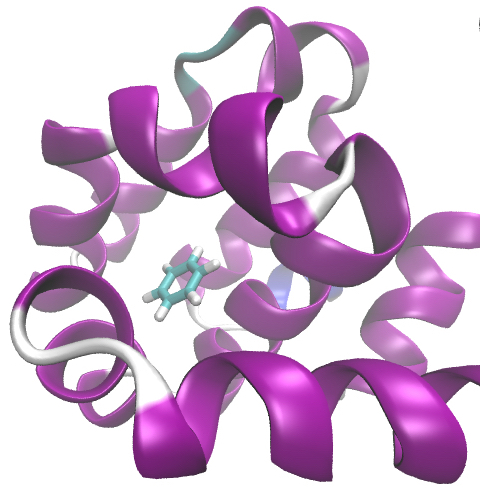
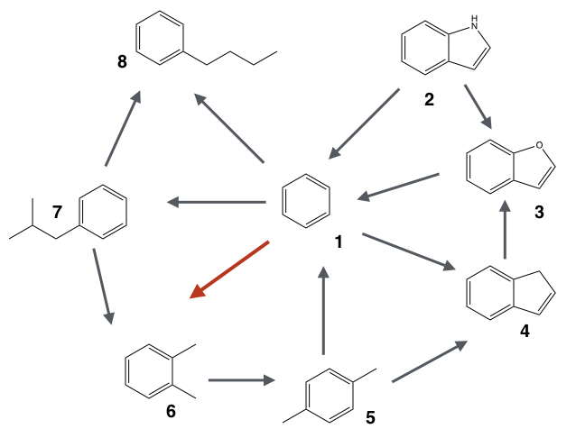
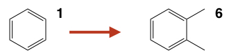
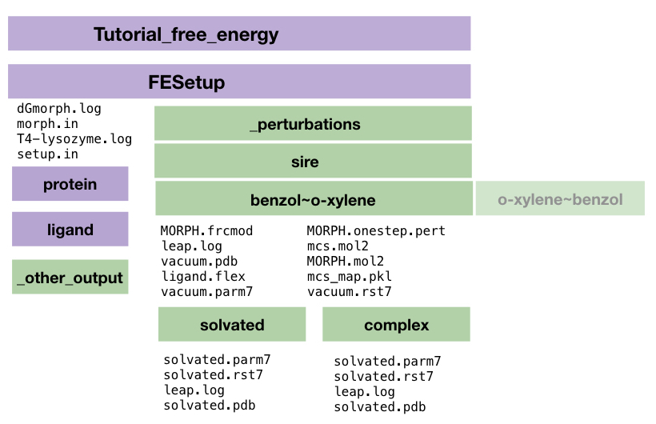
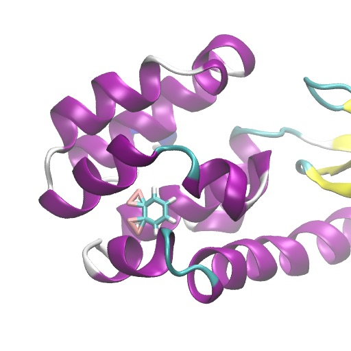

#<center>SOMD Free Energy of Binding Tutorial</center>
####<center>Step One: Running FESetup on a dataset of ligands and protein </center>

##Overview: Binding Free energies of Lysozyme ligands
This tutorial will cover how to compute the difference in free energy of binding between benzene and o-xylene to the protein T4-Lysozyme.
Below an image of benzene bound to T4-Lysoszyme:
<center>

 

*Lysozyme bound with benzene.* 
</center>

A common question in computational chemistry with relation to computer aided drug design is to estimate the differences in binding free energies of a series of small molecules (ligands to a given target compound). Alchemical free energy simulations are one way of doing this, by generating a so called perturbation map for the compounds that then allows to compute relative binding free energies of the compounds. An example of such a perturbation map can be found here: 
<center>


*Example perturbation map* 
</center>

For the purpose of this tutorial we will concentrate on a single transformation highlighted, namely benzene to o-xylene and by the end will be able to give an estimate of the difference in binding free energies for these two compound. 
The tutorial will initially follow the FESetup tutorial, written by Hannes Löffler, with slight modifications. 

## Getting started: Using FESetup to setup Lysozyme ligands with equilibration

**If you want to skip running all the FESetup steps click [here](Data/FESetupOut.zip) for the complete set of files needed for the further production runs. Simply unzip `FSetupOut.zip` in the FESetup root directory of the tutorial.**

Make sure you have a working installation of FESetup, if you are not sure how to do that click [here](http://siremol.org/tutorials/somd/Tutorial1.html).
In order to obtain the tutorial files please click [here](Data/FESetup.zip).
We will look at one of the example perturbations highlighted in red, i.e. benzene to o-xylene:
<center>
 
</center>
Let's start by creating a tutorial directory and place the unzipped FESetup file into that directory.

```bash
mkdir Tutorial_free_energy
mv /path/to/FESetup.zip Tutorial_free_energy
cd Tutorial_free_energy
unzip FESetup.zip
```

The FESetup directory should have the following content:

```
ls FESetup
ligands  setup.in  proteins

```

We now also have a directory with ligands. The coordinates of the ligands and that of the protein need to be in the same reference frame, i.e. the ligands need to fit into the binding pocket. Using VMD this can easily be double checked. 

### FESetup files explained 
The ```setup.in``` file contains again all the necessary directives to set up the protein and the two ligands as well as directives necessary for the relative free energy calculations. Let's look at some of the parts in more detail. 

```bash
logfile = T4-lysozyme.log
forcefield = amber, ff14SB, tip3p, hfe
gaff = gaff2
AFE.type = Sire
AFE.separate_vdw_elec = false
mdengine = amber, sander


[ligand]
basedir = ligands
file.name = ligand.mol2
box.type = rectangular
box.length = 12.0
neutralize = False
min.nsteps = 100
molecules = benzol, o-xylene

min.nsteps = 200
min.ncyc = 100
min.restr_force = 10.0
min.restraint = notsolvent

# heat the system to the final temperature running NVT
md.heat.nsteps = 1000
md.heat.T = 300.0
md.heat.restraint = notsolvent
md.heat.restr_force = 5.0

# fix the density of the system running NpT
md.press.nsteps = 5000
md.press.T = 300.0
md.press.p = 1.0
md.press.restraint = notsolvent
md.press.restr_force = 4.0

# restraints release in 4 steps, this is a NpT protocol
md.relax.nrestr = 4
md.relax.nsteps = 500
md.relax.T = 300.0
md.relax.p = 1.0
md.relax.restraint = notsolvent

[protein]
basedir = proteins
molecules = 181L
propka = t

```

We now have a section called ```[ligand]``` and a section called ```[protein]```, which contains all the information for the ligand simulation setup. ```basedir = ligands``` and ```file.name = ligand.mol2``` tell FESetup to look in the directory ligands for filenames ```ligand.mol2```. Looking into this directory, you find two further directories name ```benzol``` and ```o-xylene```, which are the two molecules for which we want to compute relative binding free energies. The ```[ligands]``` section with the box information will ensure that each ligand is parametrised using the generalised amber forcefield (GAFF), neutralised and minimised. The parameter ```AFE.type = Sire```, sets the output to be compatible with a  SOMD free energy calculation, however Gromacs and AMBER output formats are also supported. Respectively ```[protein]``` contains all information regarding the protein to be setup with the ligand. 

The other new section in the input file is called ```[complex]```. It means that a complex between the protein and the ligand are formed and solvated in a box and minimised. 
Below is the example from the tutorial input. 

If your AMBER installation has access to ```pmemd```, then it would be useful to change the above mdengine line to:

```
mdengine = amber, pmemd
```

```
[complex]
# explicit enumeration of pairs, otherwise all-with-all creation
pairs = 181L : benzol, 181L : o-xylene

box.type = rectangular
box.length = 12.0
align_axes = True
neutralize = True

min.nsteps = 2000
min.ncyc   = 1000
min.restr_force = 10.0

# heat the system to the final temperature running NVT
md.heat.nsteps = 1000
md.heat.T = 300.0
md.heat.restraint = bb_lig
md.heat.restr_force = 5.0

# fix the density of the system running NpT
md.press.nsteps = 5000
md.press.T = 300.0
md.press.p = 1.0
md.press.restraint = :LIG
md.press.restr_force = 4.0

# restraints release in 4 steps, this is a NpT protocol
md.relax.nrestr = 4
md.relax.nsteps = 500
md.relax.T = 300.0
md.relax.p = 1.0
md.relax.restraint = :LIG
```

### Running FESetup with Equilibration
FESetup is run in the following way:

```
FESetup setup.in
```
**Warning: The FESetup file ```setup.in``` contains the equilibration steps as well, running this can take a while (*(Running this on a single core of a 20 core machine with Intel(R) Xeon(R) CPU E5-2640 v4 @ 2.40GHz CPUs takes about ~1h 17min, this could be sped up with a PMEMD)*).**

The output generated with FESetup should look something like this:

```
=== FESetup release 1.2.1, SUI version: 0.8.3 ===

Please cite: HH Loeffler, J Michel, C Woods, J Chem Inf Mod, 55, 2485
             DOI 10.1021/acs.jcim.5b00368
For more information please visit http://www.ccpbiosim.ac.uk/fesetup/

Making biomolecule 181L...
Making ligand benzol...
Making ligand o-xylene...
Making complex from 181L and benzol...
```

 If a lot of different setups are required running this on a cluster might be a good idea and will be discussed in a bit more detail in the batch setup.

After running the above `setup.in` file through FESetup all the required output files are generated. The FESetup directory should now look like this:

```
_complexes  _ligands    _proteins  T4-lysozyme.log
ligands     _mols.done  proteins        setup.in
```
First of all the logfile ```T4-lysozyme.log``` contains all AMBER Tools commands executed to parameterise and setup the ligands and protein separately and in complex. ```_proteins``` contains the solvated and minimised protein file. ```_ligands``` contains the parameterised ligands solvated in a water box and in vacuum. Up to this point we can just run box standard molecular dynamics simulations of a protein with two different ligands bound. The necessary data for this can be found in ```_complexes```. In order to actually do an alchemical free energy calculations we need to generate a set of perturbations. This will be done with a separate morph file, called ```morph.in```. 

```bash
FE_type = Sire
AFE.separate_vdw_elec = False

[globals]
forcefield = amber, ff14SB, tip3p
gaff = gaff2
logfile = dGmorph.log

[ligand]
basedir = ligands
file.name = ligand.mol2
box.type = rectangular

morph_pairs = benzol > o-xylene,
        o-xylene > benzol

[protein]
basedir = proteins
molecules = 181L
propka = t

[complex]
# the following are required to create the morph in solution
box.type = rectangular

```

FESetup is run a again as before:
```
FESetup morph.in
```
and the output will look something like this:

```bash
=== FESetup release 1.2.1, SUI version: 0.8.3 ===

Please cite: HH Loeffler, J Michel, C Woods, J Chem Inf Mod, 55, 2485
             DOI 10.1021/acs.jcim.5b00368
For more information please visit http://www.ccpbiosim.ac.uk/fesetup/

Making biomolecule 181L...
Morphs will be generated for Sire
Morphing benzol to o-xylene...
Morphing o-xylene to benzol...
Creating complex 181L:benzol with ligand morph benzol~o-xylene...
Creating complex 181L:o-xylene with ligand morph o-xylene~benzol...

=== All molecules built successfully ===

```

 The output will have generated a directory called ```_perturbations``` that contains all the necessary input for running an alchemical relative free energy calculation, with perturbations ready in protein complex format as well as just the solvated ligands. 

 
####FESetup output
Let's take a closer look at the `_perturbations` directory, that contains all necessary files for the production run. 


So the overall directory/file structure in the Tutorial directory should now look like this:

 

The `MORPH.oneste.pert` file and the `solvated.parm7` and `solvated.rst7` files contain the relevant structures and topologies needed for the simulation, where the `complex` is the ligand bound to the protein and `solvated` simply the ligand in water. Below you can see the dummy atoms in the on the benzol needed for the morphing into xylene. 


 


With all input files generated for the alchemical free energy calculations we can now move to the production run. 


<center> <a href="Production.html"> </a> </center>

&nbsp;
&nbsp;
&nbsp;
<center>
<a href="FESetup.md"></a> 
<a href="Production.md"></a> 
<a href="Analysis.md"></a>
</center>
