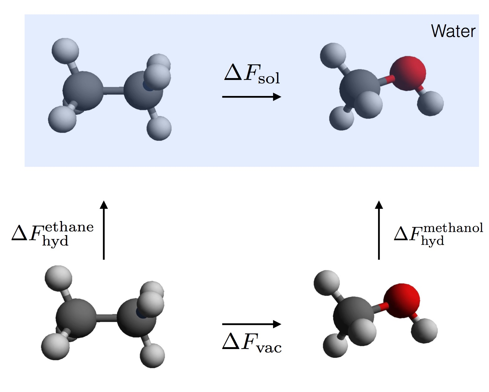
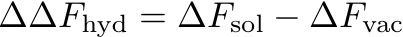
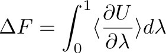
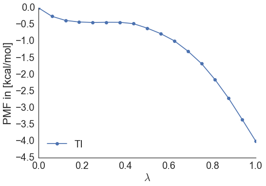
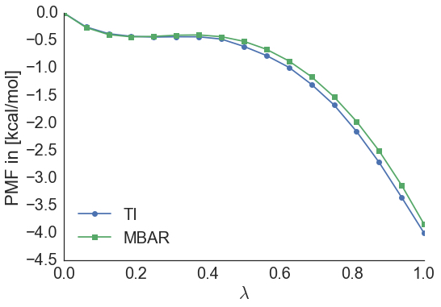

#<center>SOMD Hydration Free Energy Tutorial</center>

####<center>Step Three: Analysing an alchemical free energy simulation with SOMD </center>

###1. Getting Free Energy differences
In order to compute a hydration free energy we make use of thermodynamic cycles. 



*Thermodynamic cycle for the relative hydration energy of ethane and methanol*

The hydration free energy can be computed as the free energy difference of the alchemical transformation in solution, i.e. water, and vacuum and is given by:



The individual terms can be computed in different ways. Two common approaches are implemented in `somd`, which are thermodynamic integration and multi state Bennet's acceptance ration (MBAR). 

####1.1 Thermodynamic integration
When simulations are complete a bunch of files will have been created in each of the λ directories:

```bash
gradients.dat moves.dat simfile.dat SYSTEM.s3 sim_restart.s3 traj000000001.dcd
```
The interesting files are `gradients.dat` and `simfile.dat`. The third column of the `simfile` records the gradient of the potential with respect to λ as it varies over the simulation. Averaging over the gradients at each lambda gives the curve over which a numerical intergation needs to be carried out for TI, according to the following equation:



The average gradient versus λ for the ethane to methanol calculation in solvent looks like this:


In order to compute the relative free energy using TI it is straight forward to run a script to do so:

```bash
analyse_freenrg_mbar --lam 0.0 0.1 0.2 0.3 0.4 0.5 0.6 0.7 0.8 0.9 1.0 -i lam*/simfile.dat --temperature 298 --subsampling timeseries -o out.dat
```
This will not only compute a free energy from thermodynamic integration, but also for MBAR, which will be discussed below. An output file called `TI_out.dat` will be generated containing the PMF of going from λ=0 to λ=1. 
It should look something like this:



Furthermore, output is generated that will give a free energy difference between ethane and methanol in solvent, of about -3.8 kcal/mol. 

####1.2 MBAR

[MBAR](https://www.ncbi.nlm.nih.gov/pmc/articles/PMC2671659/) is a reweighting estimator making use of information from all the data in order to estimate a free energy difference. When running the above command for thermodynamic integration MBAR output is generated at the same time on the same dataset. The free energy difference estimated with MBAR is: -3.9 kcal/mol, and when comparing the two potential of mean forces it becomes apparent that they are very similar. 



The same will have to be done for the vacuum simulations, meaning that the relative free energy difference of hydration between ethane and methanol is given by:
ΔΔF = -3.9-(2.2) = -6.1 kcal/mol. 

####1.3 Errors
A little note on errors. Ideally simulations should be repeated multiple times to get error estimates on the computed free energies as well as the derivatives of the gradients and the PMF. MBAR does provide error estimates for the computed free energies provided that only uncorrelated samples were used to compute free energies. This is accounted for when using the timeseries approach for subsampling. The correct way of estimating errors from a single set of alchemical calculations involves discarding initial data towards equilibration and then subsampling the remaining data according to a precomputed statistical inefficiency. Please refer to the MBAR paper for more details with respect to the error analysis. 
A general advice would be to always run multiple repeats of the same simulation and estimate mean and standard deviation/error across the multiple repeats. 

###2. Corrections to computed Free Energy differences 

Extra care needs to be taken when running the simulations using reaction field. The dielectric constant should be different in vacuum and no cutoff should be used. An analytical term can then be calculated to correct for the cutoff based approach in solvent and is described [here](http://link.springer.com/article/10.1007%2Fs10822-016-9969-1) for example. 
In the following we will look at a way to compute the correction term to the free energy needed to take the reaction field into account.  

There are two python scripts that need to be run in the `lambda-0.00` and `lambda-1.0` directories respectively. 
Copy [FUNC_0.py](Data/FUNC_0.in) to `lambda-0.00` and [FUNC_1.py](Data/FUNC_1.in). 

Then run both scripts in their respective directories:

```bash
cd lambda-0.00
~/sire.app/bin/python FUNC_0.py > ../freenrg-FUNC-0.dat
cd ../lambda-1.0
~/sire.app/bin/python FUNC_1.py > ../freenrg-FUNC-1.dat
```

The correction term then becomes:


Resulting in a corrected relative free energy of hydration of:


<center> <a href="../README.md"> </a> </center>


&nbsp;
&nbsp;
&nbsp;
<center>
<a href="FESetup.md"></a> 
<a href="Production.md"></a> 
<a href="Analysis.md"></a>
</center>