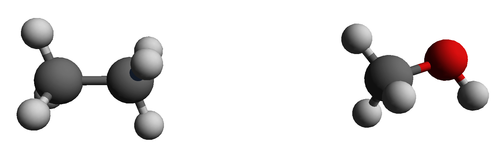

#<center>SOMD Hydration Free Energy Tutorial</center>
####<center>Step One: Introduction to Free energy calculations and how to use FESetup for the setup. </center>

###1. An introduction to relative alchemical free energy calculations
[1] [alchemistry.org](http://www.alchemistry.org/wiki/Main_Page)

###2. Using FESetup to setup perturbations
A common first toy system for a relative free energy calculation is ethane to methanol.


 

*Ethane and methanol for a relative free energy of hydration calculation.* 


In order to obtain the files needed to run the setup of the perturbation from ethane to methanol please click [here](Data/FESetup.zip). 
Let's start by creating a tutorial directory and place the unzipped FESetup file into that directory.
Navigate to the FESetup part in the directory. Let's have a look at the morph.in file, which will actually generate the input files needed for the simulation. The first section consists of global directives.

```bash
[globals]
logfile = eth-meth.log
forcefield = amber, ff14SB, tip3p, hfe
gaff = gaff2
mdengine = amber, sander
AFE.type = Sire
AFE.separate_vdw_elec = false
```

Important here are the two directives ```AFE.tye=Sire``` and ```AFE.separate_vdw_elec = false```. The first one means that Sire compatible output is generated and the second one means that the simulation will be carried out using a single step perturbation, perturbing charges and van der Waals interactions at the same time. 

The next section in the input file is concerned with the ligand, which in this case are simply the two solute molecules ethane and methanol. 

```bash
[ligand]
basedir = ligands
file.name = solute.pdb
molecules = ethane, methanol

# the following are required to create the morph in solution
box.type = rectangular
box.length = 12.0
neutralize = yes
min.nsteps = 100

min.ncyc = 100
min.restr_force = 10.0
min.restraint = notsolvent

# heat the system to the final temperature running NVT
md.heat.nsteps = 500
md.heat.T = 300.0
md.heat.restraint = notsolvent
md.heat.restr_force = 5.0

# fix the density of the system running NpT
md.press.nsteps = 1000
md.press.T = 300.0
md.press.p = 1.0
md.press.restraint = notsolvent
md.press.restr_force = 4.0

# restraints release in 4 steps, this is a NpT protocol
md.relax.nrestr = 4
md.relax.nsteps = 500
md.relax.T = 300.0
md.relax.p = 1.0
md.relax.restraint = notsolvent

morph_pairs = ethane > methanol
```
If you study the directory structure, you will see that in ligands, which is the ```basedir``` you find two further directories, ethane and methanol, which each contain a file called `solute.pdb`, given by the directive ```file.name = solute.pdb```. ```molecules``` defines the molecules that should actually be setup. 
Rather than doing a separate equilibration FESetup already takes care of the equilibration. First a minimisation is done using the ```min``` prefix followed by and NVT and NPT equilibration of the solvent using the ```md``` prefix. 

The last line ```morph_pairs = ethane > methanol``` is the one that actually generates the morph output needed for running the alchemical free energy calculation. 

To prepare the `ethane~methanol` input you can simply run:

```
FESetup morph.in
```
This should run for about 5 minutes on a modern workstation and generate further output:

```bash
ls
eth-meth.log  ligands  _ligands  morph.in  _perturbations
```

This means we are actually done with the setup now. You can always double check everything by looking at the `eth-meth.log` file. All the data needed for running the alchemical free energy simulations is found in the `_perturbations` directory. Splitting the generating the perturbations from the setup and equilibration might sometimes be useful if there are many molecules that need setting up in order to parallelise the setup and in this way speed up the process. 

<center> <a href="Production.html"> </a> </center>

&nbsp;
&nbsp;
&nbsp;
<center>
<a href="FESetup.md"></a> 
<a href="Production.md"></a> 
<a href="Analysis.md"></a>
</center>
