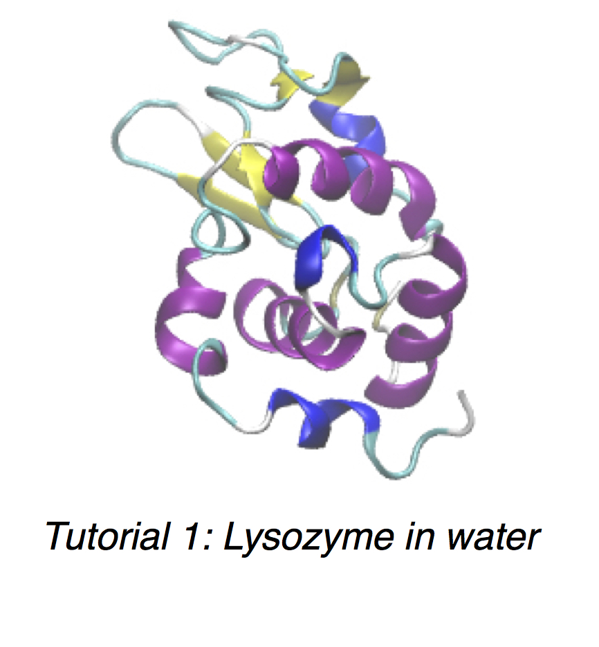
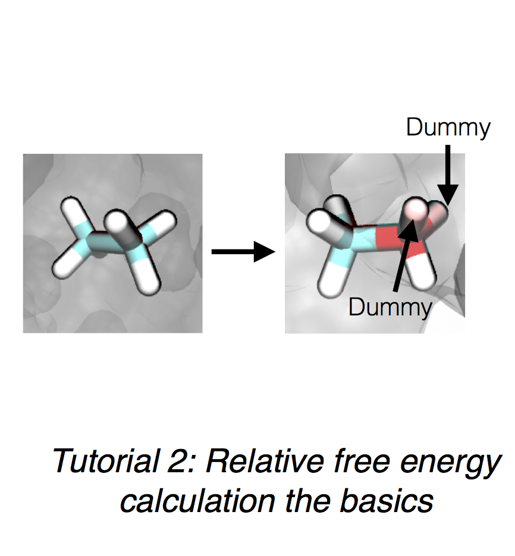

#
 SOMD Tutorials
 
This will guide the user to setup get familiar with running molecular dynamics simulations using the app `somd` as implemented in Sire. 

`somd` is a powerful tool that allows the user to run simple molecular dynamics simulations to more complex relative free energy of binding calculations. 

&nbsp;
&nbsp;
&nbsp;

 
&emsp;

&nbsp;
&nbsp;
&nbsp;

#### Installation Instructions
If you are having problems with the installation of SOMD as part of the Sire molecular library please read the installation instructions carefully, which can be found [here](Installation.md).